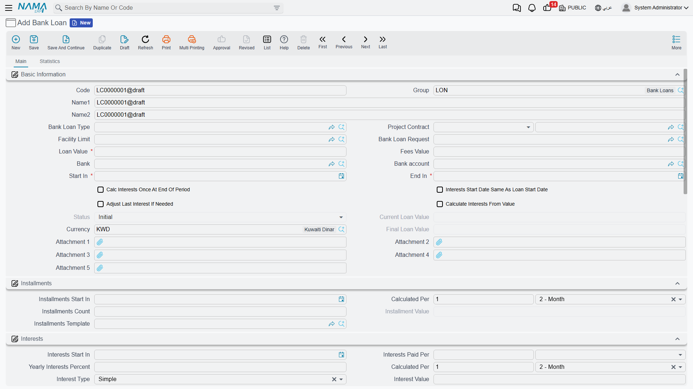
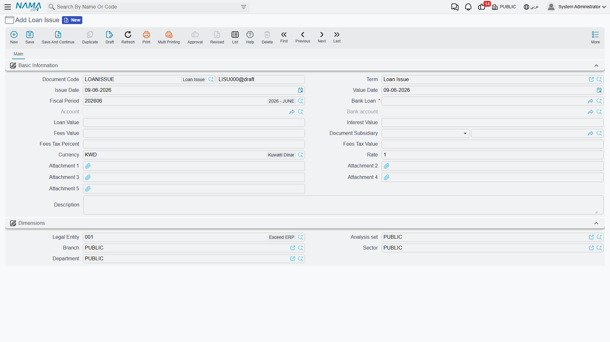
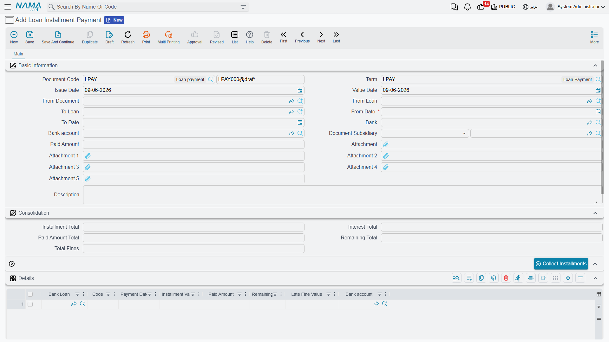

# Bank Loans

A bank loan isn't just an amount that lands in your account and then gets repaid; it's a commitment that stretches over months or years, with a principal, interest, fees and an installment schedule — and it may draw down an agreed **facility limit** with the bank. So Nama doesn't record loans as a single manual journal, but as a **connected system**: a master document holding the loan terms, then movement documents that issue it, repay its installments and accrue its interest across its whole life.

::: info Required license
Bank loans are part of the `accounting-loans` license — the same license that covers [Fixed Deposits](./fixed-deposits.md) and [Credit Facilities](./credit-facilities.md).
:::

## The story from the start

Every screen hangs off the **Banks > Bank Loans** root in the menu tree. The loan lifecycle runs like this:

1. **Bank Loan Request** — an optional first step to document the loan request before it's approved.
2. **Bank Loan** — the master file holding the full loan terms (its initial status is "Initial").
3. **Loan Issue** — the moment the loan amount actually arrives (it posts to the ledger, and the loan's status flips to "Released").
4. **Bank Loan Scheduling** — to redistribute the installments when needed.
5. **Loan Interests Calculation** — to compute and lock in the period's interest.
6. **Loan Installment Payment** — repaying one (or more) installments with its principal, interest and any late fine (it posts to the ledger).
7. **Bank Loan Changing Document** — to amend the loan after it's been issued.

## Loan type

Before recording loans, a **Bank Loan Type** (`Banks > Bank Loans > Bank Loan Type`) is created as a classifying file that groups similar loans and unifies their accounting terms. It's an organizational matter that makes later reporting and posting easier.

## The loan master file

On the **Bank Loan** screen (`Banks > Bank Loans > Bank Loan`) the loan terms are defined in three main areas:

- **Basic information**: the **loan value**, the **bank** and the **bank account** it's deposited into, the **fees value**, and the **loan type**. The loan can be linked to the **loan request** that preceded it, to the **facility limit** it draws down, and to a **project contract** when financing a specific project.
- **Installments**: the **installments count**, the **installment value**, **installments start in** (first installment date) and **calculated per** (the recurrence, e.g. every month) — or relying on a ready-made **installments template**.
- **Interests**: the **annual interest percent**, the **interest type**, **interests start in** and **paid per**. Important options here include: **calculate interest once at the end of the period**, **interest start date is the same as the loan start date**, **calculate interest based on the value not the percent**, and **adjust the last interest value if needed**.

The available **interest types**:

| Type | Meaning |
|---|---|
| Simple | A fixed interest computed on the full loan principal for the whole term. |
| Decreasing | Interest on the remaining balance, so it shrinks with each principal installment repaid. |
| Manual | Interest values are entered by hand in the interests table instead of being computed automatically. |

The **allowed late days** and **late fine percent** fields together govern how the late-installment fine is computed at payment time.

### Loan statuses

The loan moves through these statuses, which advance automatically with the movement documents:

| Status | When |
|---|---|
| Initial | when the loan is saved before being issued. |
| Released | after the loan issue document posts. |
| In Progress | while installments are being paid. |
| Finished | after all installments and interest are fully paid. |
| Cancelled | on cancellation. |

## Issuing the loan

As long as the loan is in its initial status it's just an agreement on paper. When a **Loan Issue** (`Banks > Bank Loans > Loan Issue`) is recorded the amount actually arrives: the document posts to the ledger so the loan is booked against the bank and deposited into the account, and the loan's status flips to "Released". The issue term covers the sides: **loan value debit/credit**, **fees value debit/credit** (with **fees tax**), and **interest value debit/credit** — i.e. where the accounts for the loan principal, its fees and its interest come from. (The detail of where these accounts come from is in the [Document terms](./support/accounting-document-terms.md) reference.)

## Interest accrual and repayment

As the loan periods pass, a **Loan Interests Calculation** is recorded to lock in the period's due interest according to the chosen interest type.

Then comes the **Loan Installment Payment** (`Banks > Bank Loans > Loan Installment Payment`) to repay one or more installments. The document shows the loan totals (total installments, interest, paid and remaining), and its lines separate the **installment principal**, the **interest paid** and the **late fine** (computed automatically from the late days and fine percent). The document posts via the sides: **fine debit/credit**, **interest payment value debit/credit**, plus the collected-principal side.

::: tip The interest-payment document is shared with deposits
The **Interest Payment Document** (`Banks > Fixed Deposits > Interest Payment Document`) is used to record interest/profit payments, and it's the same document used in [Fixed Deposits](./fixed-deposits.md).
:::

## Scheduling and amendment

If repayment circumstances change, a **Bank Loan Scheduling** document redistributes the remaining installments over new periods. A **Bank Loan Changing Document** is used to amend the loan data itself after it's been issued, within the system's controls.

## Reports

| Report | Answers |
|---|---|
| Loan installment details (SYSR-LON001) | The loan's installment schedule: due, paid and remaining for each installment and its interest. |
| Details of banking facilities (SYSR-LON002) | Facility-limit consumption across loans, guarantees and credits (see [Credit Facilities](./credit-facilities.md)). |

## For Support

- **"The loan is still Initial and the amount hasn't arrived"** — the loan issue document hasn't been recorded yet; issuing is what posts the amount and moves the status to "Released".
- **"Where do the loan, fees and interest accounts come from?"** — from the **Loan Issue** and **Installment Payment** terms; see [Document terms](./support/accounting-document-terms.md).
- **"The late fine isn't computed"** — make sure the **allowed late days** and **late fine percent** are set on the loan.
- **"The loan doesn't draw down the facility limit"** — make sure the loan is linked to the correct **facility limit**; details in [Credit Facilities](./credit-facilities.md).
- The accounting-processing mechanism is in [How documents are processed into accounting effects](./support/accounting-request-processing.md).
