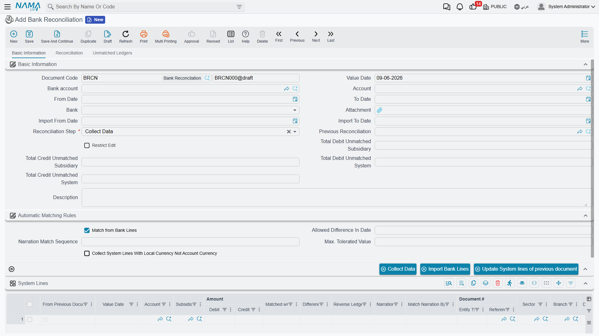

# Bank Reconciliation

Your bank balance in your books rarely matches the bank statement moment for moment: a cheque you deposited isn't yet collected, a fee the bank deducted you haven't recorded yet, a transfer in transit. **Bank Reconciliation** (`Banks > Cheques > Bank Reconciliation`) is the systematic process that places the bank statement next to your transactions, matches what matches, and surfaces the differences so they can be handled.

::: info Required license
Bank reconciliation is part of the banks license `accounting-banks`.
:::

::: warning Reconciliation doesn't post by itself
The bank reconciliation document produces **no accounting effect**; it's a comparison and difference-detection process only. The differences it finds (fees, interest...) are then recorded via a [bank adjustment](./banks-and-bank-accounts.md) or the appropriate document. Don't confuse "reconciliation" (comparison) with "adjustment" (an entry).
:::

## The three-step workflow

The document moves through a **reconciliation step** in three stages:

1. **Collect Data** — you specify the **bank account** and a date range, and the system gathers your transactions (system lines) and imports the bank statement (bank/subsidiary lines).
2. **Reconciliation** — you match the bank-statement lines against your transaction lines (manually or by matching rules on the reference/narration), within the allowed **value tolerance** and **date-difference tolerance**. The system shows the **system total**, the **subsidiary total**, the **unmatched lines** on both sides, and the **total difference**.
3. **Finished** — the document is closed once matching is complete.

Each document links to the **previous reconciliation**, so it continues where the last one ended and locks its past — a closed period isn't re-reconciled.

## Difference from subsidiary reconciliation

The same reconciliation idea applies to customers and suppliers via **Subsidiary Reconciliation** (`Accounting > Reconciliations > Subsidiary Reconciliation`): it matches the party's balance in your books against their external statement using the same three-step workflow, and chains the documents historically. The only difference is the nature of the party: a bank account here, a customer/supplier there.

## Reports

Reconciliation results and the related bank statements are in the bank reports (`SYSR-BNK*`) mentioned in [Cheques & financial papers](./cheques-financial-papers.md).

## For Support

- **"The reconciliation didn't move the bank balance"** — that's correct; reconciliation doesn't post. Record the differences with a bank adjustment.
- **"Many lines won't match even though they actually match"** — review the **value tolerance**, the **date-difference tolerance**, and the reference/narration matching rules.
- **"I can't edit an old document"** — because it's linked to a later document that locks it; this is expected, to preserve the reconciliation sequence.
