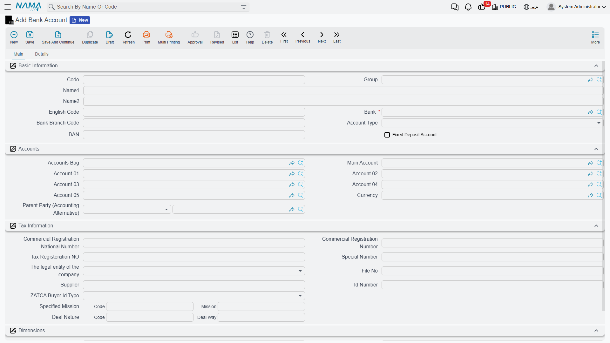

# Banks, Bank Accounts & Transfers

Managing the banking side starts by defining the **banks** you deal with, then the **bank accounts** opened with them. After the setup comes the daily movement: **bank transfers** between accounts, and **bank adjustments** to handle the differences the bank makes on its side (fees, interest, deductions).

::: info Required license
These features are part of the banks license `accounting-banks`.
:::

## The Bank

The **Bank** file (`Banks > Master Files > Bank`) defines the banking institution, and supports a **hierarchy** (a parent bank and branches) via the parent field. It carries contact data, can be linked to its own **subsidiary accounts**, and offers a **daily consolidated** option for those who need to consolidate its movements daily.

## The Bank Account

The **Bank Account** (`Banks > Master Files > Bank Account`) is the actual account opened with the bank. The most important part — the one that makes entries hit the correct ledger account — is its **account mapping** (the "Accounts" block):

- The **Bank** it belongs to (mandatory), the **Account Type**, the **Bank Branch Code**, the **bank account number**, and the **IBAN**.
- In the **Accounts** block: the **Main Account**, **Account 01** through **Account 05**, the **Currency**, and the **Accounts Bag** — this mapping is what translates this bank account's movements into the correct debit/credit side in the accounts.
- A **Fixed Deposit Account** option marks accounts tied to deposits.
- The **Tax Information** block carries tax-registration data and the Zakat-authority identity when needed.

## Bank Transfer

The **Bank Transfer** (`Banks > Master Files > Bank Transfer`) moves value from one bank account/subsidiary to another, and posts to the accounts as a document resembling the payment/receipt voucher (it takes its accounts from its term). It carries detail lines, matching against **invoices**, **payment-method** lines, and **cost allocation**. Use it to transfer between your own bank accounts, or from the bank to a party, while documenting fees.

## Bank Adjustment

Sometimes the bank makes a movement on its side with no corresponding document of yours: a service fee, credit interest, a deduction. The **Bank Adjustment** (`Banks > Master Files > Bank Adjustment`) is the direct tool to record these differences: you choose the **bank account**, the **amount**, and the **type** (**Debit** or **Credit**), and the entry is posted directly. Unlike other documents, the **bank adjustment needs no term** — it's a direct entry for the bank side.

::: tip
Don't confuse **Bank Adjustment** with **Bank Reconciliation**: the former records an actual difference movement in your accounts, while the latter ([Bank reconciliation page](./bank-reconciliation.md)) is a comparison process that doesn't post by itself — it surfaces the differences, which are then handled via a bank adjustment.
:::

## Reports and forms

- Bank reports (`SYSR-BNK*`: commercial-paper statement, cheques under collection, cheques by status, financial-paper books) are covered with [Cheques & financial papers](./cheques-financial-papers.md).
- Printed forms: bank transfer `SYSF-BNK001`, bank adjustment `SYSF-BNK002`.

## For Support

- **"A bank account movement hits the wrong ledger account"** — review the **Accounts** block on the bank account (main account / 01–05); the accounting target comes from there.
- **"How do I record bank fees/interest?"** — via a **bank adjustment** of the appropriate type (debit for fees, credit for interest).
- **"The bank adjustment asks for a term"** — it shouldn't need one; if a problem appears, it's in the account setup, not the term.
- Processing and reprocessing a stuck document are in [How documents are processed into accounting effects](./support/accounting-request-processing.md).
