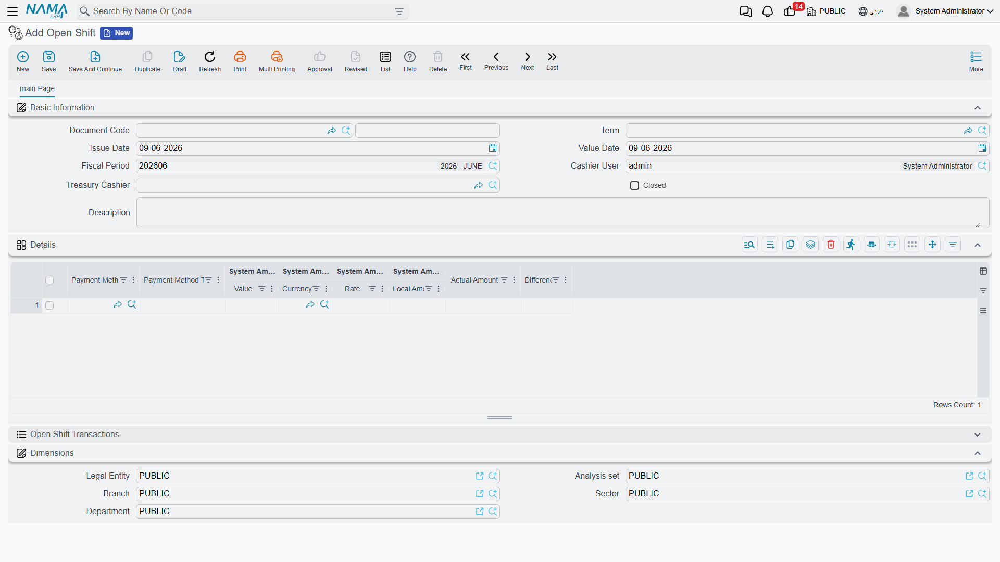
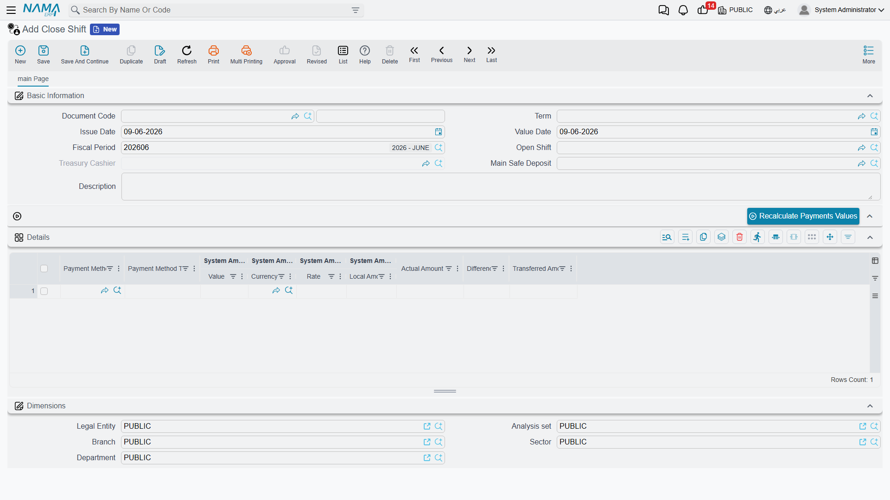

# Cashier Shifts (Cash Drawer)

The general receipt and payment vouchers ([see their page](./receipts-and-payments.md)) are flexible but more detailed than a cashier needs when handling dozens of quick payments a day. So Nama provides a simplified **cashier system** built on the idea of a **shift**: the cashier opens a shift at the start of the duty, records simple single-amount receipts and payments during it, then closes the shift — at which point the cash is reconciled and the difference is posted.

::: info Required license
The cashier is part of the `accounting-cashier` license. The **Electronic Receipt Voucher** for field collection is part of the `accounting-electronic-receipt` license.
:::

## The shift lifecycle

### 1) Open Shift

In the **Open Shift** document (`Accounting > Cashiers > Open Shift`) the cashier starts the duty: the **cashier user** and the **cashier safe** they'll work on are set, and the lines load the **opening balances** carried over from the previous shift's close (remaining cash, payment methods...).

::: warning One open shift per user
A cashier can't open a new shift while one is already open; the current one must be closed first.
:::

### 2) Receipts and payments during the shift

During the shift the cashier records **Cashier Receipt Vouchers** and **Cashier Payment Vouchers** (`Accounting > Cashiers > Cashier Receipt Voucher`). These are **simplified** vouchers: a single amount and a party, with no detail grids like the general voucher, and they're automatically linked to the open shift and the cashier safe — so the cashier doesn't bother choosing accounts, just records the amount.

### 3) Close Shift

At the end of the duty a **Close Shift** document (`Accounting > Cashiers > Close Shift`) is issued: the system reconciles the **system balance** (the sum of the shift's transactions) against the **counted amount** actually in the drawer, and posts the result through a main safe (**Main Safe Deposit**). The closing's accounting effect covers two cases: the shift **difference** (overage/shortage) via the **Difference Debit/Credit** sides, and the **transferred amount** to the main safe via the **Transferred Debit/Credit** sides.

## Electronic Receipt Voucher

For collection away from the office (a field rep with a phone), the **Electronic Receipt Voucher** (`Accounting > Mobile Apps - Accounting > Electronic Receipt Voucher`) provides a mobile-oriented version: it carries the **device ID**, the collecting **employee**, the **party**, and the **amount**; distinguishes **cash** from a **cheque** (with cheque number and bank name); captures the **client signature** and **employee signature**; and matches against the party's **invoices**. It's a field-collection tool that complements the cashier system.

## For Support

- **"I can't open a shift"** — the cashier already has an open shift; close it first with a Close Shift document.
- **"The cashier receipt voucher won't let me pick an account"** — that's intentional; the simplified voucher takes its accounts from the shift and the term, not manually.
- **"A difference at closing"** — the gap between counted and system is posted via the **Difference Debit/Credit** sides in the Close Shift term.
- **"Where do the difference/transfer accounts come from?"** — from the **Close Shift** term (see the [Document terms](./support/accounting-document-terms.md) reference).
- Processing mechanics are in [How documents are processed into accounting effects](./support/accounting-request-processing.md).
