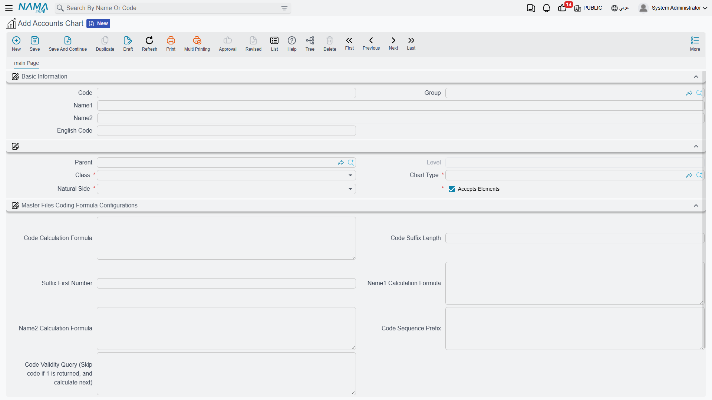
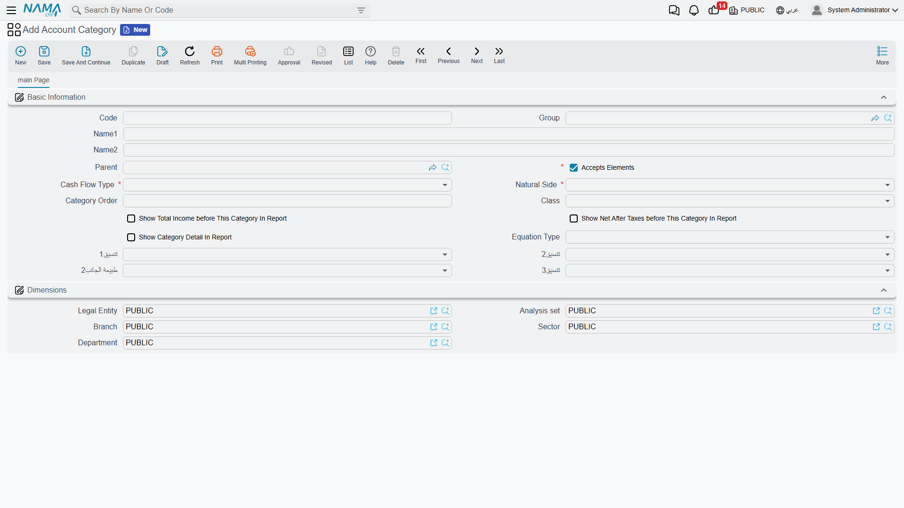

# Chart of Accounts

The chart of accounts is the backbone of your accounting system: a hierarchical structure that classifies everything you own, owe, earn, and spend into logical, branching groups. At the top of the tree are large groups (assets, liabilities, equity, revenue, expenses); beneath them finer groups; down to the **leaf accounts** where balances are actually recorded.

This page explains how the tree is built in **Accounts Chart** (`Accounting > Master Files > Accounts Chart`), and how it's complemented by the classification files that feed the financial statements: **Account Category** and **Account Tax Category**.

::: info Required license
The chart of accounts and the classifications are part of the core `accounting` license.
:::

## The hierarchical tree structure

Every node in the tree has a **parent** that links it to its ancestor, and that's how the tree forms. The essential distinction is between two kinds of node:

- **Grouping node** — carries the **Accepts Elements** (`يقبل عناصر`) flag, meaning it has branches beneath it. These nodes aren't posted to directly; they aggregate the balances of everything under them.
- **Leaf node** — does not accept elements beneath it, and is the level the actual accounts attach to and where balances are recorded.

In the screen header you enter the **Code**, **Name1** (Arabic), and **Name2** (English), and optionally the **English Code**. The next section sets the node's position and nature:

- **Parent** — the parent node this node branches from (left empty for root nodes).
- **Chart Type** — links the node to the chart type you defined during initial setup (see [Concepts & setup](./accounting-concepts-and-setup.md)).
- **Class** — the financial-statement classification the node belongs to: **Balance Sheet**, **Income Statement**, or **Other**. This decides where the account appears in the financial statements.
- **Natural Side** — the node's natural side: **Debit** or **Credit**. Assets and expenses are debit by nature; liabilities, equity, and revenue are credit by nature. This value determines how the balance is read (positive or negative) in reports.

::: tip Why "Natural Side" matters
A debit balance in a debit-natured account (like cash) is a naturally positive balance. A debit balance in a credit-natured account (like suppliers) signals an unusual situation. The system uses the natural side to present balances with their correct signs in account statements and trial balances.
:::

## Automatic account coding

Instead of numbering accounts by hand, the **Code Formula Settings** section on a grouping node lets the system compute a new account's code automatically from a formula: a sequence prefix, a numeric-suffix length, and a starting number. You can also generate the Arabic/English name from a computed formula and set a code-validity query. The benefit is that every new account under that group gets a code consistent with its siblings, effortlessly.

## Account Category

The chart of accounts organizes accounts in accounting terms, but the financial statements — especially the **cash-flow statement** and the **income statement** — need an extra classification angle. That's the role of **Account Category** (`Accounting > Master Files > Account Category`): a parallel classification tree that links each account to its role in those statements.

Its key fields:

- **Cash Flow Type** — places the account in the cash-flow statement; its values are **Operating Activities**, **Investment Activities**, **Financing Activities**, **Cash Account**, **Profit - Loss**, **Adjustment**, or **Not Involved** for accounts that don't enter the statement.
- **Equation Type** — places the account in the income statement: **Revenue**, **Cost Of Revenue**, **Expenses**, **Other Revenue**, **Taxes**, or **Not Involved**.
- **Class** and **Natural Side** — as in the chart of accounts.
- The report display options (**Show Total Income**, **Show Taxes**, **Show Category Detail**) control the level of detail the category shows when statements are printed.

## Account Tax Category

**Account Tax Category** (`Accounting > Master Files > Account Tax Category`) is similar to the account category but dedicated to tax dimensions — used to group accounts by their tax treatment in tax returns and reports. It too is a hierarchical tree carrying a **Cash Flow Type**, **Class**, and **Natural Side**.

## Reports

The **Accounts Chart** report (`SYSR-ACC001`) prints the full tree with its levels; you'll find it alongside the other core account reports on the [Account statements & trial balance](./reports-account-statements-and-trial-balance.md) page.

## For Support

- **"I can't post to a certain account"** — make sure the node is a **leaf** (doesn't carry the "Accepts Elements" flag); grouping nodes can't be posted to.
- **"The balance shows with a reversed sign in the statement"** — review the account's **Natural Side**; setting it wrong flips the balance's sign in reports.
- **"An account doesn't appear in the income/cash-flow statement"** — check the **Equation Type** and **Cash Flow Type** in the account category; the **Not Involved** value excludes the account from the statement.
- Building the leaf accounts themselves (currency, subsidiary types, posting and dimension properties) is covered in the [Accounts](./accounts.md) page.
