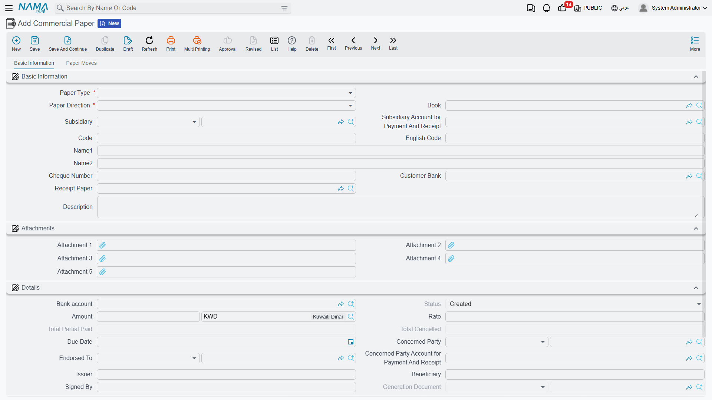
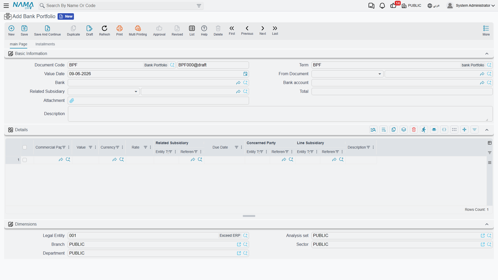

# Cheques & Financial Papers (Lifecycle)

A cheque isn't just an amount; it's a paper with a journey: it's received, deposited at the bank, collected or returned, and may be endorsed to another party or discounted before its due date. Tracking all that by hand is a nightmare, so Nama treats every cheque or bill as a **financial paper** with a **status** that moves through a clear lifecycle, driven by a set of specialized documents.

::: info Required license
Financial papers are part of the banks license `accounting-banks`.
:::

## The financial paper and its status

The **Commercial Paper** (`Banks > Master Files > Commercial Paper`) represents the cheque or bill of exchange. Its key fields: the **paper direction** (**Received** from a customer or **Issued** to a supplier), the **paper type** (**Cheque** or **Bill Of Exchange**), the **value**, **due date**, **cheque number**, **bank**, and **beneficiary/issuer**, the **commercial-paper book** it belongs to, and the **status**.

The paper is rarely created on its own; it's usually generated from a **receipt voucher** (for received papers) or a **payment voucher** (for issued papers), then its status moves via the documents below. The possible statuses:

| Status | Meaning |
|---|---|
| **Created** | The paper has been created but not yet received. |
| **Received** | The incoming paper has been received and is in your custody. |
| **Issued** | The outgoing paper has been issued to an external party. |
| **Portfolioed** | Deposited into the bank portfolio for collection. |
| **Postponed Portfolioed** | Deposited as a postponed deposit (before the due date). |
| **Agio** | Discounted at the bank before its due date (accelerated collection at a discount). |
| **Endorsed** | Endorsed (transferred) to another party. |
| **Collected** | Its value has actually been collected. |
| **Temporary / Finally Bounced** | Bounced temporarily (retryable) or finally. |
| **Partial Paid / Partial Cancel** | Part of its value has been paid/cancelled. |
| **Cancelled** | The paper has been cancelled. |

## The commercial-paper book

The **Commercial Paper Book** (`Banks > Settings > Commercial Paper Book`) organizes the papers' numbering and custody — just like a physical chequebook — so you know which papers are in which book and with whom.

## The documents that drive the cycle

- **Opening Commercial Paper** (`Banks > Cheques > Openning Commercial Paper`) — to enter existing papers at go-live with their balance and current status.
- **Bank Portfolio** (`Banks > Cheques > Bank Portfolio`) — deposits received papers at the bank for collection (status moves to "Portfolioed"). There's also the **Postponed Bank Portfolio** and **Postponed Portfolio Return** for deposits before the due date and reversing them.
- **Bank Notice** (`Banks > Cheques > Bank Notice`) — the bank's notification of the paper's outcome: **collection** (moves to "Collected") or **return** (to "Temporary/Finally Bounced").
- **Agio** (`Banks > Cheques > Agio`) and **Agio Return** — discounting the paper at the bank before its due date for a commission, and reversing it.
- **Financial Paper Cancel** — to cancel a paper.
- **Partial Payment** — to record payment of part of a paper's value.
- **Financial Paper Transfer** — to move/endorse a paper.
- **Receipt Request** — to request receiving a paper before recording it.

::: tip A simplified lifecycle for a received cheque
Receive (receipt voucher) → Received → Deposit (bank portfolio) → Portfolioed → Bank notice of collection → Collected. And if it bounces: bank notice of return → Temporary/Finally Bounced.
:::

Each of these documents moves the paper's status and records its appropriate accounting effect (moving the value between a "cheques under collection" account and the bank account, for example), and the source of these accounts is each document's term.

## Printing on bank forms

Printing the cheque itself uses **bank-specific templates** (Ahli United, Arab African, Audi, CIB, Gulf, NBAD, NBE, QNB...) within the cheque forms `SYSF-BNK-CHQ-*`, so the cheque comes out matching each bank's format.

## Reports and forms

- Reports: commercial-paper statement `SYSR-BNK001`, cheques under collection `SYSR-BNK002`, cheques by status `SYSR-BNK003`, financial-paper books `SYSR-BNK004` (see [Account statements & trial balance](./reports-account-statements-and-trial-balance.md)).
- Forms: bank portfolio `SYSF-BNK003`, bank notice `SYSF-BNK004`, paper transfer `SYSF-BNK005`, paper cancel `SYSF-BNK006`, agio `SYSF-BNK007`, agio return `SYSF-BNK008`, opening paper `SYSF-BNK009`, receipt request `SYSF-ACC013`.

## For Support

- **"The paper's status won't advance"** — each transition needs its document: deposit via the portfolio, collection/return via the bank notice. Check that the right document was issued and processed.
- **"A bounced cheque doesn't return to the customer's balance"** — a **bank notice** of return must be issued to move the status and reverse the effect.
- **"The wrong cheques-under-collection/bank account in the entry"** — its source is the relevant document's term (portfolio/notice/agio); review the [Document terms](./support/accounting-document-terms.md) reference.
- **"The cheque doesn't print in the correct bank format"** — make sure the cheque template for the right bank is selected.
- Processing and reprocessing a stuck document are in [How documents are processed into accounting effects](./support/accounting-request-processing.md).
