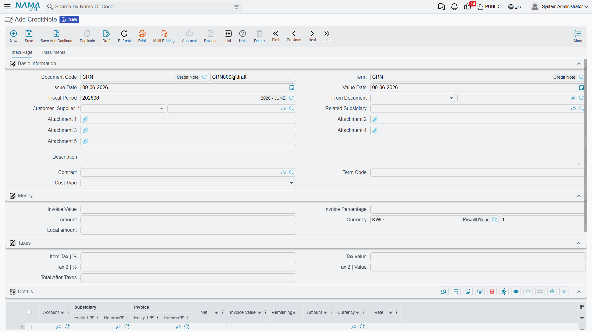

# Credit & Debit Notes

Sometimes you need to adjust a customer's or supplier's balance without any cash receipt or payment: a settlement discount for a customer, a sales return, or an extra charge on a supplier. That's the role of the **Credit Note** and the **Debit Note** — two opposite documents that move the party's balance in opposite directions.

::: info Required license
Credit and debit notes are part of the core `accounting` license.
:::

## The idea: adjusting a party's balance in two directions

- **Credit Note** (`Accounting > Documents > CreditNote`) — makes the party's account **credit**: it reduces what a customer owes us (a return/discount in their favor), or increases what we owe a supplier.
- **Debit Note** (`Accounting > Documents > DebitNote`) — makes the party's account **debit**: it increases what a customer owes (a fee/extra cost), or reduces what we owe a supplier.

The two screens are identical in structure and differ only in the direction of the effect, so explaining one is enough.

## Anatomy of a note

In the header you set the **Document Term** and **Value Date** (which determines the **Period**), the **Customer-Supplier** (the party concerned), and the **Related Subsidiary**, **Contract**, and **Cost Type** as needed.

In the **Amount** block you enter the **Amount** and **Currency** (with the corresponding **local value** shown), and the value can be computed as a **percentage of the linked invoice's amount**.

The **Taxes** block carries the **sales tax** (percentage and value) and a second tax if needed, plus the **net after tax**. And because the note is an official tax document, it's integrated with the **e-invoicing (ZATCA)** system: it carries the Zakat and Tax Authority fields (submission identifiers and approval status) that track its submission to the authority.

In the **Details** tab you match the note's value against specific **invoices** (each line shows the **invoice value**, **net**, and **remaining**), so the note's effect is deducted directly from the invoice balance. The document also provides an **installments** grid and a **Payments** tab.

## The accounting effect

The counter-side to the party's account — as well as the two tax sides — comes from the **document term** (see the [Document terms](./support/accounting-document-terms.md) reference). A credit note makes the party credit and the counter-side (revenue/return/discount) debit; a debit note reverses them.

## Reports and forms

- Party movements resulting from the notes appear in the party's account statement under [Account statements & trial balance](./reports-account-statements-and-trial-balance.md).
- Printed forms: debit note `SYSF-ACC004`, credit note `SYSF-ACC005`.

## For Support

- **"The note didn't reduce/increase the invoice balance"** — make sure it's matched to the invoice in the **Details** tab, not just entered as an amount in the header.
- **"The direction is reversed"** — make sure you're using the right type: **credit** to reduce a customer's receivable, **debit** to increase it.
- **"The note wasn't submitted to the authority / its status is pending"** — review the Zakat and Tax Authority fields and the approval status; e-invoicing integration is a topic separate from accounting.
- **"The wrong revenue/return or tax account"** — their source is the **document term**.
- Processing and reprocessing a stuck document are in [How documents are processed into accounting effects](./support/accounting-request-processing.md).
