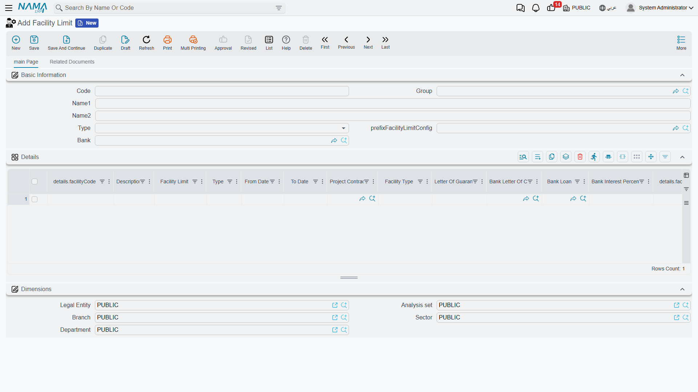
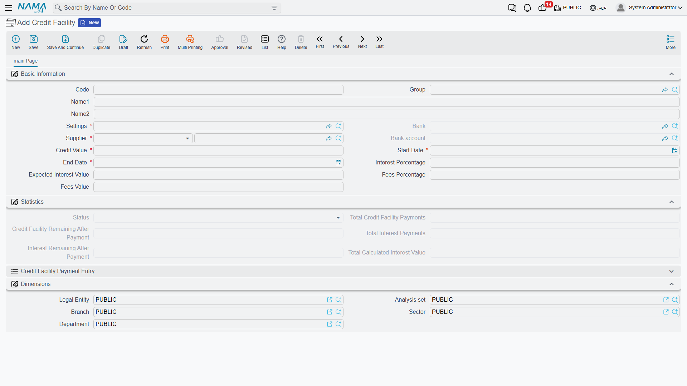
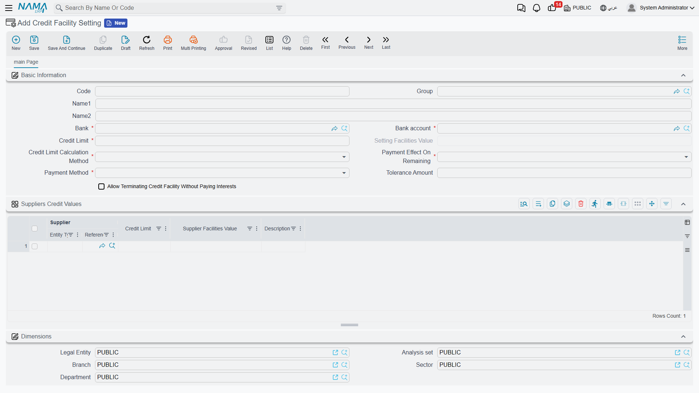

# Credit Facilities & Facility Limits

Two related but distinct ideas meet on this page:

- A **facility limit** is the **ceiling** the bank grants you, shared by a number of instruments — a loan here, a letter of guarantee there, a letter of credit — each of which reserves part of the ceiling, and the system tracks the **consumed and remaining** amounts.
- A **credit facility** is a standalone instrument: a revolving-drawdown agreement with the bank with its own value, interest and fees, issued, repaid and terminated through its own documents.

::: info Required license
Credit facilities are part of the `accounting-loans` license — the same license that covers [Bank Loans](./bank-loans.md) and [Fixed Deposits](./fixed-deposits.md).
:::

## Facility limit: the shared ceiling

On the **Facility Limit** screen (`Banks > Credit Facilities > Facility Limit`) the ceiling granted by a particular **bank** is defined, and its details are configured through the **Facility Limit Config** (`Banks > Credit Facilities > Facility Limit Config`).

As soon as a loan, letter of guarantee or LC is linked to a facility limit, it draws down from it at issue/opening; the system blocks any issue that would push the consumed amount over the ceiling. And because the three instruments share the same ceiling, the **Details of banking facilities** report (SYSR-LON002) gives you a unified picture of what's reserved across all of them.

## Credit facility: from setup to termination

A credit facility is a revolving-drawdown instrument, and its cycle runs like this:

1. **Credit Facility Setting** — the shared template: the interest-calculation method, the rule for allocating a payment between principal and interest, and the accounts.
2. **Credit Facility** — the master file in its "Not Started" status.
3. **Credit Facility Issuance** — activates the facility (it posts to the ledger, and the status flips to "In Progress").
4. **Credit Facility Payment** — repaying an installment that gets split between principal and interest per the setting (it posts to the ledger).
5. **Credit Facility Termination** — terminating the facility (status "Terminated").

### The facility master file

On the **Credit Facility** screen (`Banks > Credit Facilities > Credit Facility`) the terms are defined: the linked **setting**, the **supplier**, **bank** and **bank account**, the **credit facility value**, the **interest percentage** and **expected interest value**, the **fees percentage/value**, and the **start / end date**. The file shows live tracking totals: **total calculated interest value**, **total credit facility payments**, **total interest payments**, and the **credit-facility/interest remaining after payment**.

**Facility statuses:** Not Started → In Progress → Terminated.

### The setting

The **Credit Facility Setting** gathers the rules shared by similar facilities: the interest-calculation method (the **days per year for credit-facility interest calculation** option sets the calculation basis, default 365 — see [Accounting configuration](./support/accounting-configuration.md)) and the rule for splitting each payment between principal and interest.

### Issuance, payment and termination

**Issuance** activates the instrument and posts its effect (a **debit/credit** pair). Then each **payment document** splits its installment between principal and interest per the setting, posting via the sides: **payment of credit-facility value debit/credit**, **payment of interest value debit/credit**, and **payment value debit/credit**. Finally, the **termination document** closes the facility. (Where the accounts come from is in the [Document terms](./support/accounting-document-terms.md) reference.)

## Reports

| Report | Answers |
|---|---|
| Details of banking facilities (SYSR-LON002) | What's reserved and remaining of the facility limits across loans, guarantees, credits and facilities. |

## For Support

- **"What's the difference between a facility limit and a credit facility?"** — a facility limit is a ceiling shared by several instruments, while a credit facility is a standalone drawdown instrument with its own documents.
- **"Issuing a loan/letter/LC was rejected because of the limit"** — the consumed amount exceeds the linked facility-limit ceiling; check the Details of banking facilities report.
- **"The facility interest calculation looks wrong"** — check the **days per year** in [Accounting configuration](./support/accounting-configuration.md) and the allocation rule in the facility setting.
- **"Where do the payment accounts come from?"** — from the **Credit Facility Payment** term; see [Document terms](./support/accounting-document-terms.md).
- The accounting-processing mechanism is in [How documents are processed into accounting effects](./support/accounting-request-processing.md).
