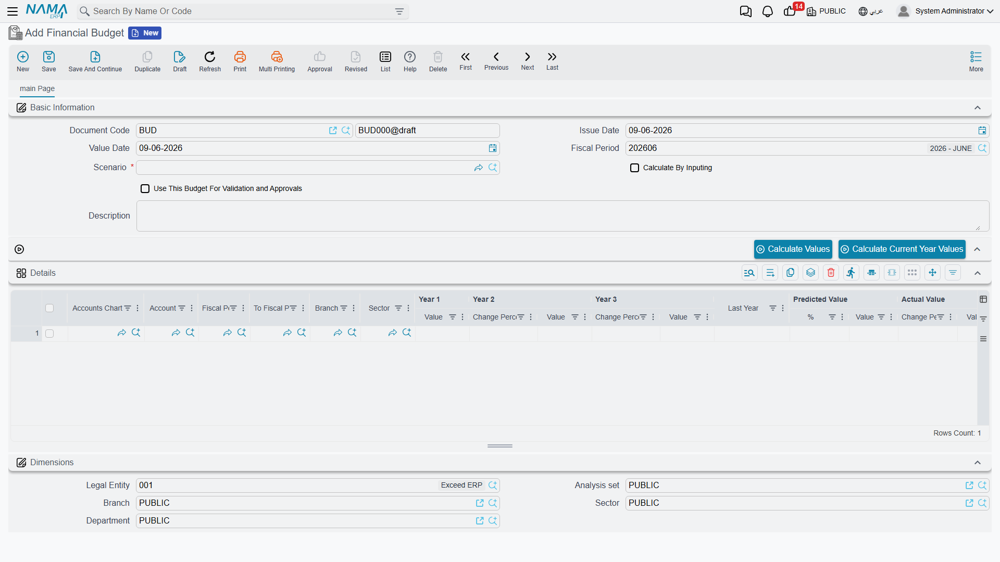

# Financial Budgets

A budget is a plan with teeth: you decide up front how much each account may spend (or should earn) over a period, and then — if you want — the system holds your documents to that plan, warning or even blocking spending that would blow past it. Nama's **financial budgets** let you set those targets per account, per period, and per dimension, and then validate actual activity against them.

::: info Required license
Financial budgets are part of the `accounting-budget` license, and live under the **Budgets** menu root.
:::

## Building a budget

The **Financial Budget** (`BUDGETS > Budgets > Financial Budget`) is the plan document. Each **details** line targets one **account** (within a chosen **accounts chart**) and carries a planned **value for the year** — and because budgeting is often multi-year, the line holds up to **six years** of values side by side, with optional **change percentages** to grow each year off the previous one automatically. The credit/debit split per year can be filled directly or calculated for you.

Every line is scoped by the **dimensions** that matter to you — legal entity, sector, branch, department, analysis set, subsidiary, even a record (entity dimension) — and by a **fiscal year / period** (a from–to period range). So "marketing department, branch Riyadh, this year: 500,000" is a single, precise budget line.

You can keep several budgets as **scenarios** (`BUDGETS > Master Files > Budget Scenario`) — an optimistic plan, a conservative one — and tag the budget with the scenario it belongs to.

## Turning a budget into a control

A budget only constrains spending if you tell it to. The switch is **"use this budget for validation"** — set on the budget (and per line, with an optional **validate-from / validate-to** date window). Once a budget is marked for validation, the system checks documents that hit its accounts against the planned figure.

**What "exceeding" means** is configured centrally, in the accounting module's **Budget Validation Options** (see the [Accounting configuration](./support/accounting-configuration.md) catalog). Two switches decide what happens when a document would push an account over its budget:

- **Prevent saving when budgets are exceeded** — the document is blocked outright.
- **Enable approvals for budgets** — instead of (or before) blocking, the over-budget document is routed for **approval**, so an authorized user can let it through.

If neither is on, the budget is informational only — it's tracked and reportable, but nothing stops the spend.

### Matching the right budget line

When it validates, the system needs to know *which* budget line a document maps to. The **Budget Validation Options** include a set of **"consider…"** toggles — consider sector, branch, department, analysis set, subsidiary, record (entity dimension), references 1–3, and fiscal period — that define how precisely actuals are matched to budget lines. Turn on the dimensions you budget by; leave off the ones you don't, so the match isn't too narrow to find its line.

## For Support

- **"My budget isn't stopping anything"** — three things must line up: the budget is marked **use for validation**, and at least one of **prevent saving** / **enable approvals** is on in the Budget Validation Options. Otherwise the budget is informational only.
- **"A document was blocked / sent for approval unexpectedly"** — it hit an account that has a validation budget and would exceed it; check the budget figure and the document's amount and dimensions.
- **"The system can't find the matching budget line"** — review the **consider…** toggles in the Budget Validation Options; if you budget by branch but "consider branch" is off (or vice-versa), the actual won't match the line.
- **"I want to compare plans"** — keep each plan as a separate **Budget Scenario** and tag its budget accordingly.
