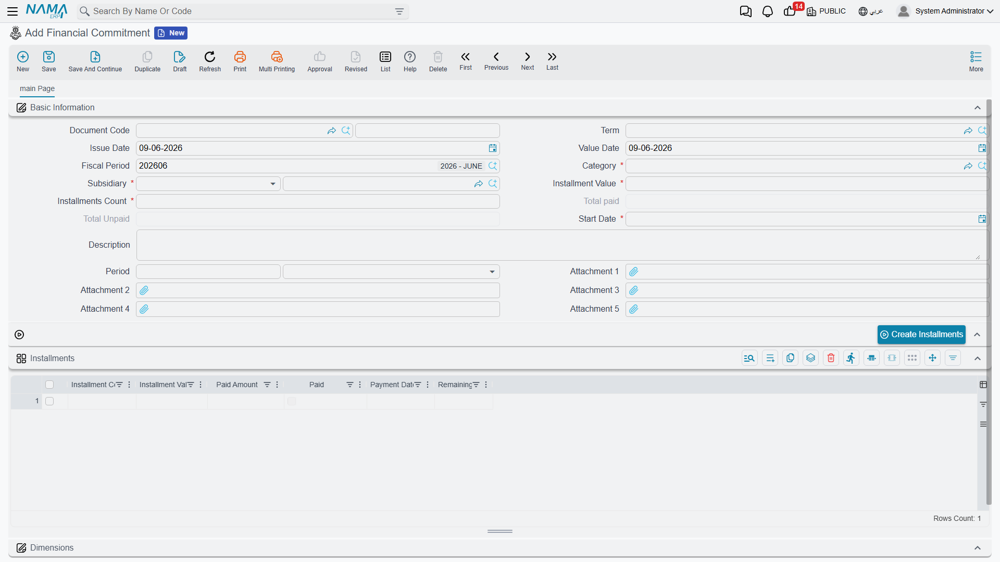
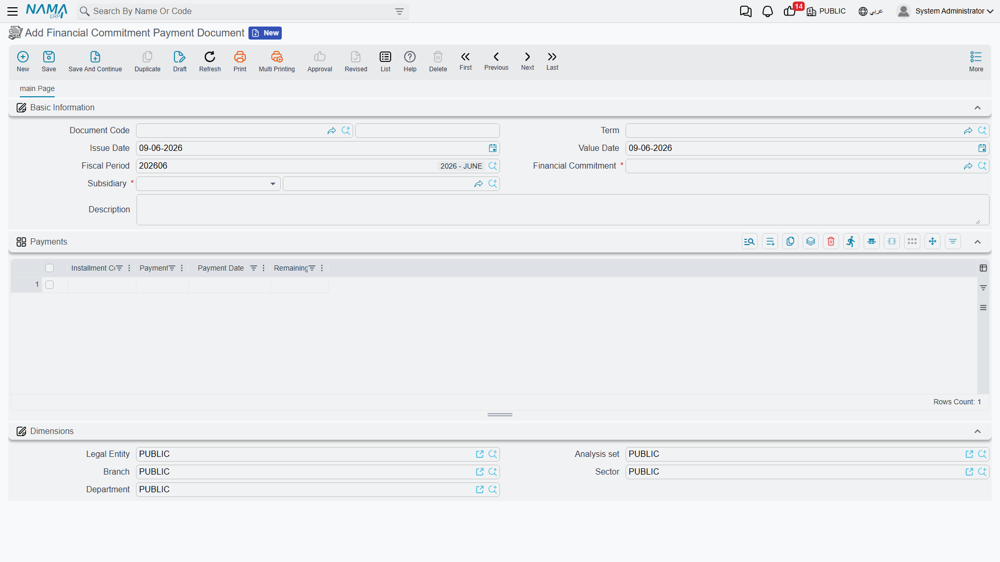

# Financial Commitments

A company carries many recurring obligations that aren't invoices yet but are very real: a yearly rent paid in quarterly installments, an insurance policy, a financing agreement with a fixed repayment schedule. The **financial-commitments** system is where you register these obligations, lay out their installment schedule, and track what's been paid against what's still due — a regulation-and-tracking layer that sits beside your ordinary vouchers.

::: info Required license
Financial commitments are part of the `accounting-financial-commitments-regulation` license.
:::

::: tip A tracking layer, not a posting document
The commitment and its payment document **do not post to the general ledger themselves**. They track the obligation and its settlement against the schedule; the actual money movement is recorded by your normal receipt/payment vouchers. Think of this system as the planner and watchdog over those obligations, not a replacement for the vouchers that move the cash.
:::

## The pieces

All screens are under the **Accounting > Financial Commitment Management** root:

1. **Financial Commitment Category** — a master file for classifying commitments (rent, insurance, financing…), so you can group and report on them.
2. **Financial Commitment** — the obligation itself: its total value, its **category**, a **start date**, a repayment **period** (every *n* months/…), and the resulting **installment schedule**.
3. **Financial Commitment Payment Document** — records a payment against a specific installment, updating that installment's paid/remaining figures.
4. **Financial Commitment Reschedule** — changes the schedule after the fact (add, edit or remove installments), keeping a before/after record of the change.

## Setting up a commitment

On the **Financial Commitment** (`Accounting > Financial Commitment Management > Financial Commitment`) you enter the obligation's **category**, its **start date**, the **installments count** and **installments value**, and the recurrence **period** (value + unit, e.g. every 1 month). From these the **Installments** grid is built — one line per installment carrying its **installment code**, **value**, **payment date**, and the running **paid amount** / **remaining** and a **paid** flag. The header keeps the rolling **total paid** and **total unpaid** so you can see at a glance where the obligation stands.

## Paying an installment

The **Financial Commitment Payment Document** (`Accounting > Financial Commitment Management > Financial Commitment Payment Document`) points at a **financial commitment** and records a payment against it. When committed, it updates the matching installment's **paid amount** and **remaining**, and flips the installment to **paid** once fully settled — so the commitment's totals always reflect reality.

## Rescheduling

Plans change — an installment is deferred, the amounts are renegotiated. The **Financial Commitment Reschedule** (`Accounting > Financial Commitment Management > Financial Commitment Reschedule`) lets you add, edit or delete installment lines on an existing commitment. It keeps two grids — the **details** (the new schedule) and the **details before edit** (the schedule as it was) — so the change is auditable.

## For Support

- **"The commitment didn't create a journal entry"** — that's expected; commitments and their payment documents don't post to the ledger. Record the actual cash movement with a normal receipt/payment voucher.
- **"The paid/remaining figures look wrong"** — they're driven by the **payment documents** linked to the commitment; check that each payment is committed and points at the right installment.
- **"I need to change the schedule"** — use a **Reschedule** document rather than editing the original commitment; it preserves the before/after history.
- **"An installment still shows unpaid after I paid it"** — confirm the payment document fully covered the installment value; partial payments leave a **remaining** balance until topped up.
