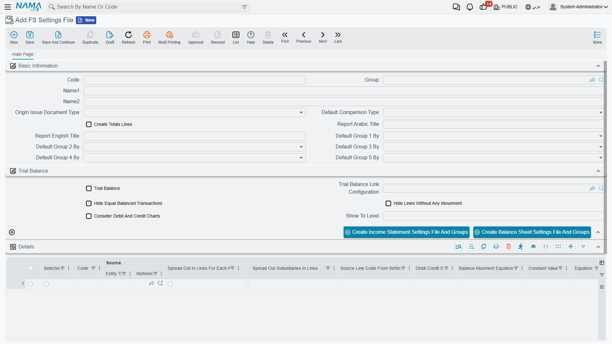
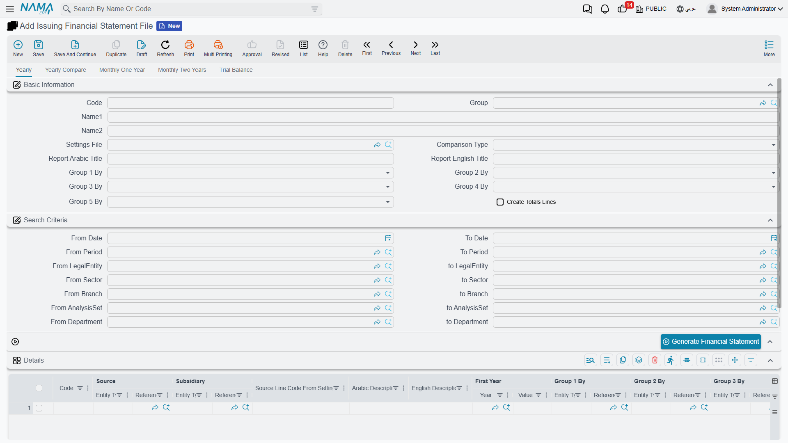
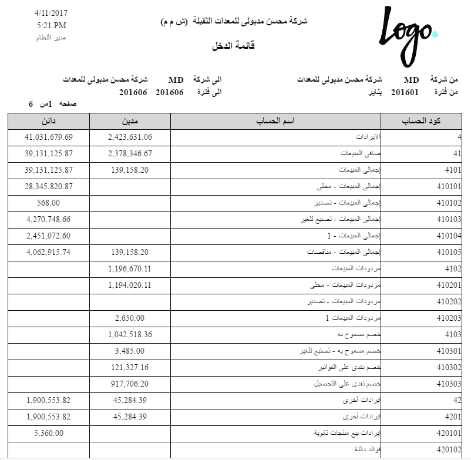
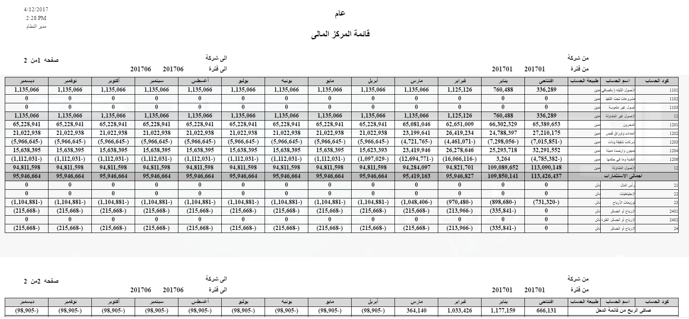

# Financial Statements

Every company needs an income statement and a balance sheet, but no two companies want them laid out exactly the same way — different line groupings, different subtotals, different comparison columns. Rather than hard-code a fixed report, Nama gives you a **configurable financial-statements engine**: you describe the shape of the statement once, then *issue* it for any period to get the numbers. The income statement, balance sheet and cash-flow reports you print are all output of this one engine.

::: info Required license
The financial-statements engine is part of the core `accounting` license. Its screens are under **Accounting > Financial Statement**.
:::

## The building blocks

You design a statement from four screens, working from the small pieces up to the finished report:

1. **FS Account Group** (`Accounting > Financial Statement > FS Account Group`) — a named bundle of accounts, so a statement line can say "Operating Revenue" and pull a whole group instead of listing accounts one by one.
2. **FS Equation** (`Accounting > Financial Statement > FS Equation`) — a reusable formula. Lines use equations to compute their value: a balance, a debit/credit movement, an opening figure, or a total rolled up from other lines.
3. **FS Settings File** (`Accounting > Financial Statement > FS Settings File`) — the **template**: the ordered set of lines that *is* the statement's structure, plus how it's grouped, compared and displayed.
4. **Issuing Financial Statement File** (`Accounting > Financial Statement > Issuing Financial Statement File`) — the **computed snapshot**: run a settings file for a period and it captures the actual numbers, ready to print and to compare against later issues.

## Designing the statement (the settings file)

The **FS Settings File** is where the statement takes shape. It carries an Arabic and English **report title**, and a grid of **lines** — each line is a row of the finished statement:

- a **level** that sets the row's place in the hierarchy (headings, sub-lines, totals), and an Arabic/English **description**,
- an **equation** that produces the row's value — there are separate equation slots for the **balance/movement**, the **debit-credit**, the **opening**, and the **totals**, so a single line can behave correctly whether it's a normal line or a subtotal,
- alternatively a **constant value**, or a reference to another line's value by its **source line code**,
- per-line **dimension limits** — "limit lines to branch / sector / department / analysis set / subsidiary / reference…" — so a line can be restricted to just one branch or cost center,
- and flags such as **invisible in reports** (a working line used only in calculations) and **spread out in lines / spread subsidiaries in lines** (explode a group or its subsidiaries into individual rows).

At the header you also choose how the whole statement behaves:

- the **comparison type** — **One Year**, **Two Years**, a **Period Set** (a run of consecutive periods, i.e. month-by-month columns), or **Two Period Sets** (the same months across two years),
- up to five **grouping axes** (**group by** legal entity, branch, department, sector, analysis set, references, record, or subsidiary) — so the same statement can be broken down by dimension,
- and display options: **create totals lines**, **hide zero-value balances**, **hide equal-balanced transactions**, **show to level** (collapse detail beyond a depth), and **consider debit and credit charts**.

## Issuing a statement

A settings file is just the design; the numbers come from an **issue**. The **Issuing Financial Statement File** runs a settings file for a chosen period and stores the computed result as a saved issue. That snapshot is what the FS-issue reports print — and because each issue is preserved, you can compare this month's issue against last month's, or this year against last.

## The reports

The printed statements all come out of this engine, under the report menu (`Acc-FNS`, codes `SYSR-FNS*`):

- **Income statement** — by accounts (`SYSR-FNS001`), monthly (`SYSR-FNS002`), and grouped by dimension (`SYSR-FNS009`).
- **Balance sheet** — by accounts (`SYSR-FNS003`), monthly (`SYSR-FNS004`), by balances and by account category.
- **Cash-flow statement.**
- **Issue-driven statements** that print from a saved issue: monthly income statement one/two years (`SYSR-FNS010`/`SYSR-FNS011`), yearly income statement one/two years (`SYSR-FNS012`/`SYSR-FNS013`), yearly balance sheet one/two years (`SYSR-FNS014`/`SYSR-FNS015`), plus an FS trial balance.

## For Support

- **"A line shows the wrong number"** — check the line's **equation** (balance vs debit-credit vs opening vs totals) and any **dimension limits** on it; a line limited to one branch only sums that branch.
- **"A subtotal isn't adding up"** — totals lines use the **totals equation** and reference other lines by **source line code**; verify those references and the line **levels**.
- **"The comparison columns are missing/wrong"** — that's the **comparison type** (One Year / Two Years / Period Set / Two Period Sets) on the settings file.
- **"The figures are out of date"** — the issue-driven reports print a saved **issue**; re-issue the settings file for the period to refresh the snapshot.
- **"Zero/empty rows clutter the statement"** — turn on **hide zero-value balances** (and **show to level** to collapse deep detail).
