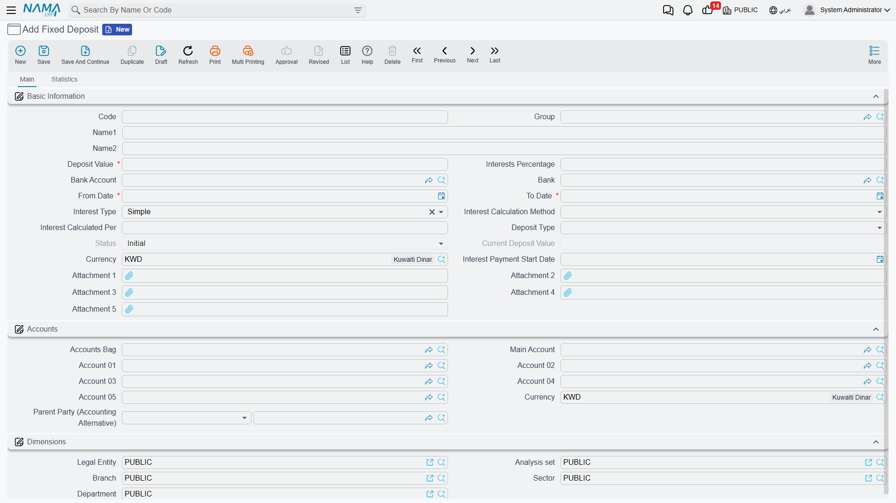
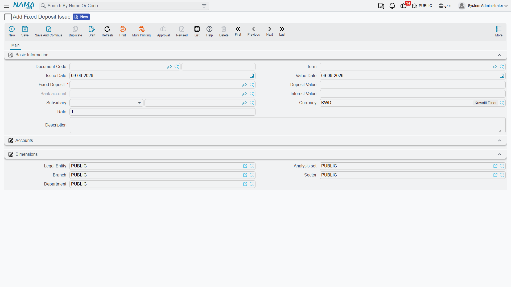

# Fixed Deposits

A fixed deposit is the mirror image of a loan: instead of borrowing from the bank, you place an amount with it for a set term in return for interest. Nama tracks it with the same logic it uses for [Bank Loans](./bank-loans.md): a master file holding the deposit terms, then an issue document that posts it, then periodic interest-payment documents that lock in the interest.

::: info Required license
Fixed deposits are part of the `accounting-loans` license — the same license that covers [Bank Loans](./bank-loans.md) and [Credit Facilities](./credit-facilities.md).
:::

## The deposit's lifecycle

Every screen hangs off the **Banks > Fixed Deposits** root:

1. **Fixed Deposit** — the master file in its initial status "Initial".
2. **Fixed Deposit Issue** — the moment the amount actually goes out into the deposit (it posts to the ledger, and the status flips to "Released").
3. **Interest Payment Document** — locking in the periodic interest payments (the same document used for loans).
4. **Fixed Deposit Changing** — amending the deposit data after it's been issued.

## The deposit's master file

On the **Fixed Deposit** screen (`Banks > Fixed Deposits > Fixed Deposit`) the terms are defined: the **bank** and **bank account**, the **deposit type**, the **deposit value**, the **from date / to date**, the **calculated per** (the interest-calculation period), the **interest percentage**, **interest type**, **interest calculation method** and **interest payment start date**.

**Interest type:** Simple or Compound. The **interest calculation method** sets the calculation frequency: Yearly, Monthly or Daily.

**Deposit statuses:** Initial → Released → In Progress → Finished / Cancelled.

## Issuing and paying interest

When a **Fixed Deposit Issue** (`Banks > Fixed Deposits > Fixed Deposit Issue`) is recorded, the amount goes out of your account into the deposit with the bank, the accounting effect posts via the **interest value debit/credit** sides alongside the principal, and the deposit's status flips to "Released".

The due interest is then locked in periodically via the **Interest Payment Document** (`Banks > Fixed Deposits > Interest Payment Document`) — the document shared with loans. (Where the issue and interest accounts come from is in the [Document terms](./support/accounting-document-terms.md) reference.)

## Amendment

A **Fixed Deposit Changing** document is used to amend the deposit data after it's been issued, within the system's controls.

## Printed forms

| Form | Document |
|---|---|
| Fixed Deposit (SYSF-BNK010) | The deposit's data printout. |
| Fixed Deposit Issue (SYSF-BNK011) | The deposit-issue document printout. |

## For Support

- **"The deposit is still Initial"** — the deposit-issue document hasn't been recorded yet; issuing is what moves the amount out and advances the status.
- **"The interest isn't computed as I expect"** — check the **interest type** (Simple/Compound) and the **interest calculation method** (Yearly/Monthly/Daily) on the deposit.
- **"The same interest-payment document shows up under loans"** — that's correct; the document is shared between deposits and [Loans](./bank-loans.md).
- **"Where do the interest accounts come from?"** — from the **Fixed Deposit Issue** and **Interest Payment Document** terms; see [Document terms](./support/accounting-document-terms.md).
- The accounting-processing mechanism is in [How documents are processed into accounting effects](./support/accounting-request-processing.md).
