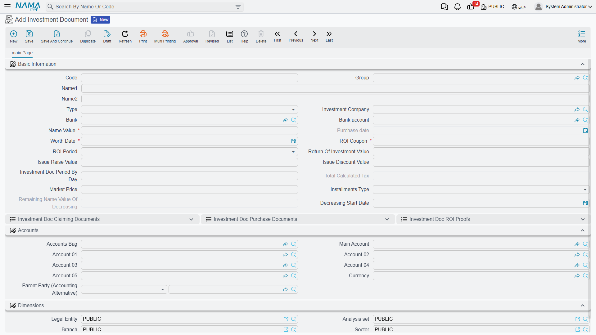
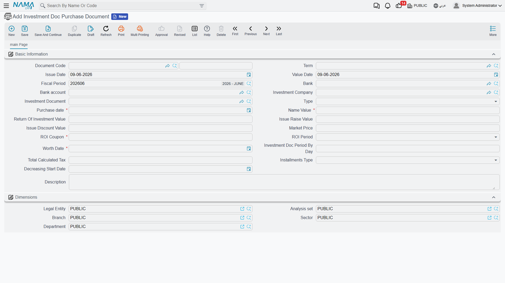
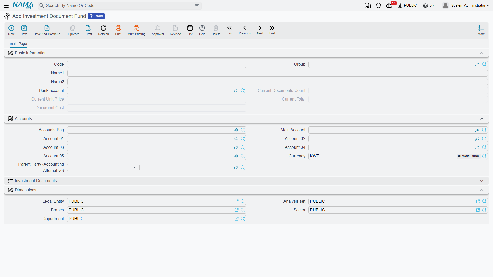

# Investment Documents & Fund Certificates

Beyond the portfolio system that tracks investment *assets*, Nama has a second investment world for the **paper instruments** a company buys and holds: bonds and fund certificates. These behave very differently from an equity stake, so they get their own documents. This page covers both — and they themselves split into two kinds, which is the first thing to get straight.

::: info Required license
Investment documents are part of the `accounting-investment-documents` license — the same license that covers **[treasury bills](./treasury-bills.md)**. Screens are under **Banks > Investment Documents** (and **Banks > Document Investments** for funds).
:::

## Two kinds of instrument — and why both exist

The two answer different needs, so don't mix them up:

- **Investment Document** (سند استثمار) — a **bond-like** instrument. You lend money against a paper that has a **nominal (name) value** and pays a periodic **coupon return** (ROI). It can be a **treasury bond** or a **company bond**, and its principal repayment can be **fixed** (the whole nominal comes back at maturity) or **decreasing** (the nominal is paid down over the life of the bond). The return is a known coupon — you're a lender.
- **Investment Document Fund** (صندوق استثمار وثيقة) — a **unit-based** fund certificate. You buy a **number of units** at a **unit price**, and your holding is worth units × current price. There's no fixed coupon; your gain or loss is the movement in the unit price — you're a unit-holder.

In short: bonds for a fixed, coupon-style return; funds for a price-driven holding. Treasury **bills** (a third, short-term discount instrument) are covered on their [own page](./treasury-bills.md).

## Investment documents (bonds)

The **Investment Document** master (`Banks > Investment Documents > Investment Document`) describes the bond: its **type** (treasury / company bond), **nominal value**, **coupon** rate and **ROI period**, the **fixed / decreasing** installments type (with a **decreasing start date** and the **remaining nominal of decreasing** tracked), the **issue discount / issue premium**, the **market price**, and the **investment company**. Its **status** follows the familiar **Initial → Ongoing → Closed** path.

The bond is brought to life by a chain of documents:

1. **Investment Doc Purchase Document** (`Banks > Investment Documents > Investment Doc Purchase Document`) — the purchase, and the document that **posts**. Its effect carries the **nominal value** debit/credit, plus the **issue discount** and **issue premium (raise)** sides — because a bond is rarely bought exactly at par.

   

2. **ROI Proof** (and **Aggregated ROI Proof** for several at once) — locking in the periodic coupon return.
3. **Claiming** — collecting the document's value at maturity.

## Investment document funds (unit certificates)

The **Investment Document Fund** master (`Banks > Investment Document > Investment Document Fund`) tracks a unit-based holding, valued as units × unit price.

It has its own three documents: a **Purchase** (buying units), a **Sale** (selling units), and a **Price Update** (revaluing the holding as the unit price moves). Because a fund's worth tracks the market, the price-update document is what keeps its value current between buying and selling.

## Profit distribution

When investments yield profit to be shared out among partners, the **Profits Distribution Doc** (`Accounting > Documents > Profits Distribution Doc`) records and distributes it. Its printed form is `SYSF-ACC023`.

## For Support

- **"Which one do I create — a document or a fund?"** — a bond with a nominal value and coupon → **Investment Document**; a holding measured in units at a unit price → **Investment Document Fund**.
- **"There's no screen to create the bond manually"** — the bond master is set up, but its accounting starts with the **Purchase Document**; the return then comes via **ROI Proof**.
- **"The fund's value is stale"** — funds are revalued by a **Price Update** document; without one, the holding shows its last known price.
- **"A decreasing bond's nominal isn't going down"** — check the **decreasing start date** and installments type; the **remaining nominal of decreasing** tracks what's left.
- **"Where do the nominal / discount / premium accounts come from?"** — from the **Investment Doc Purchase** term; see [Document terms](./support/accounting-document-terms.md).
