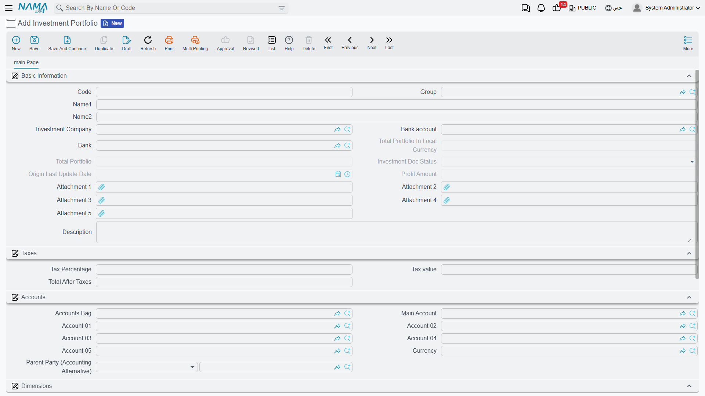
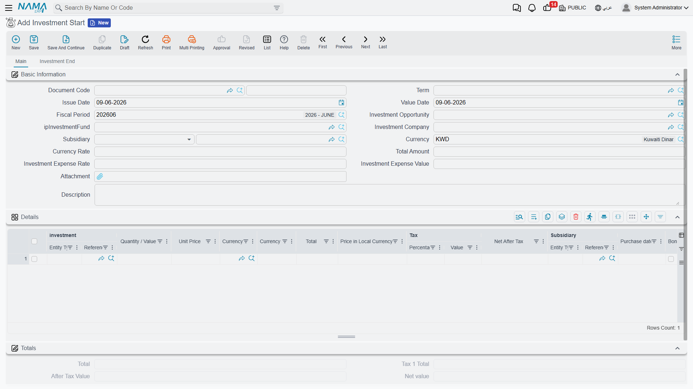

# Investment Portfolios

When a company puts money into ventures — a stake in another business, a project, a managed fund — it needs to track each investment as an asset in its own right: how much capital went in, what it's worth now, what profit it threw off, and when it was wound down. The **investment-portfolios** sub-system is built for exactly this: it follows an investment asset from a first opportunity, through deploying the capital, to distributing profits and finally closing it out.

::: info Required license
Investment portfolios are part of the `accounting-investment` license. Most screens are under **Accounting > Investment Portfolios**.
:::

::: tip Two investment systems, side by side
Nama has *two* parallel investment sub-systems. This page covers **investment portfolios** — tracking investment *assets* (stakes, projects, funds) over their life. The other, **[investment documents & fund certificates](./investment-documents.md)**, covers bond-like instruments and unit-based fund certificates. They solve different problems; pick the one that matches what you hold.
:::

## The master files

Before recording activity you set up the players and the asset:

- **Investment Portfolio** (`Accounting > Investment Portfolios > Investment Portfolio`) — the investment asset itself. It carries the **investment company**, the **bank / bank account** funding it, the running **total portfolio** value (in document and local currency), the **profit amount**, and any **tax**. Its **status** moves **Initial → Ongoing → Closed** as the lifecycle documents act on it.
- **Investor** (`Accounting > Investment Portfolios > Investor`) — a party that invests.
- **Investment Project** (`Accounting > Investment Portfolios > Investment Project`) — a project that capital is allocated to.

There are also building-block files — **shares**, **stakes**, **cash deposits**, **investment funds** and **fund types** — that describe the make-up of what's held.

## The lifecycle

The portfolio's life is driven by a sequence of documents:

1. **Investment Opportunity** (`Banks > Investment Documents > Investment Opportunity`) — the planning stage: a candidate investment being studied before any money moves.
2. **Investment Start** (`Accounting > Investment Portfolios > Investment Start`) — deploys the capital. This is the document that **posts**: it moves the portfolio to **Ongoing** and records the investment. Its effect runs through the **Debit / Credit** sides (the investment asset against the funding bank/cash), the **Investment Expense** sides for any acquisition costs, and the **Tax** sides.

   

3. **Investment Update** (`Accounting > Investment Portfolios > Investment update`) and **Investment Capital Increase** (`… > Investment Capital Increase`) — revalue the investment or inject more capital while it's running.
4. **Investment Profit Distribution** (`Accounting > Investment Portfolios > Investment Profit Distribution`) — books the profit the investment yields and distributes it.
5. **Investment End** (`Accounting > Investment Portfolios > Investment End`) — winds the investment down and sets the portfolio to **Closed**.

Alongside these, **Investment Allocation** and **Refund Investment Allocation** (`… > Investment Allocation` / `Refund Investment Allocation`) move capital to and back from **investment projects**, and the **Investment Budget** (`… > Investment Budget`) plans figures for those projects.

## Reports

The **Investment Projects Balance Sheet** (`SYSR-IVS001`) summarizes the standing of the investment projects.

## For Support

- **"The portfolio is stuck at Initial"** — it only moves to **Ongoing** when an **Investment Start** is committed against it; check that document.
- **"I can't close the investment"** — closing is done by an **Investment End** document, not by editing the portfolio.
- **"Profit isn't showing"** — profit is booked by **Investment Profit Distribution**; the portfolio's **profit amount** reflects those documents.
- **"Which investment system do I use?"** — portfolios (here) track investment *assets* over their life; for bonds and fund certificates use [investment documents](./investment-documents.md).
- **"Where do the investment / expense / tax accounts come from?"** — from the **Investment Start** term; see [Document terms](./support/accounting-document-terms.md).
