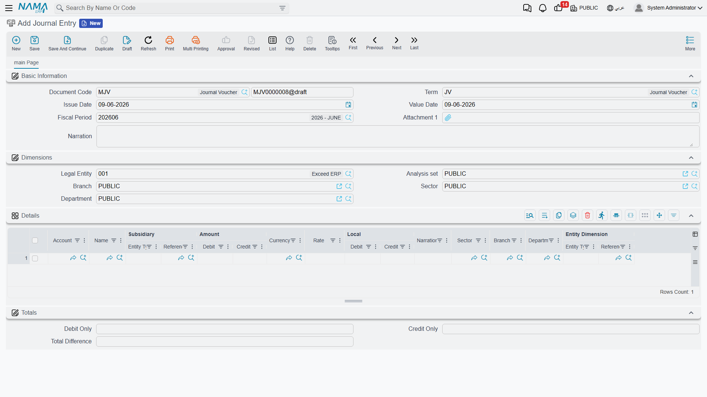

# Journal Entries & Adjustments

Most entries in Nama are generated automatically from other documents (an invoice, a stock issue, a payroll run...), but there's always a need to record **manual** entries: an adjustment, a petty expense, an opening balance, clearing a suspense account. That's the job of the **Journal Entry**. Alongside it are specialized entry documents that handle particular cases: the **Currency Diff Journal**, the **Exchange Rate Update**, and the **Inter-Company Transfer**.

::: info Required license
The journal entry, currency-difference journal, and inter-company transfer are part of the core `accounting` license. The **Exchange Rate Update**, however, is a feature within the banks license `accounting-banks`.
:::

## The Journal Entry

The journal entry (`Accounting > Documents > Journal Entry`) is the balanced document where you enter the debit and credit lines yourself — with the condition that total debit equals total credit before the system will accept it.

### Document header

In the header you set:

- **Document Term** — the term (`توجيه`) that governs the entry's behavior and where its special accounts (such as the difference account) come from. Term details are in the [Document terms](./support/accounting-document-terms.md) reference.
- **Document Number** and **Creation Date** — the serial number and the document's creation date.
- **Value Date** — the accounting date the effect is recorded under (which determines the period), and may differ from the creation date.
- **Period** — the accounting period the value date falls in; the system sets it automatically, and if it's closed the save is rejected.
- **Narration** and **dimensions** (legal entity, branch, sector, department, analysis set) at the document level.

### Detail lines

In the **Details** grid each line carries:

- **Account** and **Subsidiary** (the party, if the account is of subsidiary type).
- **Debit Amount** or **Credit Amount** — the line's value on its side, in the line's currency, with the corresponding **local** value shown after translation at the exchange rate.
- **Reference**, **Narration**, and line dimensions (sector/branch/department) for whoever needs finer detail than the document header.
- Tax fields (tax 1 and 2 percentage and value) appear when the tax features are enabled, linking the manual entry to its tax effect.

### Balancing and the difference account

At the bottom of the screen the **Totals** show: **Total Debit**, **Total Credit**, and **Total Difference**. As long as the total difference is non-zero, the entry is unbalanced and won't save. The term lets you specify a **difference account** that absorbs small rounding differences automatically so the entry balances — so you don't have to chase fractions by hand.

### Cost allocation

The **Cost Allocation** grid lets you distribute the entry's value across cost centers/dimensions independently of the debit and credit lines, for managerial analysis.

## Currency Diff Journal

The **Currency Diff Journal** (`Accounting > Documents > Currency Diff Journal`) is a specialized entry for recording the differences arising from exchange-rate fluctuations on foreign-currency balances. It's most often generated automatically as a result of an **Exchange Rate Update** (see below), but it remains a standalone document you can review and print.

## Exchange Rate Update

When currency rates change, your foreign-currency balances need **revaluation** at the new rate. The **Exchange Rate Update** (`Accounting > Documents > Exchange Rate Update`) does this in one batch: you specify the **account** (or a range of accounts), the **currency**, the new **exchange rate**, and the **mediator account** where revaluation differences are recorded; the system computes the difference for each balance and generates the corresponding currency-difference entries.

::: warning
Accounts with **Do Not Auto-Include In Exchange Rate Update** enabled (see [Accounts](./accounts.md)) are excluded from revaluation. This is a feature within the banks license `accounting-banks`.
:::

## Inter-Company Transfer

When transferring value between two companies in the same group, the **Inter-Company Transfer** (`Accounting > Documents > Inter Company Transfer`) records both sides in one step: it generates a **journal entry** in the first company and a matching one in the second, so the "inter-company current" accounts stay in sync without double manual entry.

## Reports and forms

- Entry and daily-movement statements (`SYSR-ACC` journal statements) are covered on the [Account statements & trial balance](./reports-account-statements-and-trial-balance.md) page.
- The printed form for the journal entry is `SYSF-ACC001`, for the currency-difference journal `SYSF-ACC008`, and for the inter-company transfer `SYSF-ACC007`.

## For Support

- **"The entry won't save — unbalanced"** — check the **Total Difference**; it must be zero. If it's a tiny fraction, enable/review the **difference account** in the term.
- **"Save rejected because of the period"** — the value date falls in a **closed** period or no period covers it; see [Year-end & period control](./year-end-and-period-control.md).
- **"Tax fields don't appear on the entry"** — the tax features aren't enabled in the [Accounting configuration](./support/accounting-configuration.md) catalog.
- **"Where does the difference account / the term's accounts come from?"** — from the **document term**; details in the [Document terms](./support/accounting-document-terms.md) reference.
- How a document turns into an accounting effect and how to reprocess a stuck entry are in [How documents are processed into accounting effects](./support/accounting-request-processing.md).
