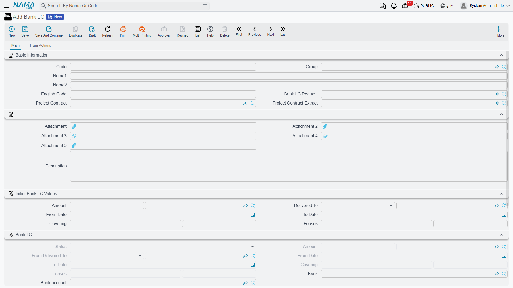
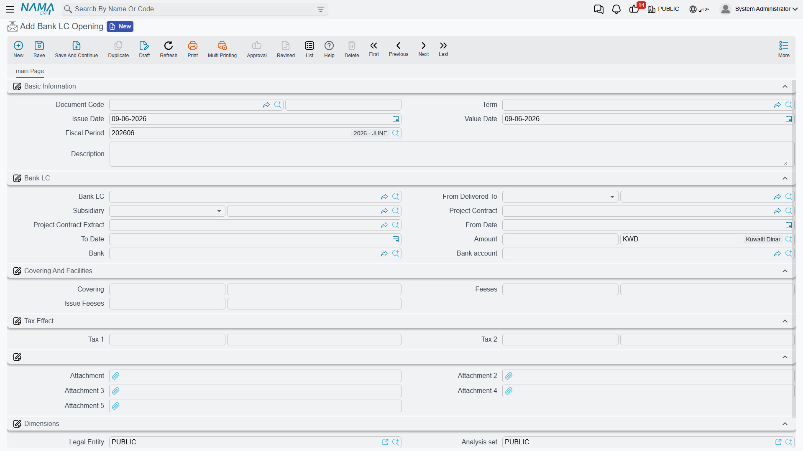

# Letters of Credit

A letter of credit (LC) is a tool an importer uses to reassure the supplier: the bank undertakes to pay the supplier the shipment's value once they present shipping documents matching the terms. Like a letter of guarantee, an LC **reserves part of your facility limit** and charges you **fees**, and it's tracked as a master file with a succession of opening, amendment and closing documents, keeping the two snapshots of **initial values** and **current values**. Its structure is very close to that of [Letters of Guarantee](./letters-of-guarantee.md).

::: info Required license
Letters of credit are part of the `accounting-blc` license.
:::

## The LC's lifecycle

Every screen hangs off the **Banks > Bank LC** root:

1. **Bank LC Request** — documenting the LC request before opening it (no accounting effect).
2. **Bank LC** — the master file in its initial status "Initial".
3. **Bank LC Opening** — the moment the bank actually opens the LC (it posts to the ledger, reserves the facility, and the status flips to "Issued").
4. **Bank LC Changing** — changing the value, term or fees (updates the current values).
5. **Bank LC Closing** — closing the LC and releasing the reserved facility.

## The LC's master file

On the **Bank LC** screen (`Banks > Bank LC > Bank LC`) the LC's data is defined:

- **Basic information**: the **bank** and **bank account**, linking the LC to the **LC request**, **facility limit** and **project contract** (and **project contract extract**) when needed, and the **LC type**.
- **Initial BLC values**: a snapshot of the opening terms — the **LC amount** and **currency**, **from date / to date**, the **covered amount** (covered in cash) and its percentage, the **facilities** (reserved portion) and its percentage, the **issue fees** and **change fees**.
- **Current values**: the values in force after any amendment, plus the **status**.

### LC statuses

The LC moves through the same statuses as a letter of guarantee: **Initial** → **Issued** → (**Received** / **Totally Delivered**) → **Finished** / **Canceled** / **Liquidated**.

## Opening and reserving the facility

When a **Bank LC Opening** (`Banks > Bank LC > Bank LC Opening`) is recorded the accounting effect posts and the facility portion is reserved. The opening term covers the sides: **LC amount debit/credit**, **facilities amount debit/credit**, **fees debit/credit** (with **tax fees 1 and 2**), and the **covering** side. (Where the accounts come from is in the [Document terms](./support/accounting-document-terms.md) reference.)

::: warning Facility-limit check
At opening, the system checks that the total reserved doesn't exceed the **facility limit** linked to the LC, blocking the opening if it does. Details in [Credit Facilities](./credit-facilities.md).
:::

## Amendment and closing

**Changing** is used to raise or lower the LC value or extend its term — it updates the current values while keeping the initial values for comparison, and records the **change fees**. **Closing** closes the LC and releases the reserved facility.

## Reports

| Report | Answers |
|---|---|
| Raw-material prices by initial LC invoices (SYSR-LCD001) | Linking imported-material cost to the LC's initial invoices. |
| Analysis of costly LCs (SYSR-LCD002) | The highest-cost LCs for comparison and analysis. |

## For Support

- **"Couldn't open the LC — limit exceeded"** — the reserved amount exceeds the linked facility limit; see [Credit Facilities](./credit-facilities.md).
- **"What's the difference between initial and current values?"** — the initial ones are a snapshot of the opening terms, and the current ones reflect the latest amendment.
- **"Where do the amount, facility and fee accounts come from?"** — from the **Bank LC Opening** term; see [Document terms](./support/accounting-document-terms.md).
- The accounting-processing mechanism is in [How documents are processed into accounting effects](./support/accounting-request-processing.md).
