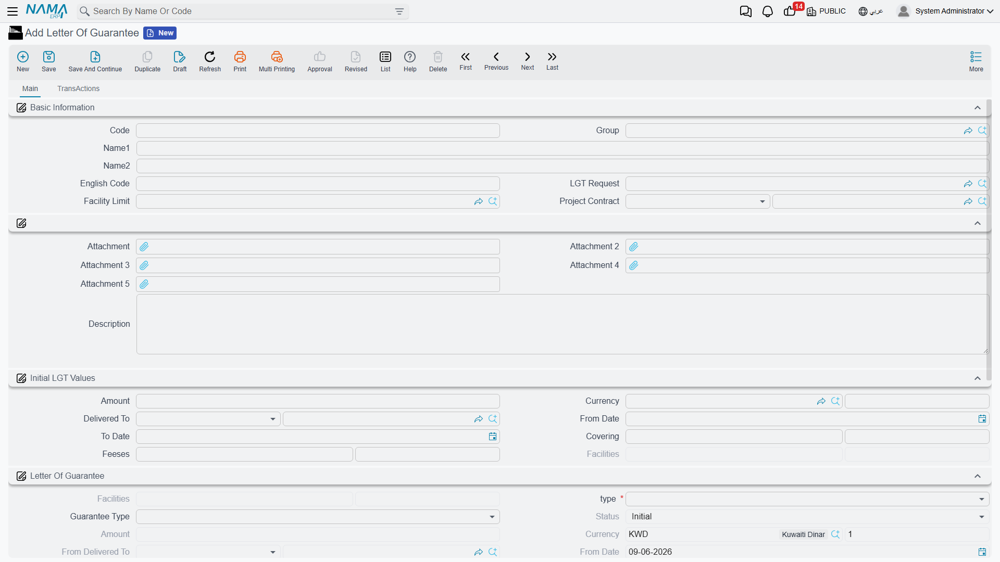
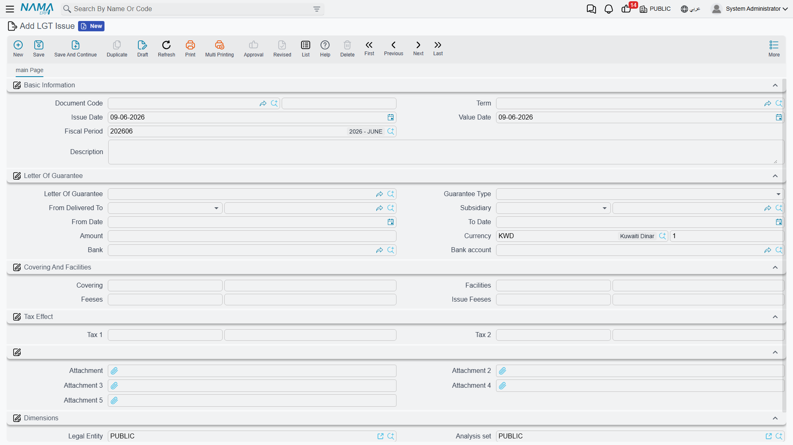

# Letters of Guarantee

A letter of guarantee is an undertaking the bank issues on your behalf in favor of a third party (a government body, a project owner…) guaranteeing that you'll meet some obligation — like a tender-entry guarantee or a contract performance guarantee. No actual cash leaves you when it's issued, but it **freezes part of your facility limit** with the bank and charges you **fees**. So Nama tracks the letter of guarantee as a master file with a succession of movement documents that issue it, receive and deliver it, amend it and close it — always keeping two snapshots: the **initial values** at issue and the **current values** after amendments.

::: info Required license
Letters of guarantee are part of the `accounting-lgt` license.
:::

## The letter's lifecycle

Every screen hangs off the **Banks > Letters Of Guarantee** root:

1. **LGT Request** — documenting the request before issuing (no accounting effect).
2. **Letter Of Guarantee** — the master file in its initial status "Initial".
3. **LGT Issue** — the moment the bank actually issues the letter (it posts to the ledger, and the status flips to "Issued").
4. **LGT Receipt / Delivery** — tracking the circulation of the paper copy with the beneficiary.
5. **LGT Changing** — extending the term or changing the value or fees (updates the current values and records the change fees).
6. **LGT Closing** — closing the letter when it ends or is canceled.

An **LGT Opening Doc** is used to enter the balances of existing letters when starting work on the system.

## The letter's master file

On the **Letter Of Guarantee** screen (`Banks > Letters Of Guarantee > Letter Of Guarantee`) the letter's data is defined:

- **Basic information**: linking the letter to the **LGT request** that preceded it, to the **facility limit** it reserves from, and to a **project contract** when needed.
- **Initial LGT values**: a snapshot of the issue terms — the **amount** and **currency**, **who it's delivered to**, **from date / to date**, the **covered amount** (covered in cash), the **facilities** (the reserved portion of the facility limit), and the **fees**.
- **Letter of guarantee (current values)**: the **LGT type**, the **guarantee type** and the **status**, plus the values in force after any amendment (amount, covered, facilities, change fees).

The **guarantee type** classifies the letter's purpose: **initial guarantee** (tender entry), **final guarantee** (performance), **advance-payment guarantee**, **customs guarantee**, or other types.

### Letter statuses

| Status | When |
|---|---|
| Initial | when saved before issuing. |
| Issued | after the issue document posts. |
| Received / Totally Delivered | after tracking the circulation of the letter copy. |
| Finished | after a normal close. |
| Canceled | on cancellation. |
| Liquidated | when the letter is liquidated (the beneficiary claims its value). |

## Issuing and reserving the facility

When an **LGT Issue** (`Banks > Letters Of Guarantee > LGT Issue`) is recorded the accounting effect posts and the facility portion is reserved. The issue term covers several sides: **LGT amount debit/credit**, **facilities amount debit/credit** (the reserved portion of the facility limit), **fees debit/credit** (with **tax fees 1 and 2**), and the **covering** side. (Where these accounts come from is explained in the [Document terms](./support/accounting-document-terms.md) reference.)

::: warning Facility-limit check
At issue, the system checks that the total reserved doesn't exceed the **facility limit** linked to the letter. If it does, issuing is blocked. The details of facility limits are in [Credit Facilities](./credit-facilities.md).
:::

## Receipt, delivery, amendment and closing

The **Receipt** and **Delivery** documents track the circulation of the paper copy of the letter. **Changing** is used to extend the letter's term or change its value or fees — it updates the current values while keeping the initial values as a reference, and records the **change fees**. Finally, **Closing** closes the letter and releases the reserved facility.

## Reports

| Report | Answers |
|---|---|
| Letter of Guarantee movements (SYSR-LGT001) | Each letter's movements: issue, amendments, closing, and covered/facility balances. |

## For Support

- **"Couldn't issue the letter — limit exceeded"** — the reserved amount exceeds the linked facility limit; see [Credit Facilities](./credit-facilities.md).
- **"What's the difference between initial and current values?"** — the initial ones are a snapshot of the issue terms, and the current ones reflect the latest amendment; both stay on the letter for comparison.
- **"Where do the amount, facility and fee accounts come from?"** — from the **LGT Issue** term; see [Document terms](./support/accounting-document-terms.md).
- The accounting-processing mechanism is in [How documents are processed into accounting effects](./support/accounting-request-processing.md).
