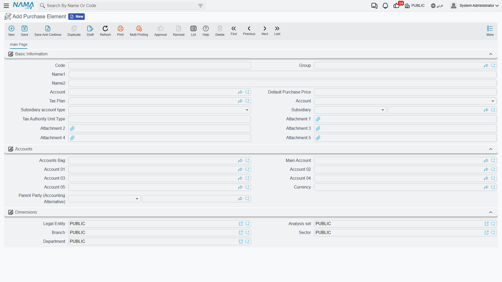
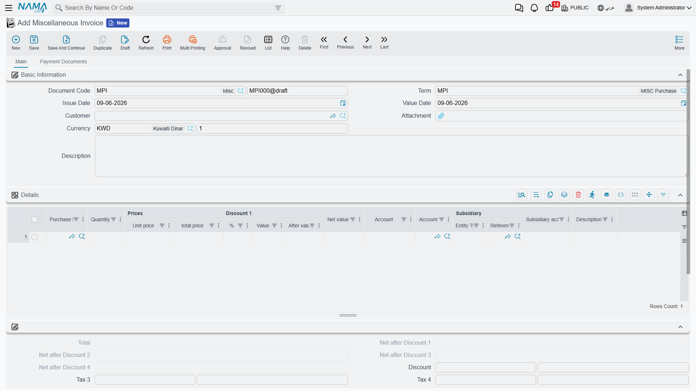
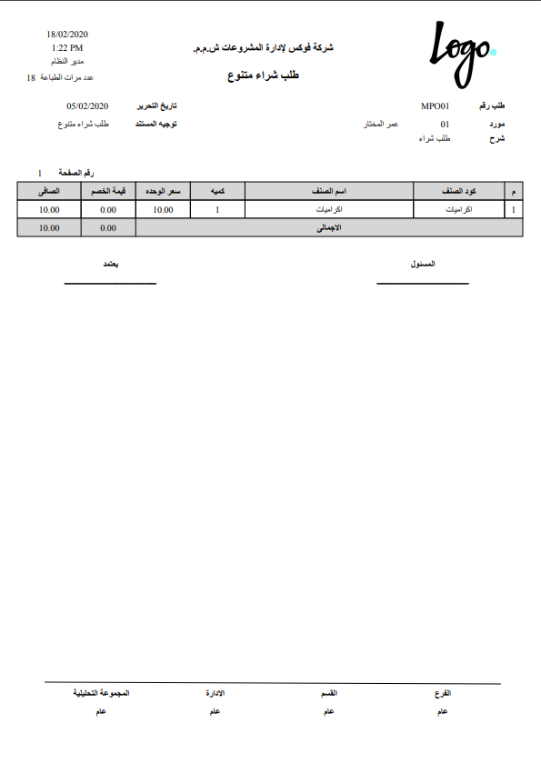
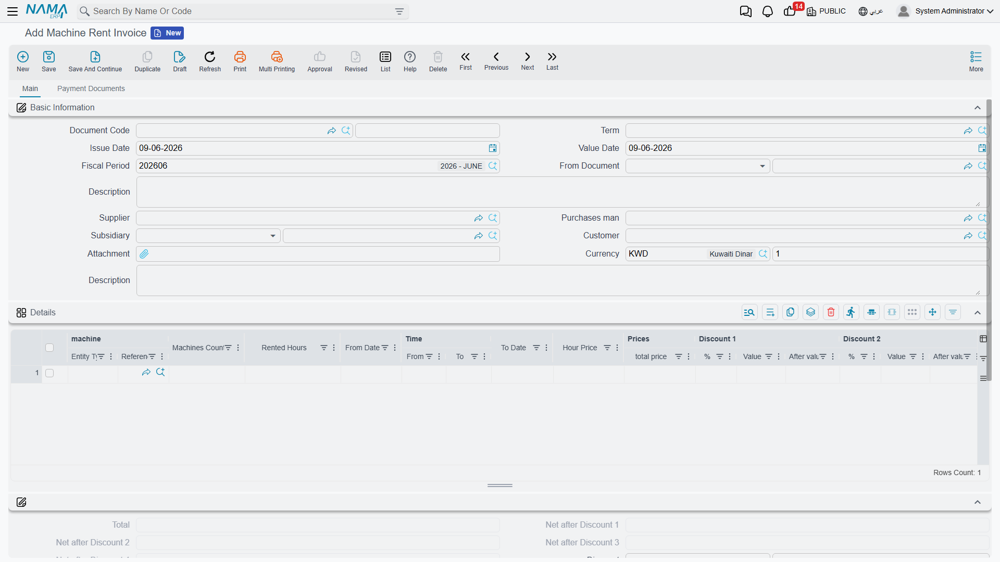

# Misc Purchasing & Machine Rent

Not every purchase flows through the inventory module. Buying a service, paying for a one-off expense, renting equipment — these don't add stock, so handling them as stock purchases would be overkill. The **miscellaneous purchasing** documents live inside accounting and let you run a lightweight purchase cycle for non-stock items, ending in an invoice that posts straight to an expense account.

::: info Required license
Misc purchasing is part of the core `accounting` license. Its documents are under **Accounting > Documents**.
:::

## The cycle: request → order → invoice

The flow mirrors a normal purchase cycle, minus the warehouse:

1. **Misc Purchase Request** (`Accounting > Documents > Misc Purchase Request`) — someone asks to buy a service or non-stock item.
2. **Misc Purchase Order** (`Accounting > Documents > Misc purchase Order`) — the order placed with the supplier. Like its inventory cousin, the order doesn't touch the ledger; it's a commitment, not an expense yet.
3. **Miscellaneous Invoice** (`Accounting > Documents > Miscellaneous Invoice`) — the supplier's bill. **This is the document that posts**: it debits the expense and credits the supplier.

The **Purchase Element** (`Accounting > Master Files > Purchase Element`) is the master file behind it all — it describes a purchasable thing (a service, a category of expense) and carries its default account, so an invoice line just picks the element and the account follows.

## The invoice

On the **Miscellaneous Invoice** each **details** line carries the **purchase element** and the **account** it expenses to, the **supplier** (with its commercial-registration and tax-registration numbers for e-invoicing), the **quantity** and **unit price**, a full ladder of **discounts** and **taxes** (sales tax 1 and 2, plus additional/discount taxes), and the line **dimensions**. The invoice also has a **payment lines** / **scheduled payments** section so you can settle it — in cash, by payment method, or by external vouchers — and a **purchase terms** grid.

### How it posts

When the invoice is committed, its effect runs through the term's sides: the line accounts are **debited** for the goods/services value, the **supplier** (or **cash**) is **credited**, and the **tax**, **discount** and **service-fees** sides carry their respective amounts. Because it's a tax document, it's integrated with **e-invoicing (ZATCA)** through the supplier's registration fields. Exactly which account each side resolves to comes from the invoice's document term — see the [Document terms](./support/accounting-document-terms.md) reference.

Printed form: the misc purchase **order** prints as `SYSF-ACC015`, and the misc purchase **invoice** as `SYSF-ACC006`.

## Machine Rent Invoice

A close variant is the **Machine Rent Invoice** (`Accounting > Documents > Machine Rent Invoice`) — for billing the operation or rental of equipment. It works like the misc invoice (lines, supplier, tax, posting to an expense account) but is tailored to equipment-operation costs.

## For Support

- **"The order created a journal entry"** — it shouldn't; only the **invoice** posts. The request and order are pre-accounting steps.
- **"The wrong expense account was used"** — check the line's **purchase element** default account and the line **account** override.
- **"The invoice wasn't submitted to the authority"** — review the supplier's commercial-registration and tax-registration fields; e-invoicing is a separate topic from the accounting effect.
- **"Where do the supplier / tax / discount accounts come from?"** — from the **Miscellaneous Invoice** document term; see [Document terms](./support/accounting-document-terms.md).
- Processing and reprocessing a stuck invoice are in [How documents are processed into accounting effects](./support/accounting-request-processing.md).
