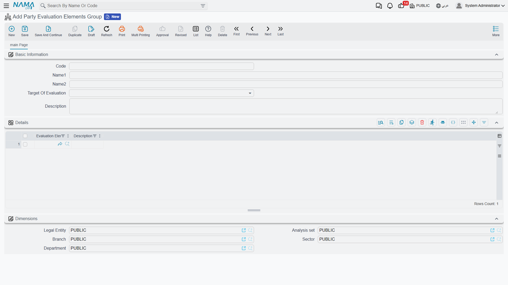
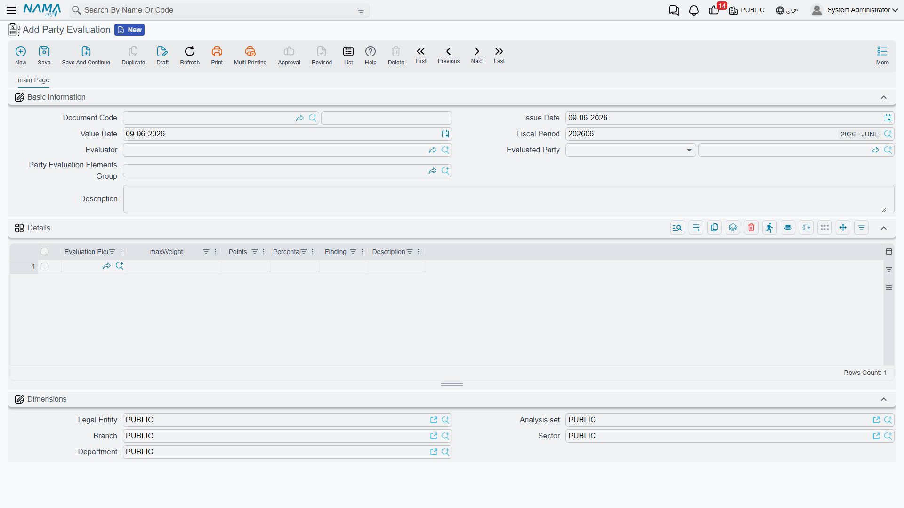

# Party Evaluation

Numbers tell you what a supplier charged or what a customer paid, but not whether they're *good* to work with: Did the supplier deliver on time? Is the bank responsive? Is the customer reliable? **Party evaluation** is a structured way to score the parties you deal with — customers, suppliers, banks — against criteria you define, and keep that judgment on record alongside the financial picture.

::: info Required license
Party evaluation is part of the core `accounting` license. Its screens are under **Accounting > Party Evaluations**. It's a qualitative tool — it has **no accounting effect**.
:::

## Defining what "good" means

You build the scorecard from two master files:

1. **Party Evaluation Element** (`Accounting > Party Evaluations > Party Evaluation Element`) — a single criterion you'll score on: "delivery punctuality", "quality", "responsiveness", "price competitiveness".
2. **Party Evaluation Elements Group** (`Accounting > Party Evaluations > Party Evaluation Elements Group`) — a bundle of elements that makes up a complete scorecard, with each element given a **maximum weight**. The weights are what make the score meaningful: punctuality might be worth 40 points, price 30, and so on.

## Scoring a party

The **Party Evaluation** (`Accounting > Party Evaluations > Party Evaluation`) is the actual assessment. Its header names the **evaluated party**, the **evaluator** doing the scoring, and the **elements group** used as the scorecard. The **details** grid then lists each criterion with its **max weight**, the **points** awarded, the resulting **percentage**, a free-text **finding**, and **remarks** — so the evaluation is both a number and a narrative.

Because evaluations carry the party and a date, you can keep a history per party and watch how a supplier's or customer's score trends over time.

## For Support

- **"There's no journal entry"** — correct; party evaluation is purely qualitative and never touches the ledger.
- **"The percentage looks wrong"** — it's the **points** awarded against the element's **max weight** from the group; check both.
- **"The criteria list is empty"** — the evaluation pulls its lines from the chosen **elements group**; make sure the group has its elements defined with weights.
- **"I want to compare a party over time"** — each evaluation is dated and tied to the party, so list them by party to see the trend.
