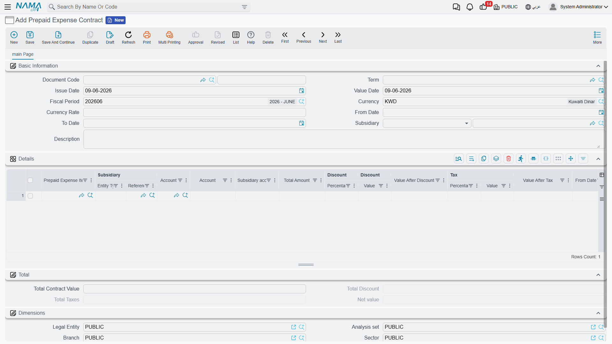
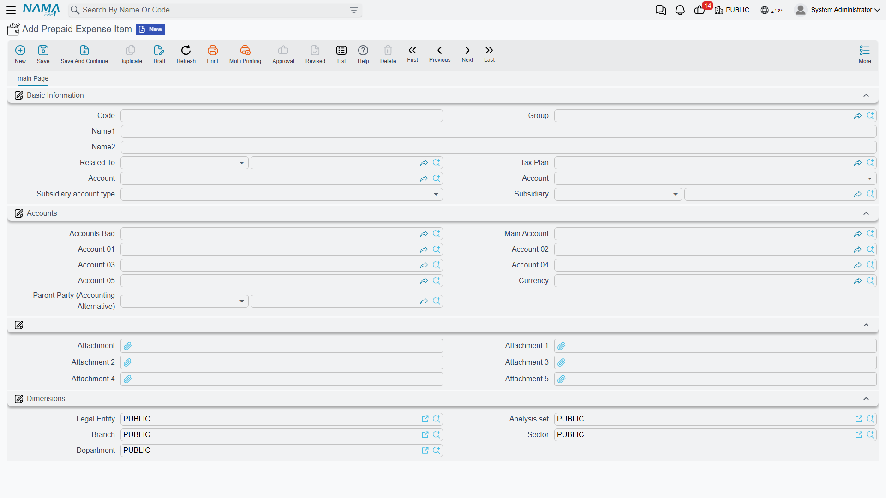

# Prepaid Expenses

Some expenses are paid once but belong to many months: an annual rent paid up front, a yearly insurance premium, a maintenance contract. Booking the whole amount as an expense in the month you paid it would distort that month's results and leave the following months looking artificially cheap. The **prepaid-expenses** system solves this: it records the full payment as an asset, then recognizes it as expense **month by month** over the period it covers — automatically.

::: info Required license
Prepaid expenses are part of the `accounting-prepaid-expenses` license.
:::

## The three pieces

The system is built from three screens, all under the **Accounting > Prepaid Expense Contracts** root:

1. **Prepaid Expense Item** — a master file that describes a *kind* of prepaid expense (rent, insurance, a service contract) and carries its default accounts and tax plan. You set it up once and reuse it.
2. **Prepaid Expense Contract** — the document that records an actual prepaid payment: which item, the total amount, and the period it covers. From it the system generates the monthly recognition entries.
3. **Prepaid Expense Ledger** — the monthly recognition entry. One is generated per month of the contract's period, and each one moves that month's share from the prepaid asset into the expense.

## Setting up an item

The **Prepaid Expense Item** (`Accounting > Prepaid Expense Contracts > Prepaid Expense Item`) is the reusable template. On it you set the **account** the expense ultimately lands in, the **credit side** (where the offsetting credit comes from — see below), and a **tax plan** if the expense is taxable. Because the item carries these defaults, the contract that uses it only needs the amount and the dates.

## Recording a contract

On the **Prepaid Expense Contract** (`Accounting > Prepaid Expense Contracts > Prepaid Expense Contract`) the header carries the **Document Term** and **Value Date** (which sets the **Period**), the **Currency**, and the contract's **from/to dates**. Each **details** line then describes one prepaid expense:

- the **Prepaid Expense Item** and the **account** it posts to,
- the line's own **from/to dates** and **month count** — the span over which it's recognized,
- the amount, expressed one of two ways: a fixed **monthly amount** × month count, or a **day cost** × **days count** (so a contract that doesn't start on the first of the month is prorated by actual days),
- an optional **discount** and **tax** (percentage or value), giving the **value after discount**, **value after tax**, and the line **total amount**,
- the **credit side** and, where relevant, a **subsidiary** and its **subsidiary account type**,
- and the full set of **dimensions** (legal entity, sector, branch, department, analysis set).

### Where the credit comes from

The line's **credit side** tells the system where to take the offsetting credit when the contract posts — you're not limited to one fixed account. The options are a **specific account**, a **specific subsidiary**, the **current user's subsidiary**, the **supplier account**, a **bank account**, the customs / insurance / shipping **company accounts** (handy for import-related prepaids), or the account taken **from the purchase item** itself.

## How it posts: contract then monthly recognition

The prepaid system posts in two stages, and that's the whole point:

- **When the contract is committed**, it records the prepaid amount as an asset — its effect runs through the **Debit / Credit** sides (plus **Discount** and **Tax** sides when present) for the line totals.
- **Each monthly Prepaid Expense Ledger** then recognizes that month's share: it moves the month's portion out of the prepaid asset and into the expense account. Twelve months of an annual contract therefore produce twelve recognition entries, each carrying one-twelfth (or its day-prorated share).

Where each side's account actually comes from is governed by the document term of each — see the [Document terms](./support/accounting-document-terms.md) reference. (Both the contract and the monthly ledger are processed in the background like any other document — see [How documents are processed into accounting effects](./support/accounting-request-processing.md).)

## For Support

- **"The whole amount hit one month as an expense"** — that's not how it should work; the contract books an asset and the **monthly ledger entries** recognize the expense over time. Check that the contract generated its monthly entries and that they were processed.
- **"The monthly entries weren't generated"** — review the line's **from/to dates** and **month count**; the number of monthly entries follows that span.
- **"A partial first or last month looks wrong"** — use the **day cost × days count** method instead of a fixed monthly amount so partial months are prorated by actual days.
- **"The wrong account was credited"** — check the line's **credit side** (specific account, supplier, bank, subsidiary...) and the item's defaults.
- **"Where do the asset/expense accounts come from?"** — from the **Prepaid Expense Contract** and **Prepaid Expense Ledger** terms; see [Document terms](./support/accounting-document-terms.md).
