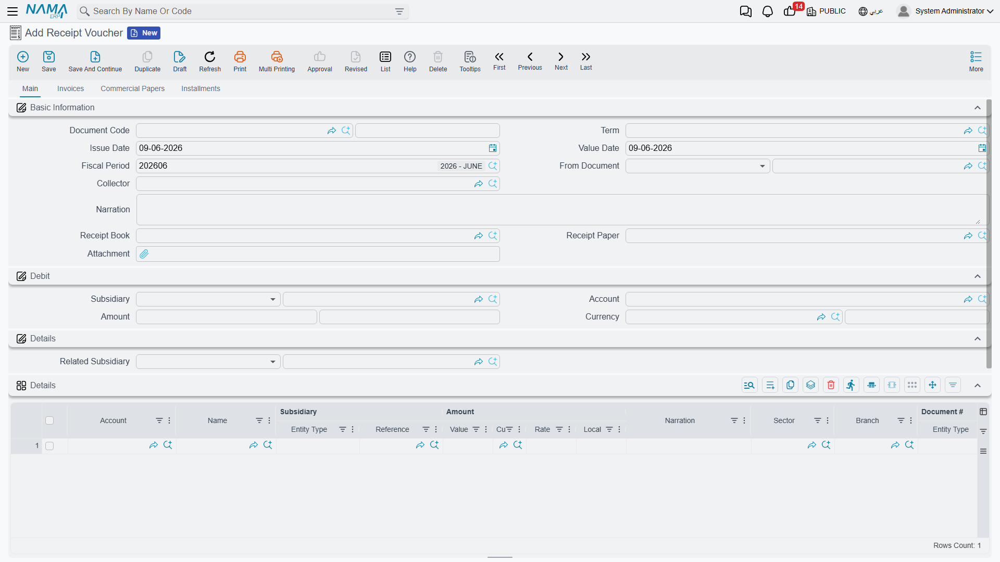
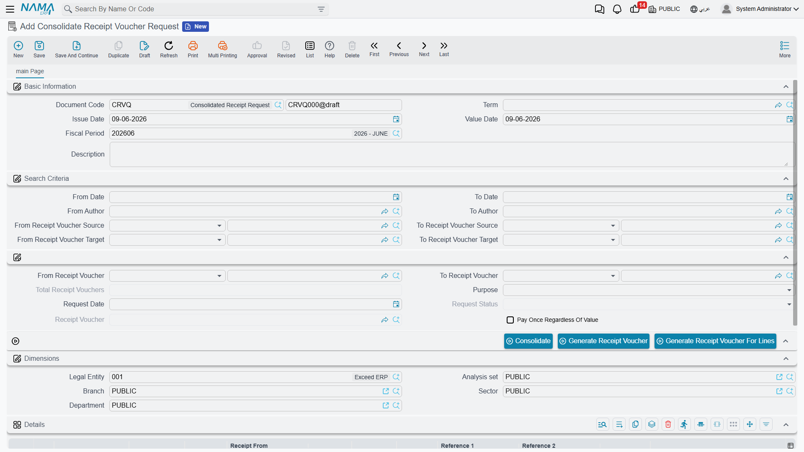

# Receipt & Payment Vouchers

Every bit of money that enters or leaves your safe or bank passes through this family of documents. They're designed as a **three-stage chain** that separates "who requests the payment", "who authorizes it", and "who actually executes it" — an important control structure in organizations that segregate duties.

::: info Required license
Receipt and payment vouchers, orders, and requests are part of the core `accounting` license.
:::

## The chain: Request → Order → Voucher

- **Receipt Request / Payment Request** (`Accounting > Documents > Receipt Request`) — a demand to collect or pay an amount. It's an organizational document that produces **no accounting effect**; it merely records the need.
- **Receipt Order / Payment Order** (`Accounting > Documents > Receipt Order`) — the authorization to execute the receipt or payment. It carries an **order status** that tracks its progress until it becomes a voucher.
- **Receipt Voucher / Payment Voucher** (`Accounting > Documents > Receipt Voucher`) — the moment of truth: cash actually moves, and this is where the **accounting effect** is recorded in the general ledger.

Not every organization needs the full chain; many start straight from the **voucher**. But those who need to separate "request" from "approval" from "disbursement" find the structure ready.

## Anatomy of a receipt voucher

In the header you set the **Document Term**, **Creation Date**, and **Value Date** (which determines the **Period**), the **Collector**, the **Receipt Book** and **Receipt** number, and **Based On** if the voucher was generated from a prior document.

In the **Debit** block you specify the party the amount concerns: the **Subsidiary** (the party type and value: customer/supplier/employee...), the **Account**, the **Amount**, and the **Currency**. The voucher is organized into tabs:

- **Details** — extra lines to distribute the amount across more than one account/subsidiary.
- **Invoices** — match the received amount against specific invoices to settle them or reduce their balance.
- **Financial Papers** — link the receipt to a cheque/financial paper (see [Cheques & financial papers](./cheques-financial-papers.md)).
- **Payments** — payment-method lines (cash, transfer, card...).

The voucher also provides **installments** and **cost allocation** across cost centers.

## The accounting effect

A **receipt** voucher makes the cash/bank side **debit** (money came in) and the party's account **credit** (what they owe us decreased, or what we owe them increased, depending on the case). A **payment** voucher reverses this exactly. The source of each of these accounts — as well as the two tax sides and the fees account — comes from the **document term**; details are in the [Document terms](./support/accounting-document-terms.md) reference.

## Consolidated requests

When many receipt/payment requests for the same party pile up and you want to execute them at once, the **Consolidated Receipt Request** / **Consolidated Payment Request** (`Accounting > Documents > Consolidate Receipt Voucher Request`) gathers them: it bundles several requests into one document from which a single combined voucher is generated, instead of issuing a voucher per request.

## Reports and forms

- Receipt/payment voucher, request, and entry statements (`SYSR-ACC015` to `ACC019` and `ACC046`–`ACC047`) are covered in [Account statements & trial balance](./reports-account-statements-and-trial-balance.md).
- Printed forms: receipt voucher `SYSF-ACC002`, payment voucher `SYSF-ACC003`, receipt order `SYSF-ACC010`, payment order `SYSF-ACC022`, receipt request `SYSF-ACC014`, payment request `SYSF-ACC021`, consolidated payment request `SYSF-ACC017`.

## For Support

- **"The request/order has no effect in the accounts"** — that's expected; the request doesn't post, and the accounting effect is recorded at the **voucher**.
- **"The received amount didn't settle the invoice"** — check the **Invoices** tab and that the line is matched to the correct invoice.
- **"The wrong cash/party account in the entry"** — the accounts' source is the **document term**; review the receipt/payment voucher term in the [Document terms](./support/accounting-document-terms.md) reference.
- **"Tax/fees fields don't appear"** — their switches are in the [Accounting configuration](./support/accounting-configuration.md) catalog.
- How a voucher turns into an effect and how to reprocess a stuck voucher are in [How documents are processed into accounting effects](./support/accounting-request-processing.md).
