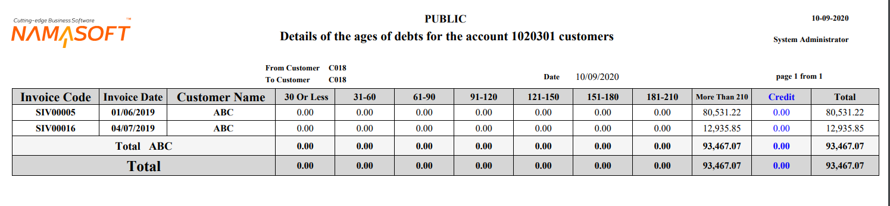
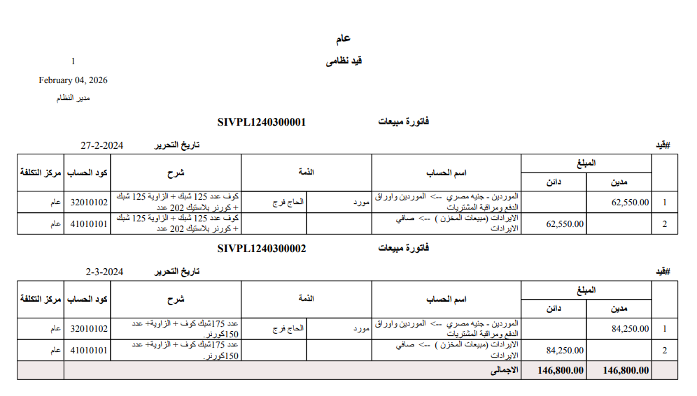

# Account Statements, Trial Balance & Analysis

Once transactions are recorded, the moment of questions arrives: What is this account's balance? What moved on this customer's subsidiary? Are my books balanced? The **account reports** family (`SYSR-ACC*`) answers that — ready-made system reports invoked from the reports menu. This page is their guide: what each report answers and its key parameters.

::: info Required license
These reports are part of the core `accounting` license.
:::

::: tip Financial statements have their own page
The formal financial statements (balance sheet, income statement, cash flow, `SYSR-FNS*`) aren't here — they're the output of the **financial-statements engine** and are documented with it. This page is for the ledger statements, trial balances, and analysis that aren't tied to a particular document type.
:::

::: info About the report samples
The sample images below are the reports' Arabic-rendered output; they illustrate the report layout and are reused on this English page.
:::

## Chart of accounts

The **Accounts Chart** report (`SYSR-ACC001`) prints the full tree with its levels and classifications — a quick reference to your account structure (see [Chart of Accounts](./chart-of-accounts.md)).

## Account statements

An account statement shows an account's movements over a period with the **running balance** (locally, and in foreign currency when needed). The variants differ by level of detail and angle:

- **General account statement** (`SYSR-ACC002`, `ACC029`) and its variants: by currency (`ACC030`), in detail (`ACC035`), by second side (`ACC037`), by exchange rate (`ACC038`), with revise capability (`ACC039`), by capabilities (`ACC040`).
- **Subsidiary account statement** (`SYSR-ACC003`, `ACC031`) and **by currency** (`ACC032`) — to show a specific party's movements.
- **Detail account statement** (`SYSR-ACC004`, `ACC033`), **by analysis set** (`ACC021`), **by currency** (`ACC034`).

The key parameters in these statements: date/period range, the account or subsidiary, currency, and dimensions (branch/sector/department). The running balance is computed by ordering movements chronologically.

## Trial balances

A trial balance summarizes account balances (debit/credit) to verify the books are balanced:

- **General trial balance** (`SYSR-ACC005`), by total balance (`ACC026`), by date (`ACC036`), and including subsidiaries (`ACC044`).
- **Subsidiary trial balance** (`SYSR-ACC006`), by total balance (`ACC027`), by date (`ACC042`).
- **Trial balance for an account** (`SYSR-ACC007`) for a specific account.

## Account analysis

- **Accounts analysis monthly** (`SYSR-ACC012`) — distributing account balances across the year's months.
- **Accounts analysis by branch** (`SYSR-ACC013`) and **by branch and sector** (`SYSR-ACC028`).

## Debt ages

These reports reveal how aged receivables are (they rely on the **Track Debt Ages** flag on the account — see [Accounts](./accounts.md)):

- **Debt ages** (`SYSR-ACC024`), its document details (`ACC025`), **by invoice** (`ACC045`), and **all manual debt lines** (`ACC041`).

## Voucher and entry statements

Statements dedicated to receipt/payment and journal documents (also linked from the [Receipt & payment vouchers](./receipts-and-payments.md) and [Journal entries](./journal-entries.md) pages):

- **Receipt voucher requests** statement (`SYSR-ACC015`), **receipt vouchers** (`ACC016`, `ACC046`).
- **Payment voucher requests** statement (`SYSR-ACC017`), **payment vouchers** (`ACC018`, `ACC047`).
- **Journal entries** statement (`SYSR-ACC019`).

## Tax rebate analysis

**Tax rebate analysis** (`SYSR-ACC014`) for tax-claim and refund purposes.

## Ledger transaction form

The **Ledger Trans Form** (`SYSR-ACC048`) prints the single accounting movement with its details.

## On-screen inquiries

Beyond the printed reports, there are **live inquiries** on screen that need no printing: the **Ledger Transactions** list and the account/dimension balance screens. You browse them directly on screen for a real-time view of balances.

## For Support

- **"The report balance doesn't match expectations"** — check the date/period range and the selected dimensions; most discrepancies are caused by an unintended filter.
- **"An account doesn't appear in debt ages"** — the **Track Debt Ages** flag isn't enabled on the account.
- **"The foreign-currency balance isn't shown"** — use the appropriate **by currency** statement variant (`ACC030`/`ACC032`/`ACC034`).
