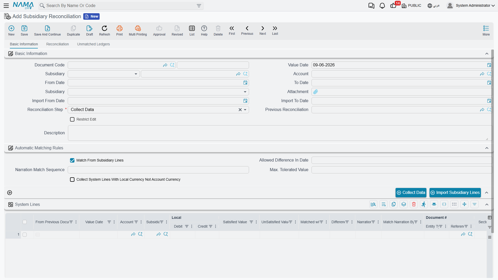

# Subsidiary Reconciliation

A customer or supplier almost always keeps their own account of your dealings — and it rarely lines up with yours to the penny: an invoice they haven't booked, a payment in transit, a credit note one side recorded and the other didn't. **Subsidiary Reconciliation** is the systematic way to lay your books for a party next to their external statement, match what matches, and surface the differences. It's the customer/supplier twin of [bank reconciliation](./bank-reconciliation.md), using the very same workflow.

::: info Required license
Subsidiary reconciliation is part of the core `accounting` license. Its screen is under **Accounting > Reconciliations**.
:::

::: warning Reconciliation doesn't post by itself
The subsidiary reconciliation document produces **no accounting effect**; it's a comparison and difference-detection process only. Any genuine differences it surfaces are corrected with the appropriate document (a credit/debit note, a voucher…) afterwards. "Reconciliation" is comparison, not an entry.
:::

## The three-step workflow

The document moves through a **reconciliation step** in three stages — exactly as bank reconciliation does:

1. **Collect Data** — you specify the **account** and **subsidiary** (the customer/supplier) and an **import date range**, and the system gathers your transactions (**system lines**) and the party's statement (**subsidiary lines**).
2. **Reconciliation** — you match the subsidiary lines against your system lines, within the allowed **value tolerance** and **date-difference tolerance**, optionally driven by a **narration match sequence** or matching from the subsidiary side. What doesn't match lands in the **unmatched system lines** and **unmatched subsidiary lines** grids, where the real discrepancies become visible.
3. **Finished** — the document is closed once matching is complete.

Each document links to the **previous reconciliation** for the same party, so it continues where the last one ended and locks the period behind it — a settled period isn't re-reconciled.

## For Support

- **"The reconciliation didn't change the party's balance"** — correct; it doesn't post. Record any true difference with the appropriate document (note/voucher) afterwards.
- **"Lines that clearly match aren't matching"** — review the **value tolerance**, the **date-difference tolerance**, and the **narration match sequence**.
- **"I can't edit an old reconciliation"** — it's chained to a later document that locks it, preserving the reconciliation sequence; this is expected.
- **"Which side is which?"** — **system lines** are your books; **subsidiary lines** are the party's external statement.
