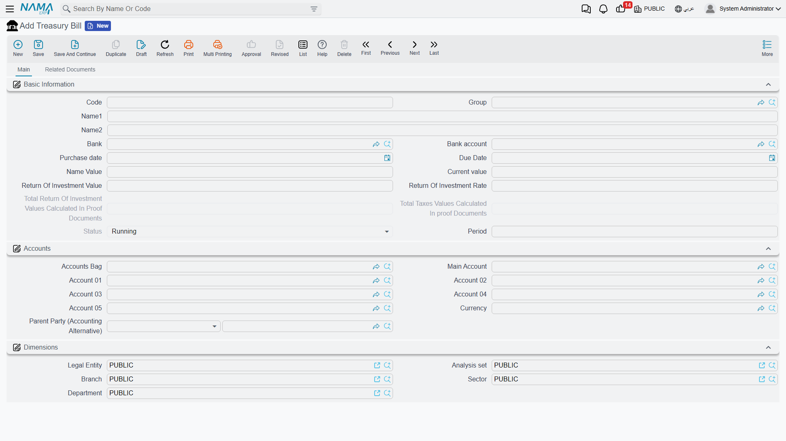
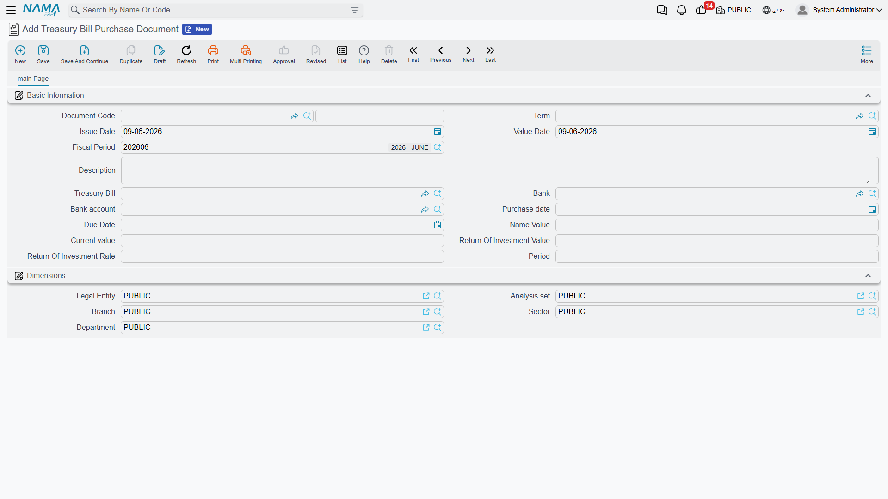

# Treasury Bills

A treasury bill is a short-term investment instrument the state issues: you buy it for less than its nominal value, and at maturity you collect its full value, so the difference is your return. Unlike the other bank documents that start with a master file you create yourself, a **treasury bill is created automatically when it's bought**: the purchase document is the starting point, then ROI-proof documents follow it until an early sale or a close at maturity.

::: info Required license
Treasury bills are part of the `accounting-investment-documents` license — the same license that covers [investment documents](./investment-documents.md).
:::

## The bill's lifecycle

Every screen hangs off the **Banks > Treasury Bill** root:

1. **Treasury Bill Purchase Document** — the starting point: it creates the bill automatically in "Running" status and posts its value to the ledger.
2. **Treasury Bill ROI Proof Document** — locking in the due return periodically (allocated pro-rata to the elapsed time), with any tax on it.
3. **Aggregate Treasury Bill Proof Document** — the batch version for proving the return on several bills at once.
4. Then one of two mutually exclusive paths:
   - **Treasury Bill Sales Document** — an early sale before maturity.
   - **Treasury Bill Close Document** — collecting the value at maturity.

On sale or close, the bill's status flips to "Closed".

::: warning Sale and close are mutually exclusive
A single bill is closed either by an early sale or by a close at maturity — not both.
:::

## The bill file

On the **Treasury Bill** screen (`Banks > Treasury Bill > Treasury Bill`) — which the purchase fills in — the bill's data appears: the **bank** and **bank account**, the **nominal value** and **current value**, the **ROI rate** and **ROI value**, the **purchase date**, **due date** and **period**, plus the tracking totals: the **total ROI values** and **total taxes** proven in the proof documents.

**Bill statuses:** Running → Closed.

## Purchase and proving the return

When a **Treasury Bill Purchase Document** (`Banks > Treasury Bill > Treasury Bill Purchase Document`) is recorded, the bill is created and its effect posts via the **current value debit/credit** sides.

The due return is then locked in periodically via the **Treasury Bill ROI Proof Document** (computed pro-rata to the elapsed period, with tax), or for several bills at once via the **Aggregate Treasury Bill Proof Document**. (Where the accounts come from is in the [Document terms](./support/accounting-document-terms.md) reference.)

## Sale or close

Eventually the bill is closed by one of two documents: a **Treasury Bill Sales Document** for an early sale before maturity, or a **Treasury Bill Close Document** to collect its nominal value at the due date. In both cases the status becomes "Closed".

## For Support

- **"I can't find a screen to create a new treasury bill"** — the bill isn't created manually; the **purchase document** creates it automatically.
- **"I tried to sell a bill that was already closed"** — sale and close are mutually exclusive; a closed bill won't accept the other.
- **"The proven return is less than expected"** — the return is allocated pro-rata to the period elapsed up to the proof date, not in full at once.
- **"Where do the purchase and return accounts come from?"** — from the **Treasury Bill Purchase** and **ROI Proof** terms; see [Document terms](./support/accounting-document-terms.md).
- The accounting-processing mechanism is in [How documents are processed into accounting effects](./support/accounting-request-processing.md).
