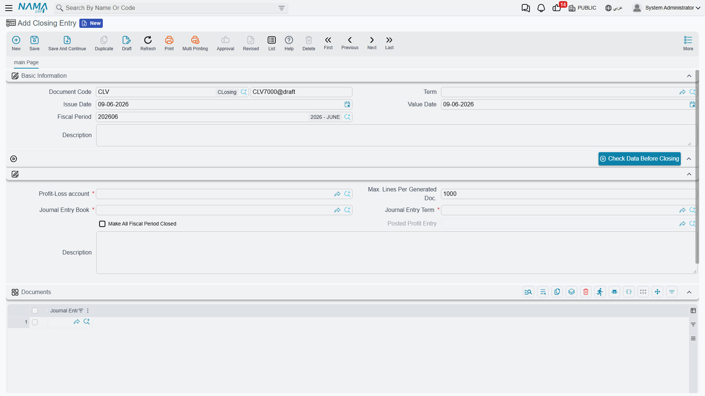
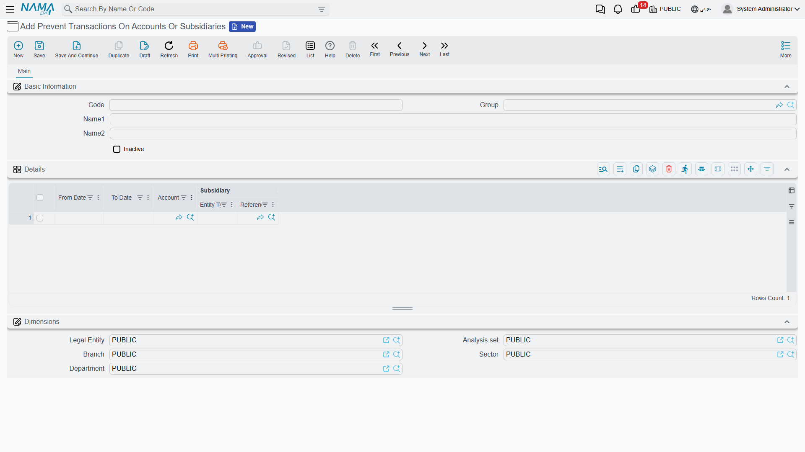

# Year-End Closing & Period Control

At the end of each fiscal year comes the moment of closing: carrying the year's profit/loss into equity, and closing the result accounts in preparation for a new year. And throughout the year you need tools to control who posts, where, and when. This page gathers those tools: the **Closing Entry**, **year and period status control**, **Prevent Accounting Transactions**, the **Ledger Revise Document**, and **purging transactions**.

::: info Required license
These tools are part of the core `accounting` license.
:::

## The Closing Entry

The **Closing Entry** (`Accounting > Documents > Closing Entry`) is the document that closes the year. Its idea: it reads the balances of the **income-statement** accounts (revenue and expenses) and generates a balancing **journal entry** that moves the net profit or loss into the **Profit-Loss account** you specify, so the result accounts are zeroed and only the balance sheet carries over to the next year.

Its key fields:

- **Profit-Loss Account** — the account that receives the year's net result (mandatory).
- **Entry Term** and **Entry Book** — the term and book the generated entry is recorded with.
- **Max Lines Per Generated Document** — splits the generated entry into several documents if it exceeds this limit (useful with many accounts).
- **Close All Fiscal Year Periods** — automatically closes all the year's periods after closing.
- The **Validate Data Before Closing** button — checks the data's readiness before executing the close.

::: warning Before closing
- The period the closing entry falls in must be of type **Adjustment** or **Closing** (see [Concepts & setup](./accounting-concepts-and-setup.md)).
- The system blocks closing if there are transactions whose processing hasn't completed (a behavior governed by a module option); process the stuck transactions first, as in [How documents are processed into accounting effects](./support/accounting-request-processing.md).
:::

## Year and period status control

Opening and closing periods in bulk is done from the **Fiscal Year** screen via the **Open Periods**, **Close Periods**, and **Create Next Fiscal Year** buttons (covered in [Concepts & setup](./accounting-concepts-and-setup.md)). A **closed** period rejects any new transaction dated within it, and is the first line of defense in periodic-close control: you close the month after its figures are approved, freezing its past.

## Prevent Accounting Transactions

Sometimes you need a lock **finer** than closing a whole period: blocking transactions on a specific account, on a specific party's subsidiary, or within a date range. That's the role of **Prevent Transactions On Accounts Or Subsidiaries** (`Accounting > Master Files > Prevent Transactions On Accounts Or Subsidiaries`).

In the document's lines you specify, per rule: the **Account**, the **Subsidiary** (optional), and a **From Date** and **To Date**. Any posting attempt falling within these constraints is rejected. An **Inactive** flag lets you disable the rule temporarily without deleting it.

## Ledger Revise Document

The **Ledger Revise Document** (`Accounting > Documents > Ledger Revise Document`) is an internal-review tool: you set the **Auditor** and **Accountant** and a date range (**From/To**), and record review remarks on the transactions in that period in its lines. It's a control record that produces no accounting effect; it documents that the books were reviewed and by whom.

## Purging transactions

As years of transactions accumulate, you may need to **purge/archive** the old ones to lighten the database. The **Purge Journal** document (`Administration > Purge Documents > Purge Journal`) handles this. It's a sensitive administrative operation carried out on periods of type **Purge Period**, and is best performed under technical supervision and after taking a backup.

## Printed forms

- Closing Entry: `SYSF-ACC020`.
- Ledger Revise Document: `SYSF-ACC016`.
- Prevent Accounting Transactions: `SYSF-ACC018`.

## For Support

- **"Closing won't complete / refuses to execute"** — use the **Validate Data Before Closing** button; the cause is usually transactions not yet processed, or the entry's period not being Adjustment/Closing type.
- **"A transaction is rejected even though the period is open"** — check for an active **Prevent Accounting Transactions** document covering the account/subsidiary/date.
- **"I want to suspend a prevention temporarily without deleting it"** — enable the **Inactive** flag on the prevention document.
- **"Where is the tolerance for closing with incomplete transactions set?"** — in the [Accounting configuration](./support/accounting-configuration.md) catalog.
- Details of the period and currency cycle are in the **Fiscal periods & currency** reference.
