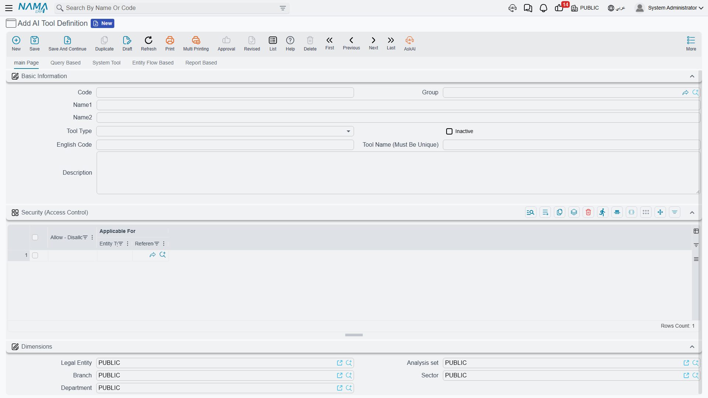
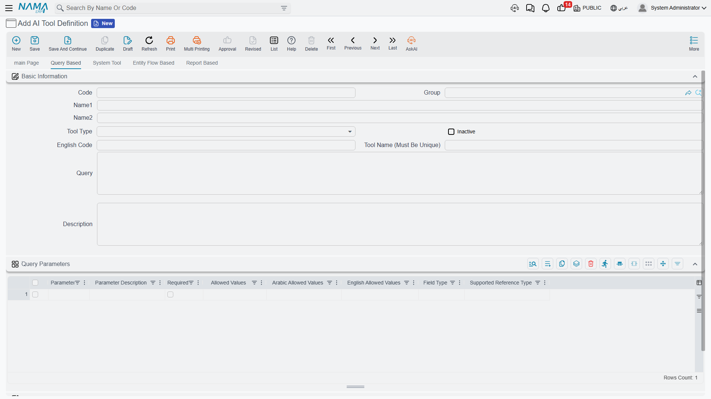
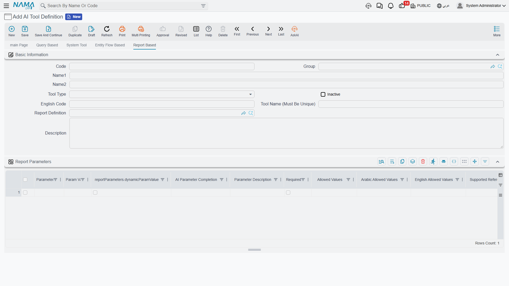
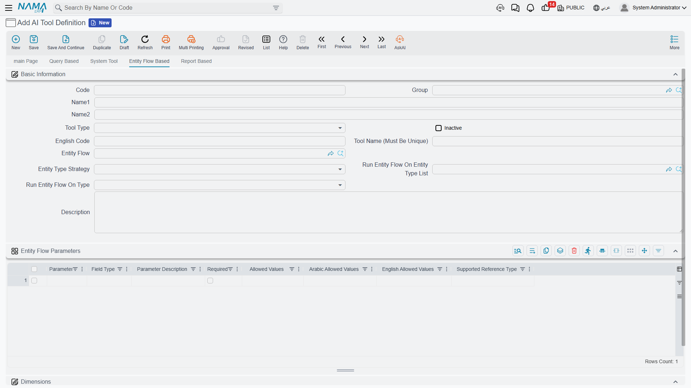
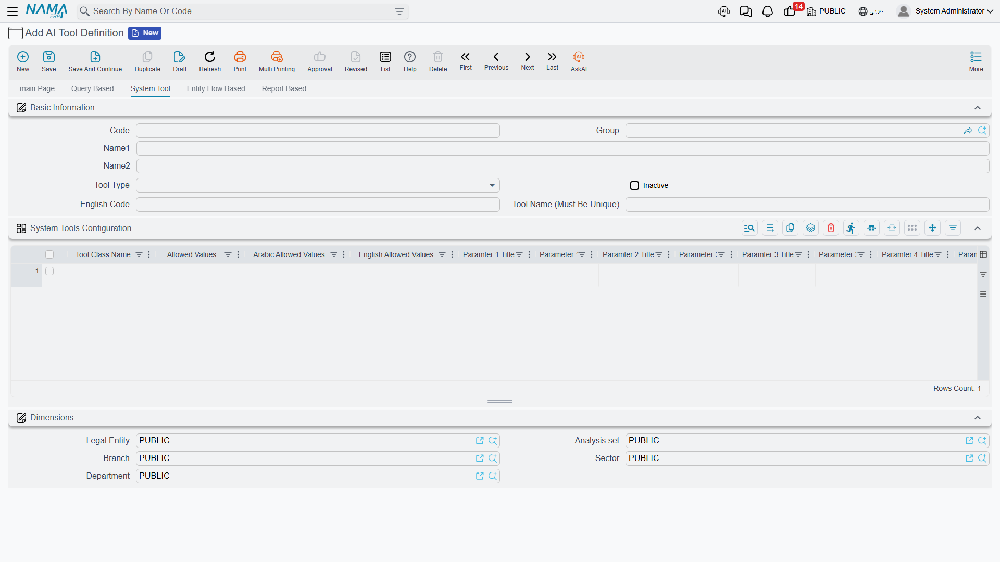

# AI Tool Definitions

When an AI assistant talks to Nama ERP — whether it is the assistant built into the system or an external client connected through the [MCP server](./ai-mcp-server.md) — it can do nothing on its own. Every capability the assistant has is a **tool** that a system administrator defined beforehand: a query that answers a specific question, a report run with parameters, an entity flow executed on a document, or one of Nama's ready-made system tools.

The **AI Tool Definition** screen in the AI module is where these tools are defined. Each record on the screen becomes a tool (or a set of tools) the language model can call, along with a description that tells it when and how to use it.

::: info Required License
This screen requires the AI module to be installed and licensed.
:::

## Basic Data

The screen header identifies the tool and controls its general behavior:

| Field | Role |
|---|---|
| **Tool Type** | The kind of tool: `Query Based`, `Report Based`, `Entity Flow Based`, or `System Tool` — this decides which page of the screen you will use |
| **Alt Code** | The name the tool is advertised under to the language model for the first three types (query/report/entity flow) |
| **Tool Name (Must Be Unique)** | For System Tools, used as the prefix of the generated tool names — see "Tool Naming" below |
| **Description** | The tool description. This is **what the language model reads to decide when and how to call the tool** — the more precise the description, the better the model uses the tool |
| **In Active** | Disables the tool without deleting it — an inactive tool is never shown to the model |

::: tip When does a tool appear to the assistant?
A tool is only offered to the language model when it is **committed** and not inactive. Later edits or deletions are picked up automatically — the tool list is rebuilt on the next connection, no restart needed.
:::

### Tool Naming

- **Query, report, and entity-flow tools** are advertised under their **Alt Code** as-is.
- **System Tools**: each line in the tools grid may generate one or more tools, and each tool name is composed of a prefix plus the internal tool name. The prefix is the first non-empty value of **Tool Name**, then **Alt Code**, then the record **code**, followed by an underscore. For example, a record whose code is `import` containing the `AITFindRecords` tool generates a tool named `import_FindRecords`.

## Security (Access Control)

The **Security (Access Control)** grid decides who may execute the tool. Each line holds:

- **Applicable For**: a user, a security profile, or a user group.
- **Allow / Prevent**.

When the tool is executed, the system looks for the first line matching the current user in this order: the **user's** own line first, then the user's **security profile** line, then the **group** line. The first matching line decides. If the grid is empty (or no line matches), the tool is available to everyone.

::: warning Access is checked at execution time
The advertised tool list is the same for all users, but **execution** is what gets the access check: if a prevented user tries to run a tool, the call is rejected with a clear message. Record-level security and dimensions (legal entity, branch, ...) also still apply to everything the tool reads or writes, because everything goes through the system's standard service gates.
:::

## Type 1: Query Based

The simplest and most common tool type: a SQL query written by the administrator, which the language model can run with parameters it chooses.

On the **Query Based** page:

1. Write the query in the **Query** field, using named parameters (such as `:fromDate` and `:toDate`).
2. Define each parameter in the **Query Parameters** grid.
3. In **Description**, explain when this tool should be used and what it returns.

At execution time the query runs with the parameter values the model sent, and the result is returned to it as JSON (column names and row values).

### The Parameters Grid

Each line in the parameters grid defines one parameter:

| Column | Role |
|---|---|
| **Param Id** | The parameter identifier — must match the name used in the query, and cannot be repeated |
| **Parameter Description** | The description the model reads to know what to send |
| **Required** | Whether the parameter is mandatory |
| **Field Type** | The value type: `Text`, `Number`, `Date`, or `Reference` |
| **Allowed Values** / **Allowed Values Ar** / **Allowed Values En** | The list of allowed values (if any) with their translations — shown to the model inside the parameter description so it sticks to them |
| **Supported Reference Type** | For `Reference` parameters: the entity type the parameter points to (such as `Customer`) |

Notes on the types:

- **Date**: the model sends dates in the `yyyy-MM-dd HH:mm` format (this format is automatically appended to the parameter description).
- **Reference**: the model can send a record code or id, which is looked up directly. If it sends free text instead (such as an approximate customer name) and the entity type is indexed in the records-embedding service, the system performs a semantic search and returns the closest records — and when several match, the model is asked to pick a specific one.

## Type 2: Report Based

Turns any existing report definition in the system into a tool the model can run and read the output of.

On the **Report Based** page:

1. Pick the report in the **Report Definition** field.
2. Define the report parameters in the **Report Parameters** grid — one line per report parameter, with **Param Id** matching the report's parameter id.
3. For each parameter, choose how it is filled in the **AI Parameter Completion** column:
   - **Fill By AI**: the language model chooses the value itself based on the user's request (with the parameter description and allowed values, as in query tools).
   - **Fill Manually**: the value is fixed in the definition itself — a literal value, a reference, a date/time, or a dynamic value, in the same style as report parameters in task schedules — and is never shown to the model.

At execution time the report runs with the collected parameters, and its output is returned to the model **as text** for it to read and build its answer on.

## Type 3: Entity Flow Based

Lets the model **perform an action** in the system through a predefined entity flow — here the AI does not just read, it makes changes.

On the **Entity Flow Based** page:

1. Pick the flow in the **Entity Flow** field.
2. Choose the **Entity Type Strategy** — which record the flow runs on:

| Strategy | Meaning |
|---|---|
| **Runs On Single Entity Type** | Runs on one specific entity type set in **Run Entity Flow On Type** |
| **Runs On Entity Type List** | Runs on one of the types listed in **Run Entity Flow On Entity Type List**; the model picks which |
| **Runs On Any Document Type** | Runs on any document type |
| **Runs On Any Master File Type** | Runs on any master file type |
| **Runs On Any Type** | Runs on any entity type |
| **Does Not Need A Record** | Needs no record — the flow executes directly |

3. Define any extra parameters the flow needs in the **Entity Flow Parameters** grid (same columns as query parameters).

When the strategy requires a record, the system automatically adds two parameters for the model: the target entity type (unless fixed in the definition) and the record code or id. At execution time the record is fetched, the parameter values are placed into the record's map, and the flow runs — any flow failure is returned to the model as an error message.

## Type 4: System Tools

Ready-made tools built into Nama, added by the administrator as lines in the **System Tools Configuration** grid: each line holds a **Tool Class Name** plus up to five text parameters (Parameter 1–5) that configure the tool when needed, and description/title fields that are filled automatically.

The **Tool Class Name** field has a suggestion list showing **every system tool available in the system** — you pick one by name. A single line may generate more than one tool (the count tool, for example, generates two).

### Record Export/Import Tools (Add Export Tools)

The most-used group with external MCP clients is the six **record export/import tools**, which let a client read system data and import new records as JSON. To add them all in one click, use the **Add Export Tools** button above the grid — it adds the missing lines and fills each tool's description automatically:

| Tool | Purpose |
|---|---|
| `AITResolveEntityType` | Resolve an Arabic or English term to an entity type |
| `AITFindRecords` | Search records by entity type and criteria |
| `AITGetRecord` | Read a single record as JSON |
| `AITGetEnumValues` | List the allowed values of an enum field |
| `AITGetImportSchema` | Get the JSON import schema of an entity type |
| `AITImportRecord` | Import one or more records into the system |

The details of these six tools — their parameters and usage examples — are documented on the [Nama ERP MCP Server](./ai-mcp-server.md) page.

### Other System Tools

The **Add Export Tools** button adds only the six tools above, but the system ships other ready-made tools you add manually by picking their class name from the **Tool Class Name** suggestion list:

| Tool | Generated tool(s) | Purpose |
|---|---|---|
| `AITCountRecordsTools` | `<prefix>countEntities` and `<prefix>countEntitiesCreatedWithinDateRange` | Count records of an entity type — in total, or between two dates |
| `AITAddDiscussionToRecord` | `<prefix>AddDiscussionToRecord` | Add a discussion (comment) to any record |
| `AITListDiscussionsOfARecord` | `<prefix>ListDiscussionsForARecord` | List the discussions of a given record |
| `AINamaERPDocsTool` | `<prefix>erpDocs` | Search the Nama ERP documentation and return the passages closest to the question |

::: info Module-specific system tools
Some modules add their own system tools that appear in the same list. For example, the HR module provides tools for an employee's vacation balance (for the current employee or any employee). The available set grows with the modules you have installed and licensed.
:::

::: warning The ERP docs tool and semantic search
`AINamaERPDocsTool` relies on a semantic index of the documentation; it does not work until the vector store is configured in [AI Module Configuration](./ai-configuration.md#Semantic-Search-and-Embedding-Setup).
:::

## Where Are These Tools Used?

- **[The in-app AI assistant](./ai-assistant.md)** calls the tools while chatting with the user to answer questions and carry out requests.
- **External MCP clients**: any client that speaks the MCP protocol — such as Claude Desktop or Claude Code — can connect to the system and use the same tools under the same permissions. See [Nama ERP MCP Server](./ai-mcp-server.md).
