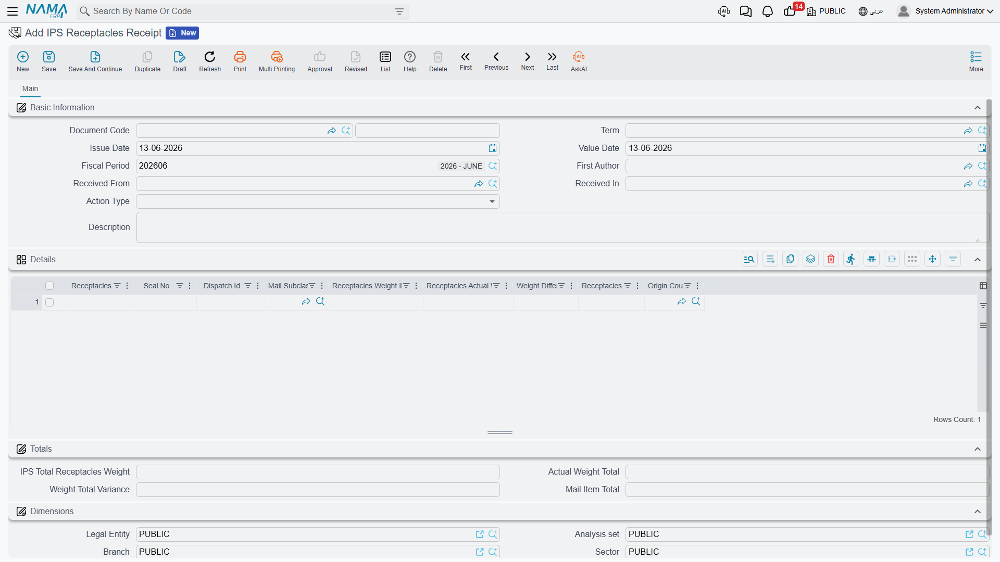

# Receptacles

A receptacle is the transport container that gathers several mail items for movement between offices — a sealed bag or box. Before you deal with individual items, you deal with receptacles: you receive them, clear them through customs, and dispatch them on route schedules. The documents for this stage are found under **Freight Management System → Documents**.

All receptacle documents share a header carrying **Received From** and **Received In**, and the total item count and receptacle weight.

## Receptacles Receipt

The entry point for inbound mail. When receptacles arrive from abroad, this document records every receptacle with its data:

- **Receptacle ID**, **Seal No**, and **Dispatch ID**.
- **Mail subclass** and country of origin.
- **Number of items inside the receptacle**, and its **declared (IPS)** weight versus the **actual weight**, with the **weight difference** computed automatically.
- The **Action Type** that defines the nature of the receipt operation.

The document also totals the **actual weight total** and the **overall weight variance** for customs reconciliation.

::: info Weight difference is an important indicator
Comparing the declared weight in the dispatch documents against the actual weight at receipt reveals shortages or tampering early. The system computes the difference at the level of a single receptacle and at the level of the whole document.
:::

## Manifest for Custody

To clear items subject to customs control, this document gathers the mail items into a manifest presented to customs. It carries the items' data (classes, HS codes, values, countries of origin) in a form that matches the requirements for customs release of inbound mail.

## Transfer Receptacles

The reverse of receipt: to dispatch outbound receptacles on transport routes (the route schedule) to the next office or external destination. It records the dispatched receptacles, their weights, and their routes, completing the tracking of a receptacle from the moment it's received until it leaves the network.

## How receptacles connect to items

The relationship is simple and gradual: **Receptacles Receipt** brings the sealed receptacles into the network → when opened, the [Mail Item Manifest](./ips-mail-items.md) records the individual items inside → and from there the [mail item's](./ips-mail-items.md) journey begins toward transfer, sorting, and [delivery](./ips-delivery.md). This is how the work moves from the transport unit (the receptacle) to the delivery unit (the item).
