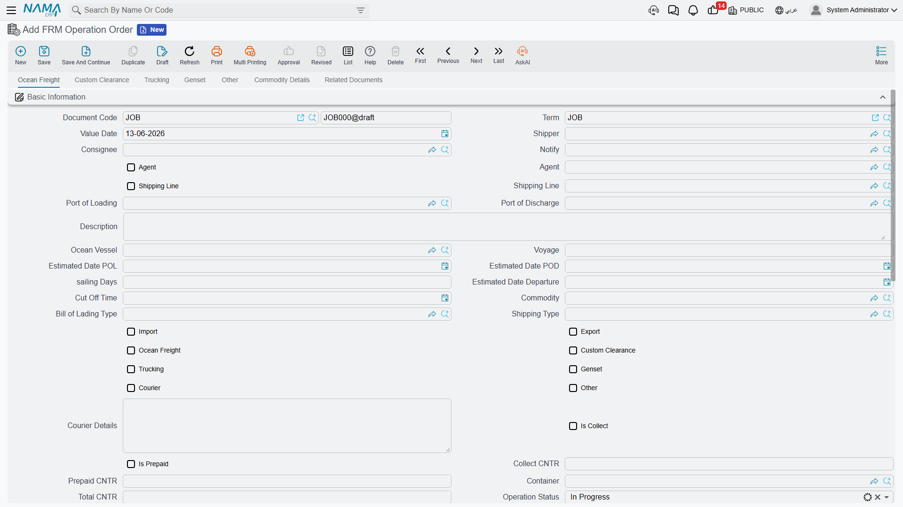

# Operation Orders

The operation order is the heart of the Freight Management module. Think of it as the **complete shipment file**: everything about a single shipment — the parties, the vessel and voyage, the ports, the container, and the services with their costs and selling prices — lives here. And from the operation order, the bill of lading and the sales and purchase invoices branch off.

You'll find it under **Freight Management System → Documents → FRM Operation Order**.

## Shipment parties

An operation order starts by identifying who is involved in the shipment:

- **Shipper** — the customer who owns the goods being sent.
- **Consignee** — the receiving party.
- **Agent** and **Notify / Notify 2** — the parties notified of the shipment's arrival.
- **Shipping Line** — the supplier carrying out the ocean freight.
- **Subsidiary** — the party billed financially (customer, supplier, employee, account…).

You also set whether the shipment is **Import** or **Export**, and **Collect** or **Prepaid**.

## Voyage and container data

In this section you record the transport details:

- **Ocean Vessel and Voyage**, plus the carrier booking number.
- **Loading, discharge, and final-destination ports**, and the gate-in/gate-out ports.
- **Estimated dates** for loading, discharge, actual sailing, and sailing days.
- **Container, its type, and count**, plus the total container number.
- Sensitive-shipment data such as **temperature, humidity, and ventilation** for reefer containers.
- **Commodity**, shipping type, and operation status.

## Services — the core of the operation order

What sets the operation order apart is that it splits services into **separate sections**, each with its own lines carrying cost and selling price:

| Section | Purpose |
|---------|---------|
| **Ocean Freight** | freight charges from the shipping line |
| **Custom Clearance** | clearance fees and services |
| **Trucking** | inland transport to/from the port |
| **Genset** | running refrigeration units |
| **Courier** | sending documents |
| **Other** | any additional services |
| **Transport / Remarks** | operational notes and data |
| **Loading Points** | goods loading locations |
| **Certificates & Forms** | documents required for the shipment |
| **Dimensions** and **Commodity** | weights and volumes of the goods |

Flags such as *ocean freight? clearance? trucking?* control which sections appear, so you only see what applies to your shipment.

::: tip The "Update All Services" button
Instead of entering each service price manually, the **Update All Services** button pulls prices from the matching [price lists](./freight-pricing.md) (by customer, commodity, ports, and container), filling in cost and selling price automatically.
:::

## Actions on the operation order

From the operation order's toolbar you execute the steps of the shipment lifecycle:

- **Create Bill of Lading** — generates a [bill of lading](./bills-of-lading.md) from the operation-order data.
- **Create Purchase Invoice** — generates a [purchase invoice](./freight-invoicing.md) to suppliers for the purchased services.
- **Telex Release** — records the shipment's release.
- **Short Shipment** — handles missing or remaining quantities of the shipment.
- **Duplicate Operation** — copies a whole operation order for a similar shipment without re-entering data.

## Operation order status (FRM OO Status)

Each operation order tracks its **status** across its lifecycle. The status isn't only updated manually — it also changes automatically via **status entries** created from the related invoices: when a sales invoice linked to an operation order is posted, the [invoice's term config](./freight-invoicing.md) carries a status that is recorded on the operation order, so you instantly know which shipment has been invoiced and which is still under operation.

## Delivery, Receipt, and Transfer

Alongside the operation order, the module offers helper documents to manage the physical movement of containers and goods:

- **FRM OO Delivery** — delivering the goods/container.
- **FRM OO Receipt** — receiving them.
- **FRM OO Transfer** — moving them between locations.

You'll find these files under **Master Files**, and they're used to track the physical location of the shipment independently of its financial effect.
