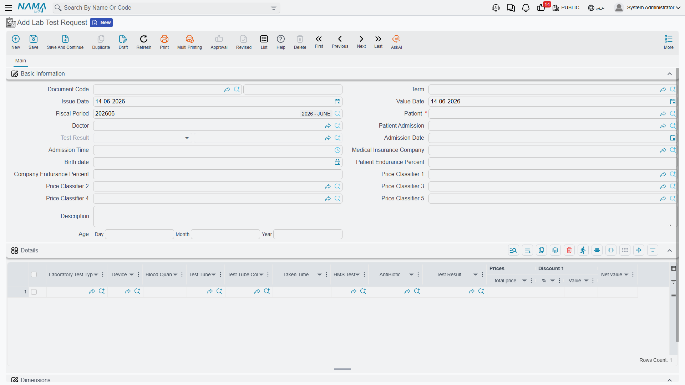
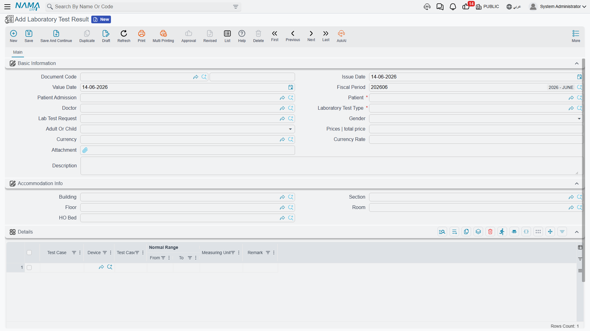
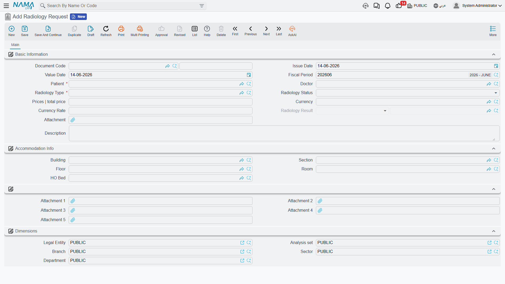
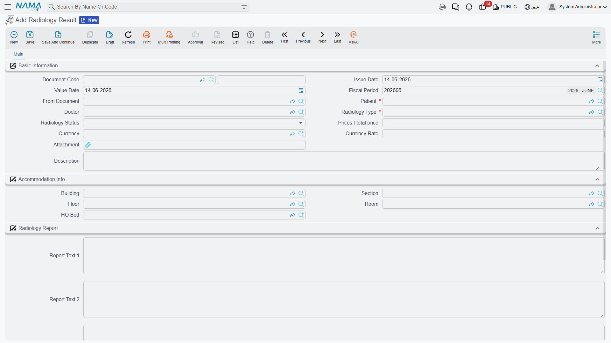
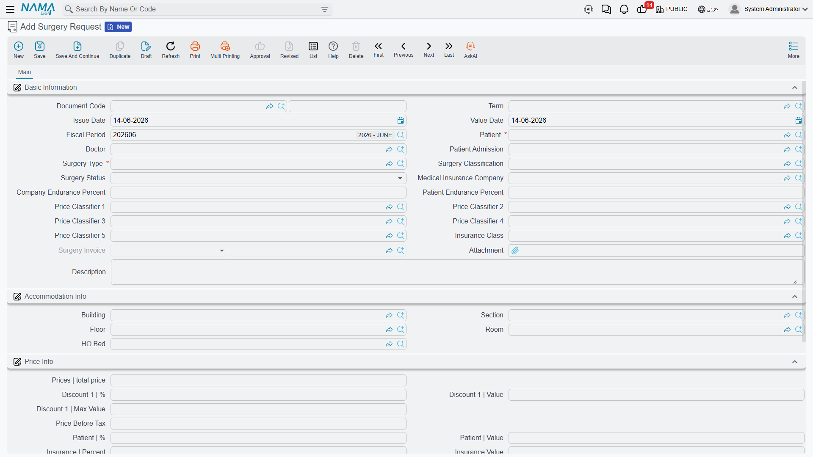
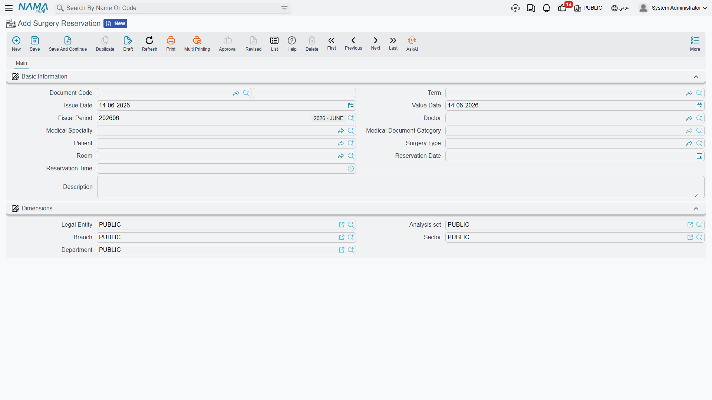
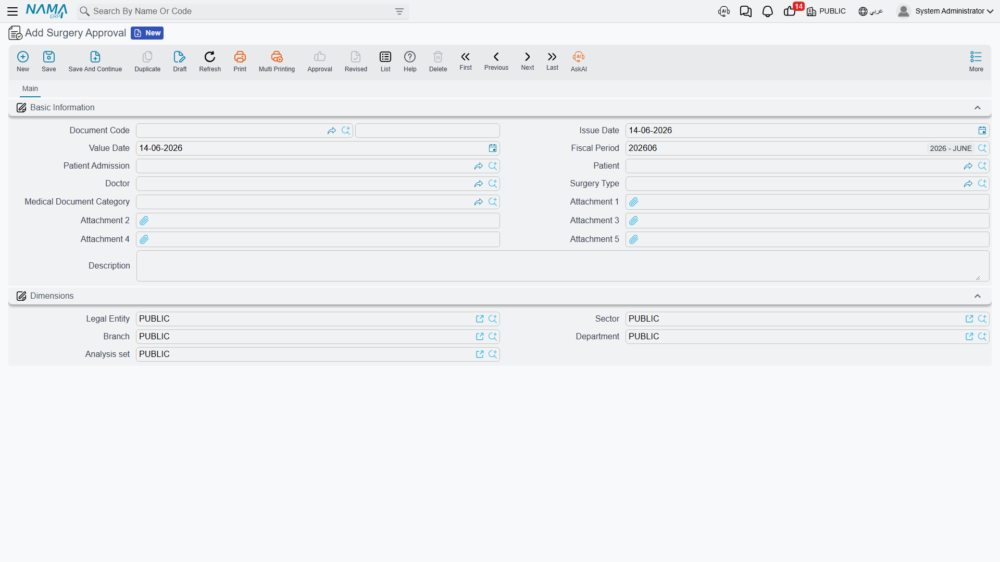
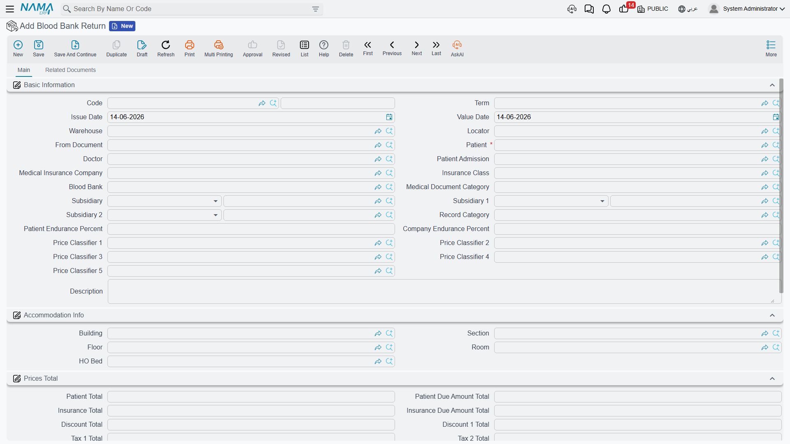

# Clinical Orders & Results

During a patient's stay (or an outpatient visit), the doctor orders investigations and procedures: lab tests, radiology, surgeries. The system follows a clear pattern — a **request** opened by the doctor, then a **result** entered by the labs or departments, with the two linked together. Every priced line is split between patient and insurer as usual.

## Lab tests: request then result

**Lab Test Request** is the doctor's order to run tests: it carries the patient, doctor and admission, and a grid of requested tests (test type, device, blood quantity, tube and color, time taken, antibiotic) and their prices, and later links to the result document.

**Lab Test Result** records the measured values. Its smartness: when you pick the **test type**, it loads its result components (test cases) and fills in **the normal range appropriate to the patient's demographic** (male/female, adult/child) automatically, so the technician enters only the measured value. Picking the **request** copies patient and doctor data, and for a single-test-type request it preloads the result lines. The lookups are filtered intelligently too: test types matching the request, and requests not yet resulted.

## Radiology: request then result

**Radiology Request** is the doctor's order for an imaging study: patient, doctor, **radiology type**, status, price, and attachments.

**Radiology Result** is the radiologist's report and images: it's created from the request (via "from document") and carries a **radiology report** block with its texts and attachments (the image and report files).

## Surgeries: request, reservation and approval

A surgery moves through three complementary documents:

- **Surgery Request** — requests the operation with its type, classification, status and full pricing (patient/insurer split), and links to the surgery invoice.

- **Surgery Reservation** — books the operating room for a given slot (doctor, specialty, surgery type, room, reservation date and time) — the scheduling side of the request.

- **Surgery Approval** — the signed consent/approval to proceed, with its supporting attachments.

## The blood bank

**Blood Bank** is a master file that acts as an accounting party (the source/destination of blood units). When blood units are returned (e.g. unused ones), this is recorded in a **Blood Bank Return** — a document with full inventory lines (item, quantity, lot, expiry) and pricing split between patient and insurer, producing a stock receipt. Issuing and billing blood is done via the **[Blood Bank Invoice](./hms-invoicing.md)**.

