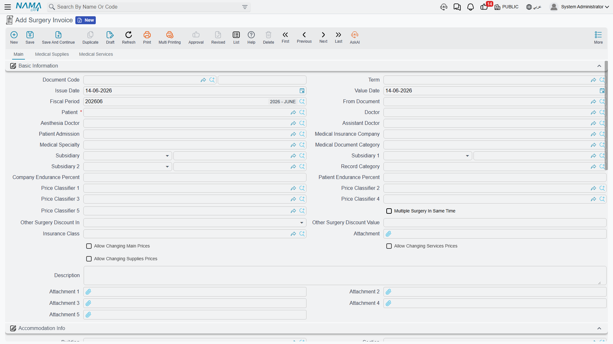
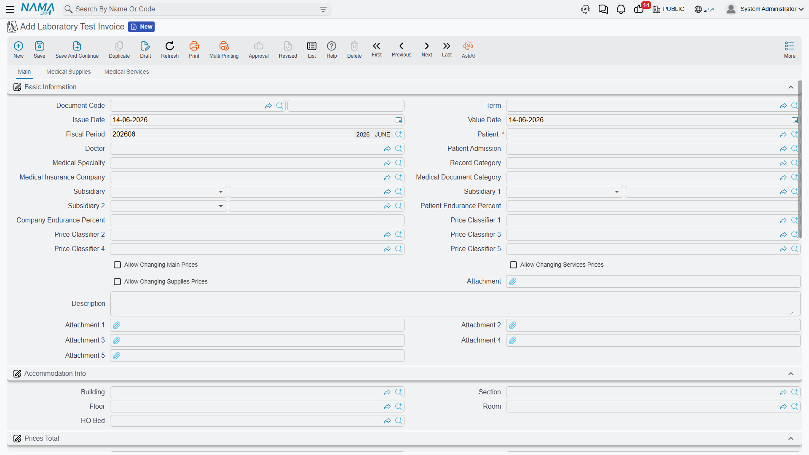
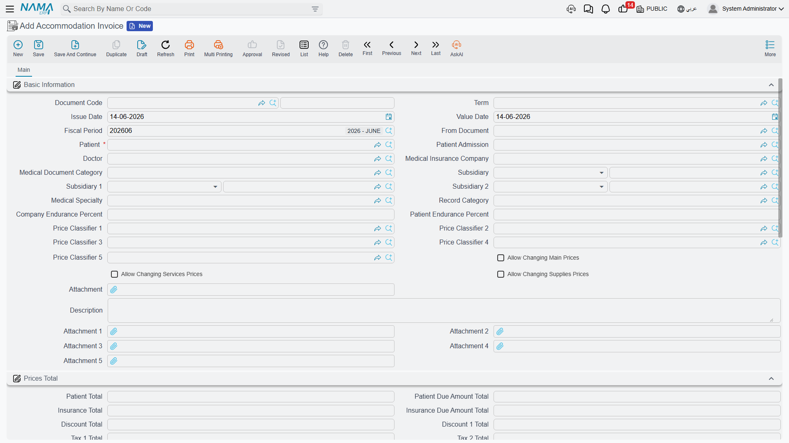
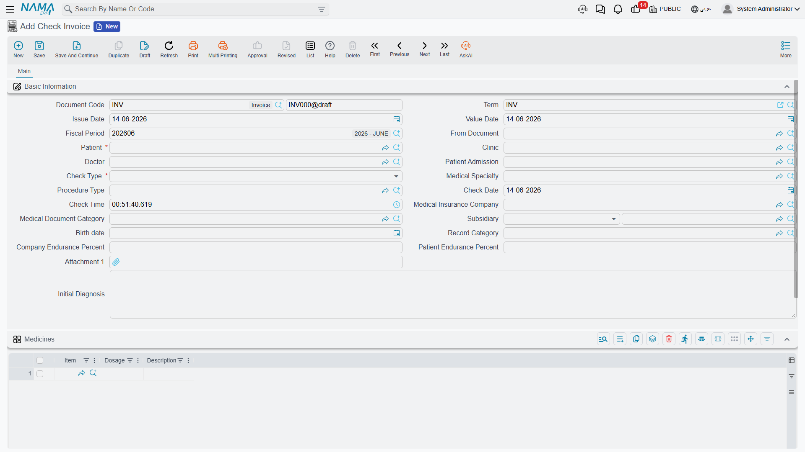
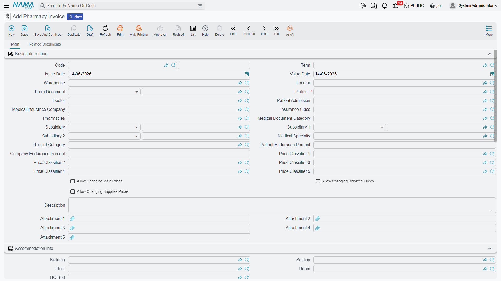
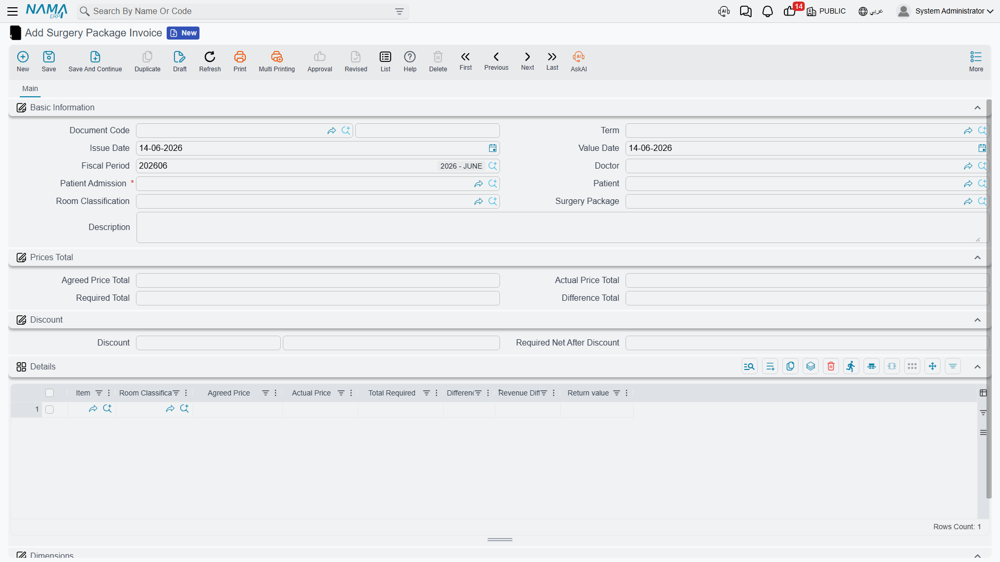
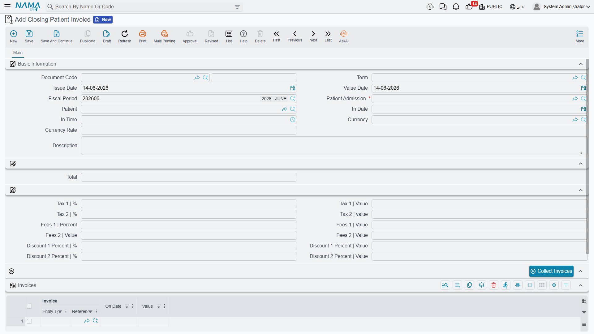

# Invoicing & Billing

Billing is the hospital's financial backbone. The rule is simple: **one invoice per service type**. These invoices are very similar in structure and then differ in their lines by service type. All of them are documents that produce an **accounting effect**.

## The common pattern across all invoices

Service invoices share one skeleton:

1. **Document header** — document code, term, issue and value dates, fiscal period, and dimensions.
2. **Patient context** — patient, **patient admission** (linking the charge to the admission), insurance company and class, patient/company endurance percentages, often the doctor, specialty and document category, and the cost-bearing parties.
3. **Service lines** — each with a rich price block that computes: price, discount 1/2, **patient/insurer split** (a percent and value each), the **insurance max value from the approval and from the admission**, taxes split between patient and insurer, **total patient due** and **total insurance due**, and the cost percentage/value with its allocation to subsidiaries.
4. **Totals** — mirroring the above at document level.
5. **Overhead lines** — on most invoices.

::: tip Split billing is the core idea
Every line is automatically divided into a **patient share** and an **insurance share** (using the endurance percentages from the [insurance approval](./hms-insurance.md) and the admission), each taxed separately and posted to a distinct account in the **term config**. That term config is what maps the value types (patient value, insurance value, discounts, taxes, cost, subsidiary cost) to ledger accounts.
:::

## Service invoices

These follow the service pattern (price + supervision + addition-time cost for surgeries):

- **Accommodation Invoice** — the room/bed accommodation fee, usually auto-generated from the accommodation document.
- **Attendant Invoice** — accommodation for the patient's companion.
- **Lab Test Invoice** — lab tests, with optional supplies and services.
- **Radiology Invoice** — imaging and its supplies.
- **Physical Therapy Invoice** — physiotherapy sessions.
- **Supervision Invoice** — the doctor's supervision of the patient.
- **Services Invoice** — general medical services.
- **Check Invoice** — the outpatient consultation, uniquely carrying a **Medicines** grid for drugs prescribed at the visit.

The richest of these is the **Surgery Invoice**: three tabs (surgery, supplies, services), with anesthesia and assistant doctors, price classifiers, accommodation info and attachments in the header; the surgery line breaks the fee into its components (open surgery, surgeon, assistant, anesthesia, other) with standard and additional hours. The supplies tab is a full inventory line that produces a stock issue.

## Inventory invoices and returns

These invoices **move stock** and add **Service Fees** accounts; their line is a full inventory line (item, unit, lot, batch, expiry, warehouse):

- **Pharmacy Invoice** and **Pharmacy Return** — dispensing drugs and returning them.
- **Supplies Invoice** and **Supply Return** — issuing supplies and returning them.
- **Service And Supply Invoice** — services and supplies on one document.
- **Blood Bank Invoice** — issuing blood units and related services (moves blood stock).

## The surgery package invoice

**Surgery Package Invoice** bills an operation against an **agreed package price** instead of itemized billing. It shows the **agreed price total**, the **actual** total and the **difference**, and per item: the agreed price, the actual price, and the difference and revenue difference. Accounting-wise, it posts the gap between the package price and the actual cost of services via dedicated difference accounts.

## The closing invoice

**Closing Invoice** is the discharge settlement document. When a patient leaves, this single invoice gathers **every individual invoice issued during the stay** into one statement, then applies admission-level taxes, fees and discounts to reach the final amount owed by the patient/insurer.

Its heart is the **Collect Invoices** button, which pulls all the patient's invoices tied to the admission into the details grid (invoice, date, value). Its header carries the admission, patient and in-date, plus **Tax 1/2**, **Fees 1/2** and **Discount 1/2** fields (percent + value) for admission-level adjustments. It posts the consolidated patient and insurance receivables together with those adjustments.

