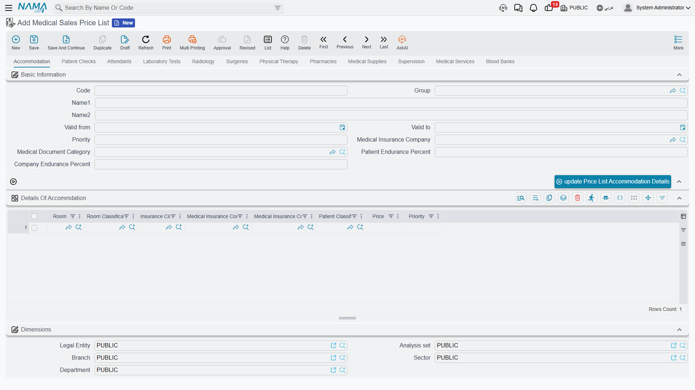
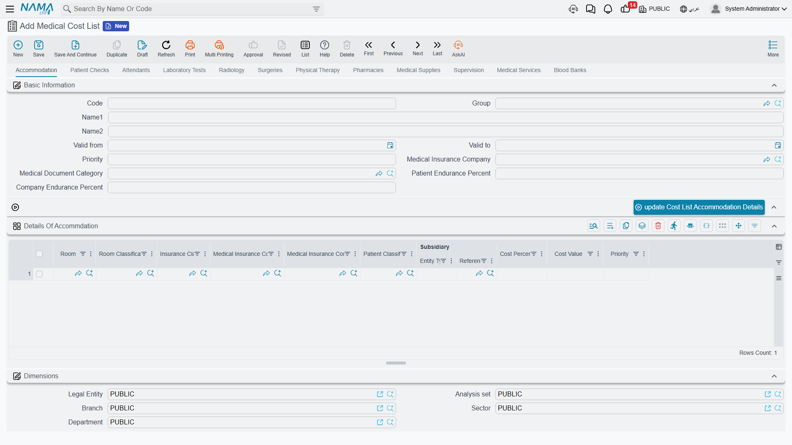
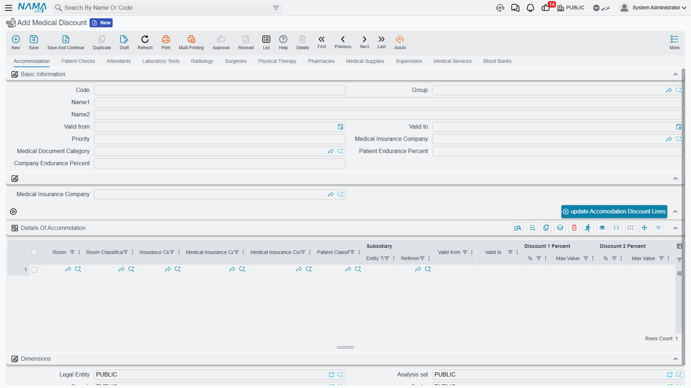
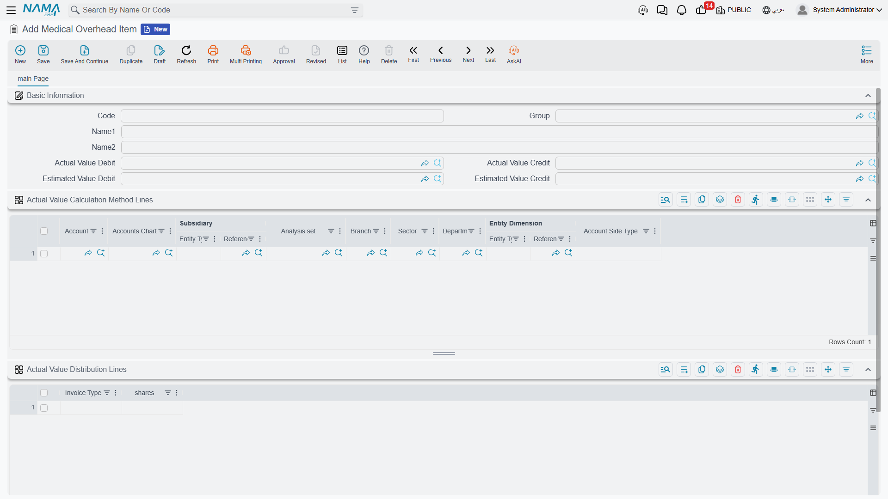
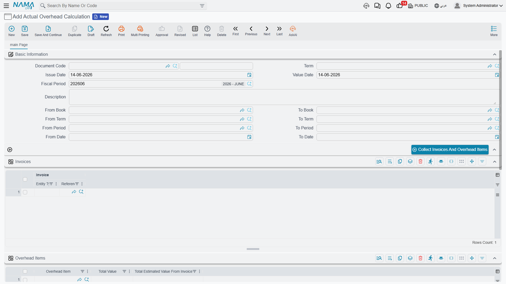
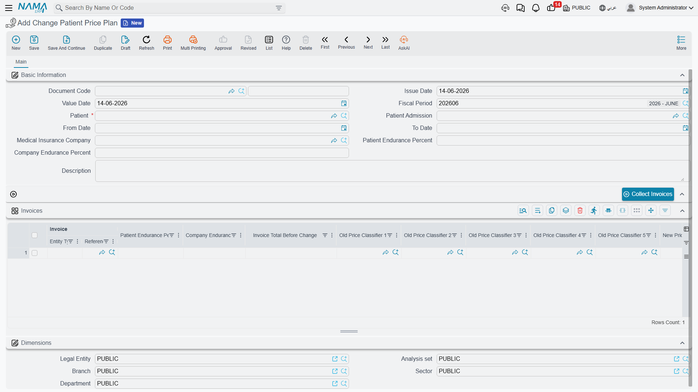

# Pricing, Costing & Discounts

Every hospital service has a selling price and a cost. As a hospital grows, pricing each service individually becomes impractical, so **lists** gather prices, costs and discounts in one place. These lists all share a single structure, so learning it once is enough.

## The shared structure: a tab per service type

The **sales price list, cost list, discount, and overhead list** all follow the same pattern: a tab per service area (accommodation, check, attendants, lab, radiology, surgeries, physiotherapy, pharmacy, supplies, supervision, services, blood bank), and a grid of lines on each tab.

Each tab repeats a common header: code and name, **valid from/to**, **priority**, **insurance company**, **document category**, and **patient/company endurance percent**. And the lines on every grid share the same **matching keys** used to select a line at billing time: the relevant service reference (room / doctor / test type / radiology type / surgery type / item…), degree, **insurance class, insurance company, insurance company class, patient class**, the period, and priority to break ties. What differs between the lists is only the **value columns**.

## The medical sales price list

**Medical Sales Price List** is the selling-price book — its core column is **price**. Certain tabs add their own columns (the surgeries tab breaks out standard hours and surgeon/assistant/anesthesia fees; the pharmacy, supplies and blood tabs add quantity and unit). This list determines what the patient is charged for each service, varied by doctor, insurer, patient class and period.

## The medical cost list

**Medical Cost List** has the same shape, but its columns capture **cost** rather than price: **cost percentage and value**, with up to three **subsidiary** splits per line (the doctor's/lab's/external party's share of the revenue). On the surgeries tab every fee component expands into percentage + value + an additional-time cost. This list is used for revenue-sharing with doctors and for profitability.

## Medical discounts

**Medical Discount** applies two stacked discounts per line: **Discount 1** and **Discount 2** (each a percent and a max value). Each tab has a button to bulk-update the discount lines at once for a given insurance company from the document header. It's used to apply patient- or insurer-specific discounts to services.

## Indirect (overhead) costing

Not every cost is direct — there's electricity, cleaning, administration. The system allocates these onto services through a three-piece machinery:

- **Overhead Item** — defines a single indirect-cost item (electricity, housekeeping…) and its accounts, **how to read its actual value** from the ledger, and **how to distribute it** across invoice types by weights (shares).

- **Overhead List** — the **estimated** indirect cost loaded onto each service (it follows the shared tabbed structure), applied automatically to invoices.

- **Actual Overhead Calculation** — a period-end document that computes and distributes the **actual** indirect cost. Three buttons run in order: **Collect Invoices and Overhead Items**, then **Calculate Overhead Value**, then **Distribute Actual Value** — posting the variance between estimated and actual.

## Changing a patient's price plan

Sometimes insurance coverage is confirmed after a patient is admitted and their invoices have been issued. The **Change Patient Price Plan** document re-prices a patient's issued invoices retroactively. You pick the patient, their admission, the period, the insurance company and the new endurance percentages; the **Collect Invoices** button gathers their invoices in range, and the grid shows for each invoice the **total before** and **after** the change, with the old and new price classifiers.

