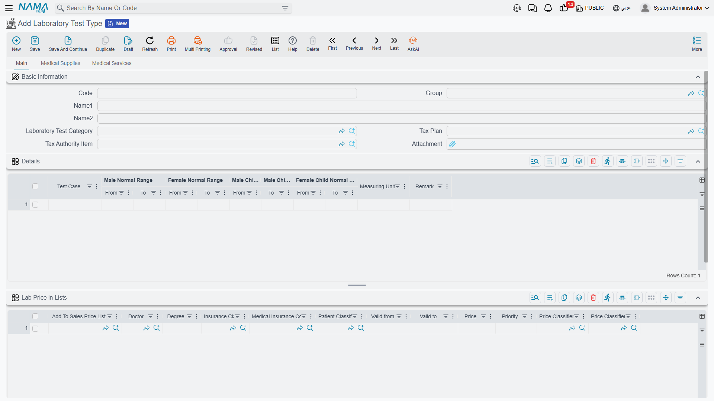
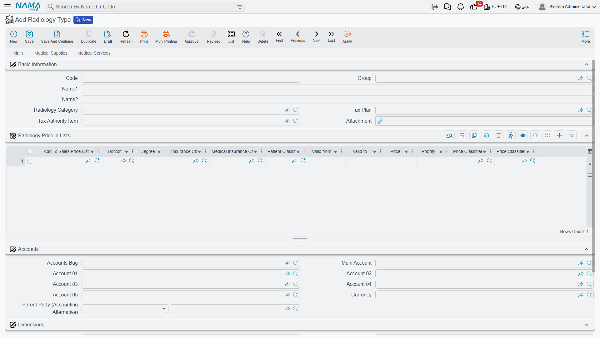
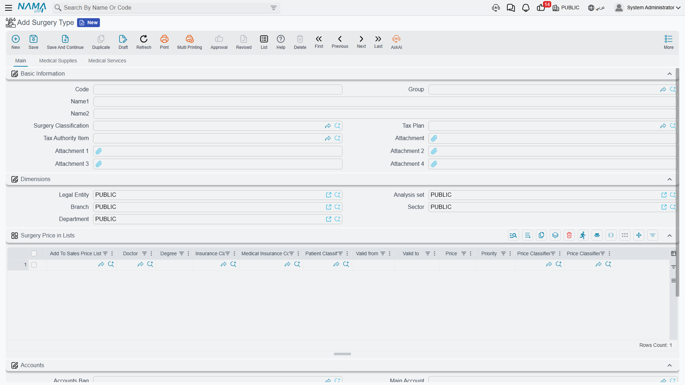
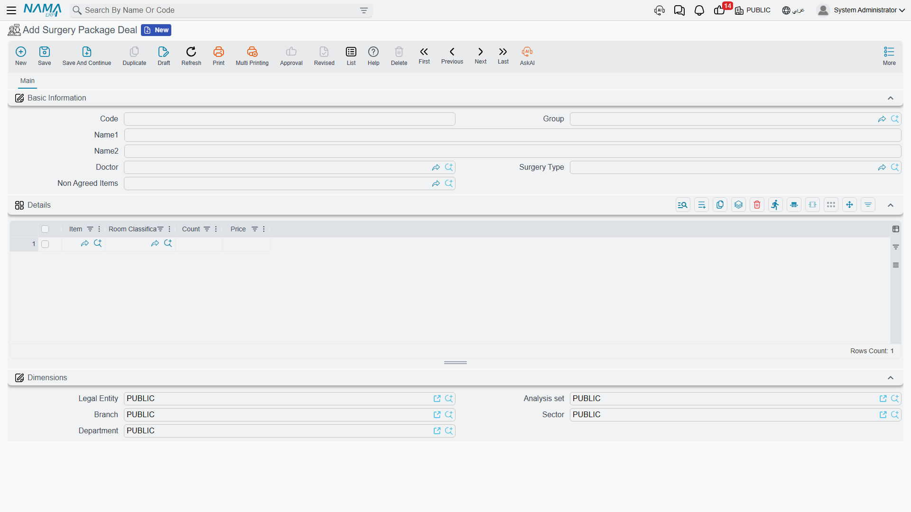

# Medical Service Catalog

Alongside general medical services, the hospital keeps specialized catalogs for each kind of clinical activity: **lab tests**, **radiology**, **physiotherapy**, and **surgeries**. These catalogs are what a doctor orders and what invoices are later priced from.

## A shared pattern: "a sellable service type"

Lab, radiology, physiotherapy and surgery types all share the same shape — they are the items the hospital actually charges for:

- **Basic Information:** code, name, the parent **category**, **tax plan**, and the **tax-authority item** (for e-invoicing).
- **Price-in-lists grid:** a quick way to push this item's price straight into one or more price lists, varying by doctor/degree/insurer/patient class and period.
- **Accounts and Taxes:** each type behaves as its own accounting party.
- **Medical Supplies tab:** the default items issued from the warehouse when the service is performed.
- **Medical Services tab:** default linked medical services.

## Lab tests

**Laboratory Test Type** defines a single test the lab offers (CBC, fasting glucose…). On top of the shared pattern, it has a unique tab defining the **normal reference ranges** for each result component, split by demographic: male / female / male-child / female-child (from–to) and the measuring unit. This grid is what later decides whether a patient's result is in or out of range.

Tests are grouped under a **Laboratory Test Category**. The system also includes lab support lists: **HMS Test** as a result component, and **Test Tube** and **Test Tube Color** to describe sample tubes and their conventional cap colours.

## Radiology and physiotherapy

**Radiology Type** defines a single imaging procedure (X-ray, CT, MRI, ultrasound…), follows the shared pattern, and is grouped under a **Radiology Category**.

Similarly, **Physical Therapy Type** defines a physiotherapy session/procedure, grouped under a **Physical Therapy Category**.

## Surgeries

**Surgery Type** defines an operation the hospital performs, adding surgery-specific details to the shared pattern: standard hours and the additional-hour price, and the **fee components** (surgeon fees, assistant, anesthesia, open surgery, other), along with a supplies warehouse and operative-document attachments. It's grouped under a **Surgery Classification** used as a pricing dimension.

## Surgery packages

Instead of billing an operation item by item, you can agree a **fixed all-in price** for it via a **Surgery Package**. The package links a doctor and surgery type to a billing item for non-agreed items (anything outside the bundle), and its details list a set of **package items**, each priced and optionally per room classification.

A **Package Item** is the line that appears inside the package, carrying flags that define **what this line covers** (supplies, check, accommodation, attendant, supervision, lab, radiology, physiotherapy, pharmacy, service, surgery, blood bank…) — i.e. it maps the package line to the real service category it represents. The package is later billed via the **[Surgery Package Invoice](./hms-invoicing.md)**, which compares the agreed price to the actual price and posts the difference.
