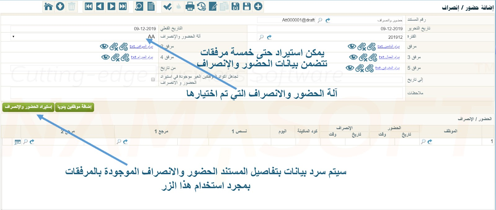
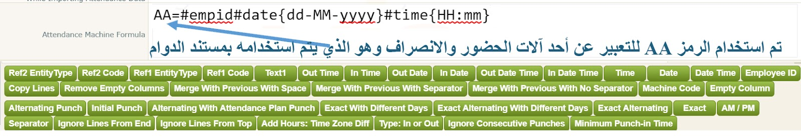

# Attendance and Departure Formulas

Employees typically record attendance and departure via fingerprint using a dedicated Time Attendance Machine.
The format of data exported from each machine differs.
For example, some machines output time in 24-hour format while others use 12-hour AM/PM format,
and data may be exported as an Excel file or as a text file with a specific field delimiter.
The delimiter varies from one machine to another, and so on.

Note that if the file exported by the machine uses the old Excel format with the `.xls` extension, it must be re-saved with the modern `.xlsx` extension to avoid errors when importing data.

Through the Attendance and Departure document, employee time-sheet files are imported by selecting the attendance machine being used,
then specifying the files to be imported via the attachment fields — the system allows importing up to 5 attachments.
See the following figure:



Namasoft has designed, through the payroll settings file, a mechanism to help the user import data from the time-sheet file.
Note that Nama ERP works only with the time-sheet file exported from the attendance machine
and does not connect directly to the attendance machine itself under any circumstances.

The purpose of the attendance and departure formulas — which we will explain below — is to inform the Nama system of the format and structure of the data in the file to be imported,
such as how the date is formatted: whether the day is written as a single digit (1, 2, 3) or two digits (01, 02, 03).

The following explains how to define the formula used to describe attendance and departure data, by explaining the mechanism mentioned in the previous paragraph.

The general formula for defining the format of imported fields can be understood from the example shown in the following image:



Where `AA` is a name representing the machine for which the formula is to be used; it can be replaced with any other text. When importing data from this machine through the time-sheet document, select `AA` in the Attendance Machine field.

The `#` symbol is used before the formula of any field — see the image.

`#empid`  represents the employee's code on the attendance machine.

`#date{dd-MM-yyyy}`  represents the date format for that employee.

`#time{HH:mm}`  represents the first time field (check-in time) for that employee.

Any other data to be added, such as text 1 and so on, is listed afterward.

You can use any of the buttons at the bottom of the window to insert attendance formula tokens such as date and time; the system automatically places the `#` symbol followed by the required formula in the correct format. For this reason, the development company recommends using these buttons to avoid manual errors.

When the formula is set up this way, the Nama system expects the data in the imported file to look as follows:


# Attendance Import Button Formulas

Below is an explanation of all field formulas that can be used when importing attendance and departure data in the Nama system.

## Table of All Attendance Formula Components {#Table-of-All-Attendance-Formula-Components}

---

# Attendance Import Button Formulas

## Employee ID

**Formula:** `#empid`

Used to insert the employee's code on the attendance machine.

---

## Date

**Formula:** `#date{dd-MM-yyyy}`

Used to insert the date (either check-in or check-out).
Format details:

* `dd`: Day. If two characters are used, the expected data is like `01, 02, ..., 31`.
  If a single character `d` is used, the expected data is like `1, 2, ..., 31`.

* `MM`: Month as two digits, like `01, 02, ..., 12`.
  **Important:** Use uppercase `M` because lowercase `m` refers to minutes.

* `yyyy`: Year as four digits, like `2024`, `2025`.

::: tip
The system supports the following escape sequences inside date and time formulas:
* `\n` — New Line
* `\r` — Carriage Return
* `\t` — Tab

This is useful when the time-sheet file contains special characters within the date or time format. For example, if the separator between the date and time in the file is a tab, you can use a formula like:
`#datetime{dd-MM-yyyy\tHH:mm:ss}`
:::

---

## In Date

**Formula:** `#indate{dd-MM-yyyy}`

Used to insert the **check-in date** in a separate column.
When used, `Out Date` must also be used, since both check-in and check-out dates appear on the same line.

---

## Out Date

**Formula:** `#outdate{dd-MM-yyyy}`

Used to insert the **check-out date** in a separate column.
Used together with `In Date`.

---

## Time

**Formula:** `#time{HH:mm}`
or `#time{hh:mm a}`

* `HH`: Hour in 24-hour format.
  If only `H` is used, the expected format is `1, 2, ..., 24`.

* `hh`: Hour in 12-hour format; `a` must be added to specify the period (AM/PM).

* `mm`: Minutes, like `01, 02, ..., 59`.

Examples:

* `10:42 am`
* `10:42 pm`

---

## In Time

**Formula:** `#intime{HH:mm:ss}`

Used to insert the **check-in time** in a separate column.
Used together with `Out Time`.

---

## Out Time

**Formula:** `#outtime{HH:mm:ss}`

Used to insert the **check-out time** in a separate column.
Used together with `In Time`.

---

## Date Time

**Formula:** `#datetime{dd-MM-yyyy HH:mm:ss}`

Used to insert the date and time in a single column.

---

## In Date Time

**Formula:** `#indatetime{dd-MM-yyyy HH:mm:ss}`

Used to insert the check-in date and time in a single column.

---

## Out Date Time

**Formula:** `#outdatetime{dd-MM-yyyy HH:mm:ss}`

Used to insert the check-out date and time in a single column.

---

## Alternating Punch

**Formula:** `#alternatingPunch`

The first reading of the day is treated as check-in and the last reading as check-out.
Used to simplify import data from the machine.

---
## Alternating With Attendance Plan Punch

**Formula:** `#alternatingWithAttendancePlanPunch{2.5}`

This formula is used to intelligently process imported data: the system determines whether a punch represents a **check-in** or **check-out** based on the employee's **attendance plan**.

This determination relies on a time window (in hours) specified inside the `{}` brackets. Within this window, a punch is classified as either check-in or check-out based on how close it is to the scheduled shift time.

### Illustrative Example:

```
AA=#empid#date{dd-MM-yyyy}#time{hh:mm}#alternatingWithAttendancePlanPunch{2}
```

**Explanation:**

* Employee's attendance plan: 8:00 AM to 4:00 PM.
* The window `{2}` is set in the formula.

Accordingly:

* Any punch between **6:00 AM and 10:00 AM** → treated as a **check-in punch**.
* Any punch between **2:00 PM and 6:00 PM** → treated as a **check-out punch**.

### When to Use This Formula?

This formula is particularly useful when:

* The employee has **more than one shift** in a single day.
* **More than one actual check-in and check-out** is recorded on the same day.

Thanks to this formula, data is interpreted flexibly and intelligently without needing to explicitly define the punch type inside the file.

---

## Respect Attendance Plan Punch Type

**Formula:** `#respectAttendancePlanPunchType`

This formula is used in conjunction with `#alternatingWithAttendancePlanPunch` to modify how check-in and check-out punches are paired within a single shift.

### Default Behavior (Without This Formula)

When punches are grouped by shift, the system takes only the **first punch** as check-in and the **last punch** as check-out, ignoring any intermediate punches during pairing.

### Behavior When Using `#respectAttendancePlanPunchType`

The system takes into account the **inferred type of each punch** (check-in or check-out) — based on its proximity to the shift plan times — and iterates through punches in order, pairing them according to the following rules:

* If the current punch is a **check-out** and no check-in punch precedes it within the shift, it is treated as a standalone check-out row (only check-out is set; check-in is left empty).
* If the current punch is a **check-in** and the next one is a **check-out**, they are paired together as a (check-in/check-out) pair.
* If the current punch is a **check-in** and the next one is also a **check-in**, the first is recorded as a standalone check-in row without pairing, and the next punch is then processed with the same logic.

- When to Use This Formula?

This formula is particularly useful when:

* The employee records **multiple check-in and check-out punches** during the same shift (e.g., leaving for a break and returning).
* You need to preserve **each successive check-in/check-out pair** as separate rows instead of merging only the first and last punch.
* You want the system to respect the intelligent punch classification derived from matching against the attendance plan.

### Illustrative Example:

```
AA=#empid#date{dd-MM-yyyy}#time{hh:mm}#alternatingWithAttendancePlanPunch{2}#respectAttendancePlanPunchType
```

In this example, if an employee records four punches in their day (check-in, check-out, check-in, check-out), **two separate rows** are produced representing the two work periods, rather than a single row combining the first check-in and last check-out.

---

## Exact Alternating

**Formula:** `#exactAlternating`

The first reading is treated as check-in, the second as check-out, the third as check-in, and so on.
If a new day starts, the reading is automatically treated as check-in.

---

## Exact Alternating With Different Days

**Formula:** `#exactAlternatingWithDifferentDays`

Same concept as `Exact Alternating` but across multiple days.

---

## Exact With Different Days

**Formula:** `#exactWithDifferentDays`

Every two consecutive readings are treated as check-in and check-out regardless of the dates.

---

## Ignore Consecutive Punches

**Formula:** `#ignoreConsecutivePunches{5}`

Used to ignore punches that occur within a specified number of minutes of each other (e.g., 5 minutes).

---

## Add Hours: Time Zone Diff

**Formula:** `#addhours{2}`
or `#addhours{-2}`

Used to shift the time by adding or subtracting a specified number of hours.

---

## Type: In or Out

**Formula:** `#type{I-O}`
or `#type{C/In-C/Out}`

Used to specify the punch type (check-in or check-out) if it is present as a value in the file.

---

## Copy Lines

**Formula:**
`#copylines{intime=Checkin2,outtime=Checkout2|intime=Checkin3,outtime=Checkout3}`

Sometimes attendance data for more than one **shift** (two or three shifts) is imported on the **same line** in the source file.

### How to Represent This:

#### 1. Insert the date and time for the first shift:

```
AA=#date{dd-MM-yyyy}#intime{HH:mm:ss}#outtime{HH:mm:ss}
```

#### 2. Insert the additional fields for the second and third shifts (for example):

```
AA=#date{dd-MM-yyyy}#intime{HH:mm:ss}#outtime{HH:mm:ss}#Checkin2#Checkout2#Checkin3#Checkout3
```

#### 3. Use the `copylines` formula to copy the other shifts into separate rows:

```
AA=#date{dd-MM-yyyy}#intime{HH:mm:ss}#outtime{HH:mm:ss}#Checkin2#Checkout2#Checkin3#Checkout3#copylines{intime=Checkin2,outtime=Checkout2|intime=Checkin3,outtime=Checkout3}
```

### Notes:

* If there is only one additional shift, the part for `Checkin3` and `Checkout3` can be omitted.
* This formula causes the system to treat each (check-in time / check-out time) pair as an independent shift and convert it into a **separate row** during import.

---


## Separator

**Formula:** `#sep{,}`

Used to specify the delimiter between fields in a text file (e.g., `,`, tab `\\t`, or space).

---

## Empty Column

**Formula:** `#ignore`

To ignore a specific column in the file.

---

## Ignore Lines From Top

**Formula:** `#ignoreLinesFromTop{1}`

To ignore a specified number of lines from the top of the file.

---

## Ignore Lines From End

**Formula:** `#ignoreLinesFromEnd{1}`

To ignore a specified number of lines from the end of the file.

---

## Text 1

**Formula:** `#text1`

To import an additional text field, such as nationality.

---

## Machine Code

**Formula:** `#machinecode`

To import the machine code into the attendance details.

---

## Ref1 Code & Ref1 Entity Type

**Formulas:**

* `#ref1Code`
* `#ref1EntityType{Project}`

Used to import the code and entity type of reference 1 (e.g., Project, Department, Branch...).

---

## Ref2 Code & Ref2 Entity Type

**Formulas:**

* `#ref2Code`
* `#ref2EntityType{Branch}`

Used to import the code and entity type of reference 2.

---

## Remove Empty Columns

**Formula:** `#removeEmptyColumns`

Used to remove empty columns that result from repeated spaces in a text file.

---

## AM / PM

**Formula:** `#am_pm{صباحاً-مساءاً}`

Used when using 12-hour format with Arabic morning/evening expressions instead of AM/PM.

---
## Merge With Previous With Separator

**Formula:** `#mergeWithPreviousWithSeparator{-}`

This formula is used in **rare cases** where one of the fields is split across **multiple columns** in a text file, as with a date written in the following form:

```
2019 01 15
```

In this case, the system reads these values as three separate columns, not as a single value.

### Solution:

`#mergeWithPreviousWithSeparator{-}` can be used to merge these three columns into a single value separated by a character such as `-`, resulting in:

```
2019-01-15
```

### Practical Example:

```
AA=#empid#date#mergeWithPreviousWithSeparator{-}#mergeWithPreviousWithSeparator{-}#time{HH:mm}
```

### Notes:

* The formula is used **twice** because there are **two spaces** between the parts of the date.
* Inside the `{}` brackets, the **new separator** to be used during merging is specified (in this example `-`).
* This formula is useful when importing from unstructured files or files formatted manually with inconsistent delimiters.


---

## Merge With Previous With No Separator

**Formula:** `#mergeWithPreviousNoSeparator`

Used to merge values without using any separator.

---

## Merge With Previous With Space

**Formula:** `#mergeWithPreviousWithSpace`

Used to merge values separated by a space instead of another delimiter.

---


::: tip
You can use the buttons available in the formula setup screen inside the system to automatically insert the correct formula and avoid manual errors.
:::
