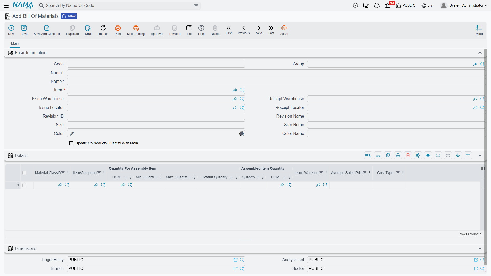
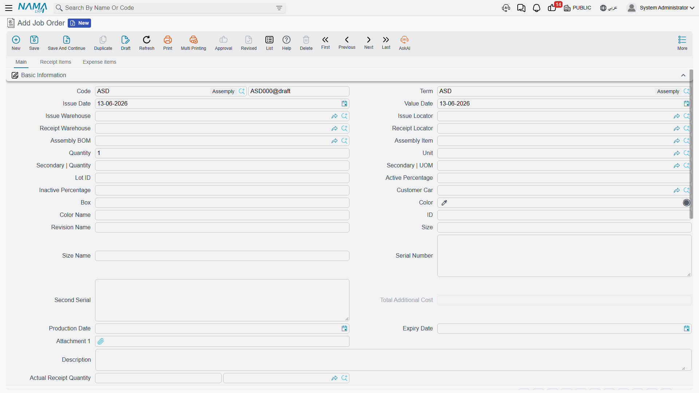

# Assembly & Packaging

Not everything you sell is bought as-is; some items are assembled from components, or transformed and packaged before sale. **Assembly** is the "light manufacturing" within the supply chain: you issue components and receive an assembled product, without the complexity of full production orders in the Manufacturing module.

::: info When Assembly, When Manufacturing?
Use assembly for simple cases: kitting, building custom configurations, or packaging. Complex production with its stages, labor, and overhead belongs in the [Manufacturing module](/en/modules/manufacturing/).
:::

## The Bill of Materials: The Recipe (AssemblyBOM)

The **Assembly BOM** is the "recipe" of the assembled product: it defines the main item, its components and their quantities, plus co-products and dimension specifiers (size, color, revision), and the issue and receipt warehouses and locators for the assembly operation. It also allows linking alternative materials when source flexibility is needed.

To reduce repetitive entry, the **Partial Assembly BOM** (PartialAssemblyBOM) lets you define an assembly rule at the item-classification level (not per item), so similar items inherit their component structure. The **Assembly Component** (AssemblyComponent) is available as a registry of reusable component sets.

## The Assembly Document: Executing the Recipe (AssemblyDocument)

The **Assembly Document** actually executes the operation: it issues components from inventory and receives the assembled item, allocating costs from components to the finished product and co-products, with the ability to track processing stages and quality control.

**Example - assembling computer systems:** a customer orders 20 complete systems. The document issues 20 base units, 20 monitors, 20 keyboards, and 20 mice, and receives 20 integrated systems. Component stock decreases, system stock rises, and value moves from components to systems (a system's cost = the sum of its components). The system also supports **de-assembly** to reverse the operation: breaking an unsold kit back into its components to restock them.

### Assembly Types and Tools

- **Aggregated Assembly Document** (AggrAssemblyDocument): a batch assembly document for multiple items/days with accumulated materials and costs, separating staging and final warehouses and generating the linked issue and receipt documents.
- **Multi-Assembly Document** (MultiAssemblyDoc): assembles a main item from multiple materials and components in a single document.
- **Assembly Request** (AssemblyRequest): starts the assembly path as a request (with its components and quantities) and converts to an assembly document after approval.
- **Alternative Materials** (AssemblyAltMaterial): a register of approved alternative materials per BOM, with quantity ranges and substitution rules that maintain component compatibility with source flexibility.

### Supporting Configuration Files

- **Assembly Process File** (AssemblyProcessFile): defines the assembly process steps (process routing) for quality control and batch tracking.
- **Assembly Machine** (AssemblyMachine): defines the machine used and its raw and indirect material warehouses, outputs, and costs.

## Processing (ProcessingDoc)

The **Processing Document** records intermediate processing operations: it manages raw and indirect materials and outputs with warehouse and locator assignment, and generates the linked inventory documents with direct-labor tracking and batch date/time for traceability.

## Packaging (PackagingMethodFile)

The **Packaging Method File** defines the standard packaging units for the finished product and its packaging components (the quantity per package), used in costing and delivery consolidation. This links the product's form as sold (pack, carton, pallet) to its actual components in inventory.

## Assembly and Cost

Assembling a product means rolling up its cost. **Finished Product Pricing** captures this roll-up from the BOM or the assembly document to arrive at the final cost - you'll find the details in [Inventory Costing & Revaluation](./inventory-costing.md).

## Next Steps

- [Inventory Costing & Revaluation](./inventory-costing.md) - rolling up the costs of assembled products
- [Quality Control](./quality-control.md) - quality checks within assembly stages
- [Manufacturing module](/en/modules/manufacturing/) - complex production with full orders
