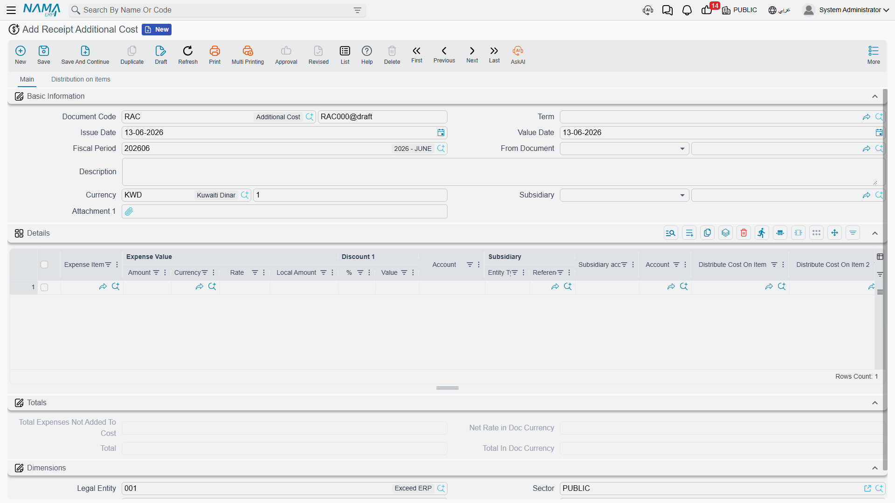
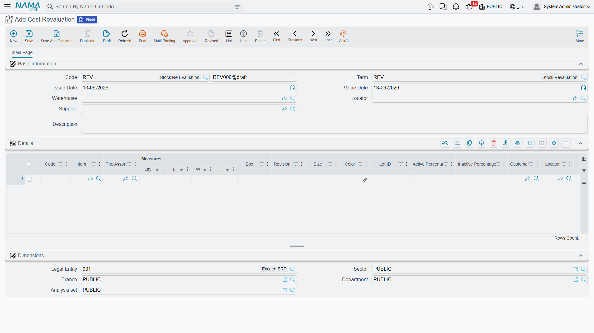

# Inventory Costing & Revaluation

Inventory quantity is only half the truth; the other half is its **value**. This guide gathers the documents that adjust your inventory's cost: distributing additional charges across receipts, revaluing cost, and freezing cost at period close.

## How the System Tracks Cost

The system keeps each item's cost and updates it with every movement according to the adopted costing method - such as **First In First Out (FIFO)**, **moving average cost**, and **last purchase cost**. On each receipt the cost is updated, and on each issue the cost of the issued goods is computed the same way, so cost of goods sold and inventory value stay automatically consistent.

But reality imposes cases where this automatic tracking needs intervention: freight charges that arrive after the receipt, a market value that drops, or a monthly close at which cost must be fixed. Those are the cases this page covers.

## Additional Costs on Receipts (ReceiptAdditionalCost)

The supplier's item price isn't the whole true cost. There's freight, insurance, customs, clearance, and commissions. The **Additional Cost** document distributes these charges across the receipt's items to arrive at the true **landed cost**.

### How It Works

You link the document to the relevant receipt (or purchase order), then enter the charge lines. The system distributes them across the items on a basis you choose - by value, by weight, by quantity, or manually. The result is that each item's cost rises by its fair share of the charges, so inventory value - and therefore cost of sale - reflects the true cost, not the supplier price alone.

The document supports automatic, manual, and calculated lines, and supports scheduling payment of external charges via scheduling templates, linking charges to their payees over time.

::: tip Additional Costs and Letters of Credit
In imports via letters of credit, the LC charges (freight, insurance, customs, bank commissions) are accumulated and loaded onto the goods within the LC path. See [Letters of Credit](./letters-of-credit.md).
:::

## Cost Revaluation (CostRevaluation)

Sometimes the quantity is right but the **value** needs adjusting. The **Cost Revaluation** document changes items' cost without changing their quantities - no physical movement, accounting effect only.

Use cases:
- **Market value decline**: electronics bought at a high price, then a newer model is released, so their value is reduced to match the market (lower of cost or market).
- **Obsolescence**: old stock that won't sell at full price, so its value is adjusted to the expected recoverable amount.
- **Correcting cost errors**: items received at the wrong cost, restored to the correct cost.

The location and quantity stay the same, and only the value balance in the books changes, with an accounting entry reflecting the value difference.

## Finished Product Pricing (FinishedProductPricing)

When you assemble or manufacture a finished product, its cost accumulates from its components. The **Finished Product Pricing** document captures this roll-up: it gathers component costs from the bill of materials (BOM) or the assembly document, allocates co-products and indirect additional costs, and arrives at the final cost of the assembled product. This document complements the [Assembly & Packaging](./assembly-and-packaging.md) path from the costing side. Full production costing (labor and overhead for production orders), however, lives in the [Manufacturing module](/en/modules/manufacturing/).

## Freezing Cost at Close (FrozenCostAccounts)

When you close an accounting period (month-end, for example), you don't want inventory cost changing retroactively after statements are issued. **Frozen Cost Accounts** prevents cost adjustments during a date-bounded period, preserving the stability of the numbers your financial statements were built on, and preventing late receipts or adjustments from moving the cost of a closed period.

::: tip Preventing the Use of Specific Batches
Alongside freezing cost, the system lets you **prevent using a batch** during a period (for example a batch under recall or quarantine), so that batch can't be issued until the prevention is lifted - a quality-control tool that intersects with cost by preventing movement of stock that shouldn't be sold.
:::

## Best Practices

::: tip Practical Tips
**Distribute additional costs before close**: Enter freight and customs charges on the receipt as soon as they're available, so inventory cost reflects reality before cost of sales is computed.

**Document the reason for revaluation**: Every revaluation needs a clear justification (market drop, obsolescence, correction) for audit and compliance purposes.

**Freeze cost right after close**: Enable freezing as soon as the period's statements are approved to prevent any later movement of their numbers.

**Review landed cost periodically**: Compare actual landed cost to expected to catch supplier or freight deviations early.
:::

## Next Steps

- [Receiving Stock](./receiving-stock.md) - where inventory cost begins
- [Stock Taking](./stock-taking.md) - reconciling quantities before fixing values
- [Assembly & Packaging](./assembly-and-packaging.md) - building products and rolling up their costs
- [Letters of Credit](./letters-of-credit.md) - import costs via letters of credit
