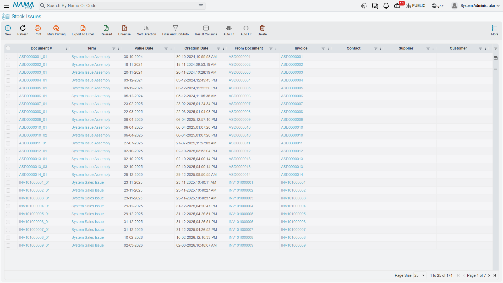
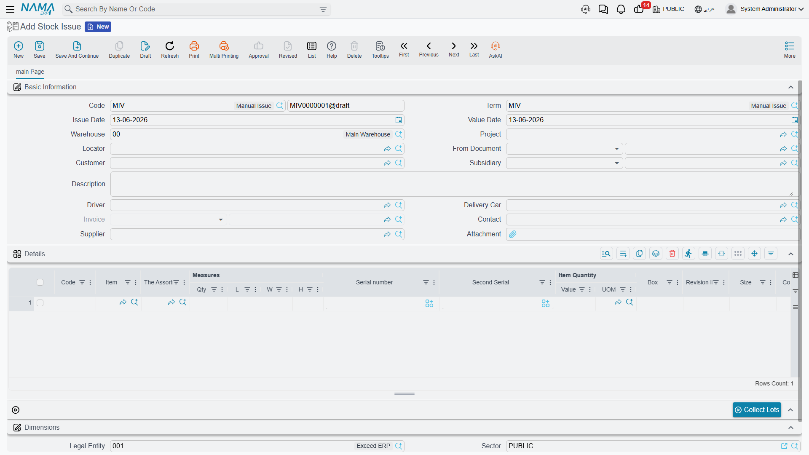

# Issuing Stock

What goes in must come out! While [receiving stock](./receiving-stock.md) is about bringing items into your warehouse, issuing is about releasing them for use. Let's explore when, why, and how items leave your inventory.

## The Stock Issue: Your Inventory's Exit Point

The **Stock Issue** (StockIssue) is the official record proving that items left the warehouse at a specific time for a specific purpose. Just like receipt documents, different scenarios call for different handling.

## The General Stock Issue: Your Primary Tool

The stock issue document is your multipurpose tool for taking items out of inventory for any reason other than a direct sale (which has its own path in [The Sales Journey](./sales-journey.md)).

### Common Scenarios

**Internal department use**
The IT department needs 10 laptops for a new project. Create a stock issue to move them from "available" into the department's custody, reduce available stock (so you don't accidentally sell them), and know their location later.

**Samples and demos**
The sales team needs samples for a trade show. Issue them with notes about the purpose, to track what's been distributed vs. available for sale, and book their cost as a marketing expense.

**Shortages, losses, and damage**
During stock taking you discovered a shortage of 5 pieces, or some goods were damaged in storage. The system has no standalone "damage voucher"; the correct way to record any incidental loss or damage is a **stock issue** directed to an appropriate loss account. This formally removes the items from tracked inventory and records the loss in accounting, with the reason documented.

::: warning Natural loss and periodic differences
If the shortage results from natural loss or periodic differences discovered during counting (not a specific damage event), it's better settled through [Stock Taking](./stock-taking.md), not a manual issue.
:::

**Donations**
You donate old equipment to a charity. Issue the items with proper documentation for tax purposes, recording the fair value and the recipient's information.

### How It Works

Every issue document needs:
1. **Source location**: Where are the items taken from? Which warehouse and specific locator?
2. **Items and quantities**: What's leaving and how much? With the unit of measure specified.
3. **Purpose / destination**: Where is it going? A department? A project? A loss account?
4. **Costing method**: Usually automatic, based on the adopted costing method.

The system then reduces the inventory quantity at the source location, decreases inventory asset value, creates accounting entries (crediting inventory, debiting the expense or target account), records the specific serials or batches issued, and updates available quantities.

## The Request-First Approach: Stock Issue Request (StockIssueReq)

In many organizations, items aren't issued at random - someone requests them first. The **Stock Issue Request** is a request for items that must be reviewed and approved before the actual issue.

**Workflow:**
1. **Request**: The department creates an issue request: "we need 100 kg of material, 50 pieces for work order #12345."
2. **Review**: The warehouse supervisor checks availability, the request's validity, and the reasonableness of quantities.
3. **Approval**: After approval, the request is authorized.
4. **Execution**: The warehouse creates the actual issue document linked to the request.

**Why the extra step?** Because it gives you control (no one takes items without a request and approval), planning (preparing items in advance), visibility (management sees consumption before it happens), and a clear audit trail. This is critical for high-value items, controlled materials, and budget-restricted items.

::: info Issuing to production and specialized departments
Issuing raw materials to production orders has its documents in the **Manufacturing** and **Manufacturing Components (MC)** modules; issuing supplies to patient wards is in **Hospital Management**; and issuing site materials is in **Contracting**. Each of these tracks its cost its own way, so see each module's documentation for those paths. The general stock issue here remains your tool for non-specialized purposes.
:::

## Cutting Two-Dimensional Materials (ItemCuttingDoc)

The **Item Cutting Document** handles a special case for **two-dimensional** items (such as steel, glass, and wood sheets): when you don't just issue the material, but transform it into smaller pieces of specific dimensions.

**Example**: You have a steel sheet measuring 2×3 meters. You cut it into several pieces of various dimensions per the manufacturing need. This document **issues** the full sheet, **receives** the resulting pieces with their dimensions, and **tracks** the waste (the difference between the sheet's area and the sum of the pieces' areas). It's an issue and a receipt at once - a transformation document for two-dimensional items.

::: tip Not for weight loss
The cutting document is for the geometric transformation of two-dimensional items, not for handling weight loss or natural shrinkage (such as meat losing weight); that's handled through [Stock Taking](./stock-taking.md).
:::

## Batch Selection: Which Items Are Issued?

When you have several batches of the same item, which one is issued? The system can select automatically based on:

- **FIFO (First In First Out)**: issue the oldest stock first - suitable for perishable items and obsolescence prevention.
- **LIFO (Last In First Out)**: issue the newest stock first - sometimes used for items where newer is better.
- **FEFO (First Expiry First Out)**: issue the nearest-to-expiry first - essential for medicines, food, and any item with an expiry date.
- **Manual selection**: when you need to pick a specific batch for quality considerations or a customer preference.

## Serial Number Management

For serialized items, issuing requires specifying exactly which serials are leaving. The system displays available serials at the source location, the user selects (or scans) which to issue, the system verifies availability, and on save those serials move from "available" to "issued." Future tracing stays possible: "where is serial #12345?" shows it was issued on such a date to such a destination. This is essential for warranty tracking, recall management, and asset management.

## The Accounting Effect of Issuing

Every issue has accounting consequences that depend on the purpose:

- **Issue to a department (internal use)**: credit inventory / debit department expense
- **Issue for samples (marketing)**: credit inventory / debit marketing expense
- **Issue for losses/damage**: credit inventory / debit loss account
- **Issue for repair (returned later)**: credit inventory / debit inventory-under-repair (still an asset!)

The system creates these entries automatically based on the accounting setup you configured for the item and the issue's purpose.

## Correcting Issue Errors

What if you issued too much? Too little? The wrong item?
- **Return via receipt**: if items are returned, create a receipt to bring them back into available stock.
- **Adjustment issue**: if you issued too little, create an additional issue for the remaining quantity.
- **Cancel and re-issue**: clearer audit trail but the most effort.

Choose based on your organization's controls, the time elapsed, and whether downstream operations (like production costing) have already used the issue data.

## Tips for Accurate Issuing

::: tip Best Practices
**Verify before saving**: Review quantities and items before saving (not as a draft). Once saved, the document affects the system immediately.

**Use locators precisely**: Issue from the actual location where the items reside, not from the warehouse in general.

**Link to source documents**: Always link the issue to its purpose. This traceability is essential when investigating discrepancies.

**Don't delay recording issues**: Record them as soon as they happen. Real-time inventory accuracy requires real-time recording.

**Handle partial issues**: If only part of the request is available, issue what you have and record the shortage rather than waiting.
:::

## Frequently Asked Questions

**Q: Can we issue items not in stock (go negative)?**

A: It depends on the item's overdraft policy; some critical items prevent negative stock, while others warn but allow. See [Understanding Inventory Items](./understanding-items.md#Inventory-Control-How-Does-Stock-Behave).

**Q: What's the difference between an issue and a transfer?**

A: An **issue** reduces total inventory (items left the organization's control). A **transfer** moves items between locations while the total stays the same. Moving from one warehouse to another is a transfer, covered in [Moving Stock](./moving-stock.md).

**Q: How do we record damaged goods without a "damage voucher"?**

A: Use a stock issue directed to a loss account. This is the system's adopted way to record incidental damage, with the reason documented in the notes.

## Next Steps

Now that you understand receiving and issuing together, learn about:
- [Moving Stock Between Warehouses](./moving-stock.md) - transfers and consolidations
- [Stock Taking](./stock-taking.md) - reconciling differences and natural loss
- [The Sales Journey](./sales-journey.md) - how sold items leave (leading to issues)
