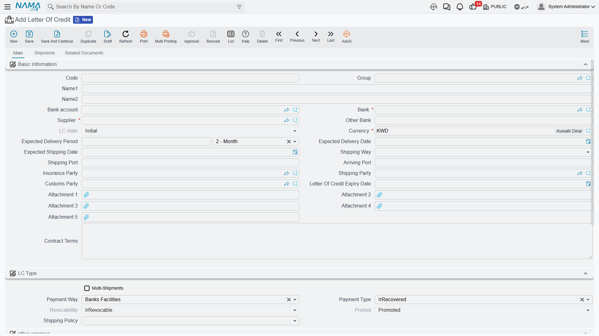
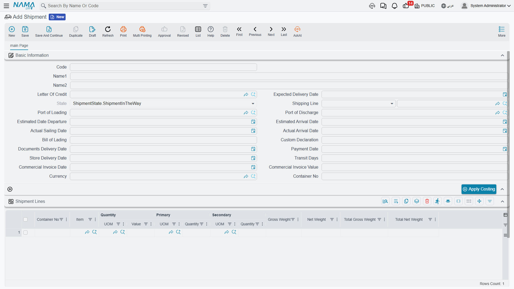

# Letters of Credit

When you import goods from a supplier abroad, both parties need a guarantee: the supplier wants assured payment, and you want assured conforming shipment. The **Letter of Credit (LC)** is the banking instrument that reconciles the two, and the system manages its full cycle - from opening to shipments to costs.

## What Is a Letter of Credit?

It's an undertaking by your bank to pay the supplier the value of the goods once they meet agreed conditions (conforming shipping documents within a set deadline). Instead of wiring money directly to a distant supplier you've never dealt with, the bank stands as a trusted intermediary protecting both parties.



## The LC File (LetterOfCredit)

The **Letter of Credit** is the master file linking the supplier, bank, shipment details, and terms: the payment type (prepaid or deferred), the shipment policy and LC shape (sight or usance), the LC value and expiry date, the shipping ports, and the insurance, customs, and shipping parties. It supports multiple shipments with expected delivery periods, and stores attachments and the associated proforma invoices.

## The Opening Cycle

```
LC Request → Opening Request → Opening Document → Shipments → Costs & Expenses
```

- **LC Request** (LetterOfCreditRequest): starts the workflow with a down-payment percentage and supplier details, with status tracking for the LC.
- **Opening Request** (LCOpeningRequest): the pre-opening stage that prepares for establishing the LC at the bank.
- **Opening Document** (LCOpeningDoc): finalizes the opening with a bank account, opening commission, and value confirmation, distributes the down payment and commission as additional costs, creates the necessary accounting entries, and links to the expense document to track LC costs across its cycle.

## Shipments (LCShipment)



The **LC Shipment** tracks the dispatch of goods under the LC: container, bill of lading, and customs documents, expected vs. actual dates and transit days, the commercial invoice with its currency and shipment lines, and shipping-line assignment and port routing. Linked to it at the document level are:
- **LC Proforma Invoice** (LCProformaInvoice): a proforma invoice before shipment that defines the items and prices, with support for deferred payment scheduling.
- **LC Shipment Proforma Invoice** (LCShipmentProformaInvoice): issued upon shipment execution, with lines keyed to the actual shipment quantities.

## Costs and Expenses

The cost of imported goods isn't just their price; it includes insurance, freight, customs, commissions, and financing. The **LC Expense Document** (LcExpenseDocument) accumulates these and loads them onto the goods, supporting manual, calculated, and scheduled-payment lines, and integrating with the accounting setup for multiple taxes. The **LC Cost Document** (LCCostDoc) is available for additional cost tracking. This brings you to the true **landed cost** of the imported goods - an extension of the [additional costs](./inventory-costing.md) concept.

## Event Log (LCAction)

Throughout the LC's life, administrative events arise: amendments, notifications, claims, and releases. The **LC Action** document records them with their types, attachments, and shipment links, forming a complete audit trail of the LC lifecycle.

## The Full Picture

1. You agree with a foreign supplier, so you create the **LC Request** then the **Opening Request**.
2. The bank opens the LC via the **Opening Document**, and the down payment and commission are loaded as costs.
3. The supplier ships the goods, so the **Shipment** is recorded with its documents and invoice.
4. Insurance, freight, and customs charges accumulate in the **Expense Document** and are loaded onto the goods.
5. The goods arrive and are received into inventory at their full landed cost, with any events recorded via the **Action Log**.

## Next Steps

- [The Purchasing Journey](./purchasing-journey.md) - local vs. import purchases
- [Inventory Costing & Revaluation](./inventory-costing.md) - loading additional costs onto goods
- [Receiving Stock](./receiving-stock.md) - receiving imported goods into inventory
