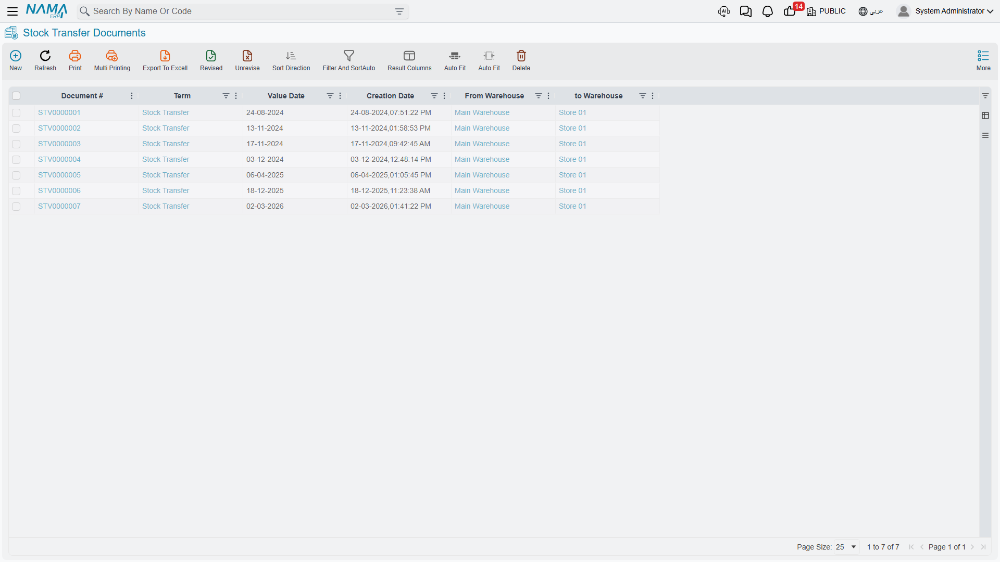
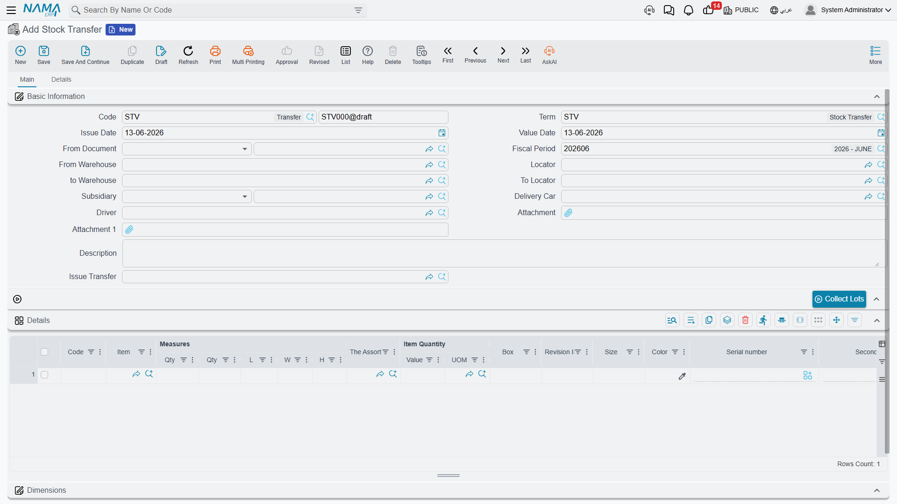

# Moving Stock Between Warehouses

Sometimes items don't come in or go out - they just move from one place to another. This guide focuses on **stock transfers**: moving inventory between warehouses and locations while its ownership stays within the organization.

::: info Other movements have their own guides
Transforming stock by **assembling** it is covered in [Assembly & Packaging](./assembly-and-packaging.md); **reserving** items without moving them in the [Reservation System Guide](./reservation-system-guide.md); **loading and delivering** them to customers in [Delivery & Loading](./delivery-and-loading.md); and reconciling differences through **counting** in [Stock Taking](./stock-taking.md). This guide stays focused on inter-warehouse transfers.
:::

## Stock Transfers: The Basics

A **stock transfer** is any movement of items from one location to another without changing their owner. Total inventory stays the same - only the location changes.

Think of it like moving money between your checking and savings accounts. Your total wealth doesn't change, but where the money sits does, and you need to track that.

## The Simple Transfer: One Document, Complete Movement

The **Stock Transfer** (StockTransfer) document handles direct transfers in a single step.

### Common Transfer Scenarios

**Between warehouses**
You have three warehouses: main, north branch, and south branch. A customer at the north branch wants an item that's only in the main warehouse. Create a transfer from the main warehouse to the north branch for the required quantity. The system reduces stock at the source and increases it at the destination, with the total staying constant, and tracks the item's movement history.

**Within a single warehouse**
Even inside one building you may need to move items: from the receiving dock to a storage location, from storage to a staging area, or from shelf to shelf during reorganization. Create transfers to update the system's location records to match physical reality.

### How Transfers Work

A transfer simultaneously:
1. **Issues** from the source location (reducing the quantity there)
2. **Receives** at the destination location (increasing the quantity there)

It's essentially an issue and a receipt together, bundled into one document. If the transfer fails or is cancelled, both sides are reversed together - you won't find items lost in the middle.

**Cost note**: Items are usually moved at their current cost - no revaluation. An item carries the same cost wherever it is.

## The Two-Step Transfer: More Control and Tracking

Some organizations want tighter control over transfers, especially when items move between distant locations, transit time is significant, custody changes hands, or security and compliance require tracking inventory in transit. This is where the two-step transfer process comes in.

### Issue Stock Transfer (IssueStockTransfer)

The **Issue Stock Transfer** documents the sending side: items leave the source warehouse, so stock decreases there and the items become "in transit," and the document records what was sent, when, and by whom.

### Receipt Stock Transfer (ReceiptStockTransfer)

The **Receipt Stock Transfer** documents the arrival side: items reach the destination warehouse, so stock increases there and they become "available" in the new location, and the document records what was received, when, and by whom.

### Why Two Steps?

- **Tracking inventory in transit**: If items are on a truck for two days between warehouses, you know they're unavailable at the source (shipped), unavailable at the destination (not arrived), and in transit. A **"goods in transit" warehouse** is often used for this ([see warehouse types](./warehouses-and-locators.md)).
- **Managing discrepancies**: The source sent 100 items but the destination received 98; the system highlights the 2-unit difference for investigation (damage? miscount?).
- **Custody transfer**: The source employee signs off on the issue, and the destination employee signs off on the receipt, so accountability is clear at each stage.
- **Approval points**: You may require an approval for the issue and a separate approval for the receipt.

### Stock Transfer Request (StockTransferReq)

The **Stock Transfer Request** adds a layer above: requesting the transfer before executing it.

**Workflow:** the north branch requests 50 units of item X from the main warehouse → the main warehouse reviews and approves → it ships 50 units → the items transit → the north branch receives 50 units (or fewer, with an explanation). This ensures planned transfers, coordination between locations, and visibility of upcoming movements.

When transfer requests recur from several branches or for several items, the **Aggregated Transfer Request** (AggrStockTransferReq) consolidates them into a single document that makes planning and execution easier in one batch.

## Tips for Accurate Transfer Tracking

::: tip Best Practices
**Transfer only for real movements**: Create transfers only when items physically move, not "virtual" transfers for reporting purposes.

**Consolidate transfers wisely**: If you move 100 items in one batch, one document for quantity 100 is cleaner than 100 documents. But if they move at different times, create separate transfers.

**Track transit time**: In two-step transfers, minimize the time between issue and receipt. Long transit periods signal lost items or a process that needs improvement.

**Handle discrepancies immediately**: When you receive less than was shipped, document the difference and investigate rather than ignoring it.
:::

## Frequently Asked Questions

**Q: Can we transfer items between different companies?**

A: Transfers within a single company are simple. Between companies, you usually need intercompany sale/purchase documents to account for the change of ownership correctly.

**Q: What happens to reservations when transferring reserved items?**

A: Reservations usually travel with the items - if you transfer reserved stock to another warehouse, it stays reserved for the same purpose at the new location.

**Q: Do we use the two-step or one-step transfer?**

A: Use one-step for transfers within a single location or between nearby locations with negligible transit time. Use two-step when transit time is significant, different people handle shipping vs. receiving, or you need to track inventory in transit.

## Next Steps

- [Stock Taking](./stock-taking.md) - verifying that book and physical balances match
- [Inventory Costing & Revaluation](./inventory-costing.md) - adjusting values without moving quantities
- [The Sales Journey](./sales-journey.md) - how sold items leave the organization
