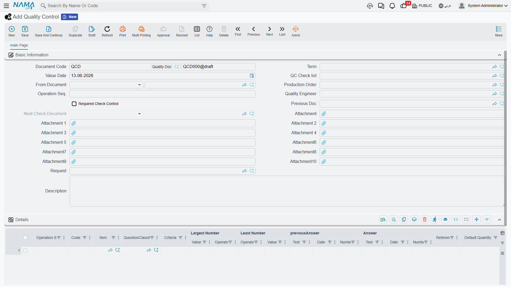
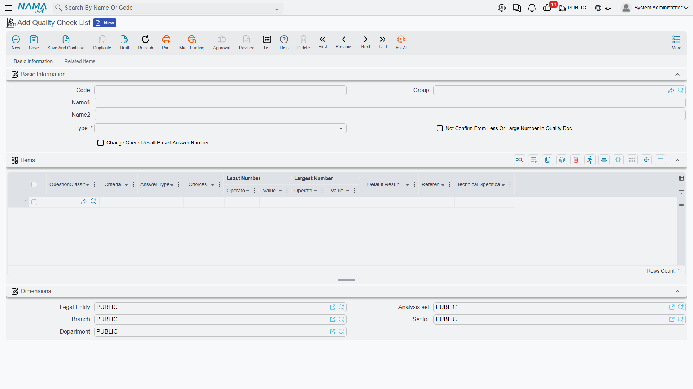

# Quality Control

Not everything that arrives meets your standards, and not everything you produce is ready for the customer. **Quality control** is the gate that ensures only what passes inspection enters available stock or reaches the customer. The system integrates with receiving and production, preventing items from moving into available stock until their checks are complete.

## Two Concepts: Quality Control and Quality Assurance

The system distinguishes two complementary paths:

- **Quality Control (QC)**: inspecting incoming or in-process items against acceptance criteria - "is this batch conforming?".
- **Quality Assurance (QA)**: verifying the soundness of the process itself at operation stages, with a quality engineer assigned - "was the step performed to specification?".

Both follow a **request → document** pattern: a request starts the inspection, and a document records its result.

## Quality Control Documents (QualityControlDoc)

The path begins with a **Quality Control Request** (QualityControlReq) that specifies inspection criteria and levels, then is executed via the **Quality Control Document** (QualityControlDoc), which records the inspection results (pass/fail/rework), links to the request, and supports sequencing across multi-stage inspections (previous and next documents) to maintain traceability.

Possible outcomes after inspection:
- **Accept**: the items move into available stock.
- **Reject**: they become a return to the supplier or move to defective goods.
- **Partial accept**: accept part of the quantity and reject the rest.

## Quality Assurance Documents (QualityAssuranceDoc)

For in-process verification, the **Quality Assurance Request** (QualityAssuranceReq) starts by specifying the operation sequence and quality engineer, then is executed via the **Quality Assurance Document** (QualityAssuranceDoc), which uses a standardized checklist, supports multi-stage checks by linking the previous document and routing the next check, and is attached to supply chain documents (receipts, issues, assemblies).

## The Checklist (QualityCheckList)

The **Checklist** is the standardized inspection template: a set of questions/criteria for each item type, assembly, or finished product. It supports multiple result types (yes/no, numeric, ranges) with answer classification, and quantity-based confirmation rules. Its questions are categorized via **Question Classification** (QuestionClassification) for organization and reuse.

When a checklist is linked to an item (see [Understanding Inventory Items](./understanding-items.md#Manufacturing-and-Quality-Configuration)), the system enforces passing the check before the item becomes available.

## Integration with Receiving and Production

Quality control isn't isolated, but a step within larger paths:

- **With receiving**: via [Receipt Inspection](./receiving-stock.md), goods first arrive in an "under inspection" warehouse/location, and move into available stock only after acceptance.
- **With production and assembly**: quality checks are embedded within [assembly](./assembly-and-packaging.md) stages and production orders, so output isn't approved before passing its check.
- **Re-testing**: for items with a re-test period (chemicals and medicines), the system reminds you to re-inspect periodically.

## Best Practices

::: tip Practical Tips
**Link checklists to critical items**: Make inspection mandatory for items whose defects affect safety or compliance.

**Separate the inspection warehouse**: Receive incoming goods into a separate inspection warehouse so they aren't sold before approval.

**Document the reason for rejection**: Record why each batch failed; analyzing rejection patterns reveals supplier quality and process issues.

**Use QA for processes, not just items**: Inspect the soundness of the step itself, not only the output, to prevent the error from recurring.
:::

## Next Steps

- [Receiving Stock](./receiving-stock.md) - receipt inspection as a gate to inventory
- [Assembly & Packaging](./assembly-and-packaging.md) - quality within assembly stages
- [Understanding Inventory Items](./understanding-items.md) - linking checklists to items
