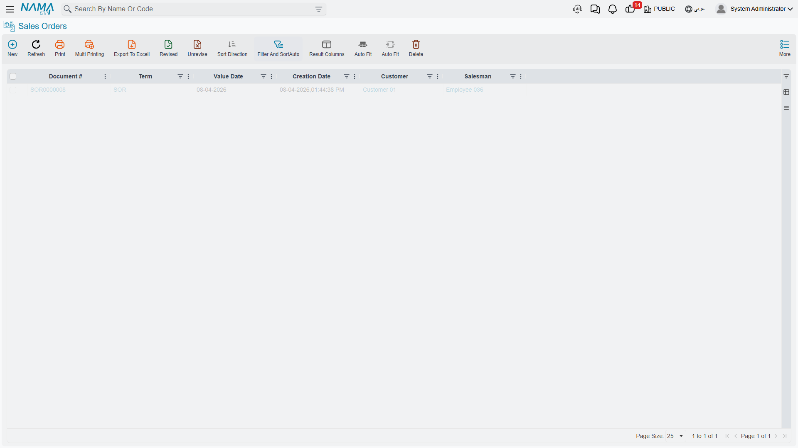
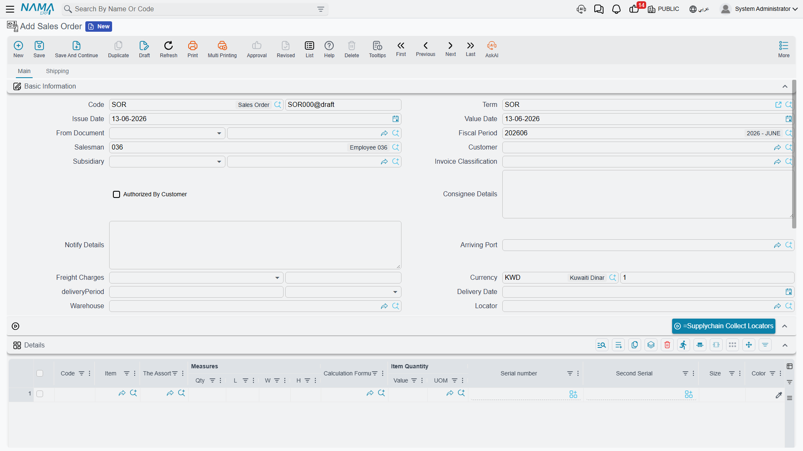

# The Sales Journey

The sales journey is the mirror image of purchasing - instead of bringing items in, you're selling and delivering them to customers. But the principles are similar: Quote → Order → Fulfill → Invoice → Collect. Let's walk through this journey and understand when to use each document.

## The Full Picture

```
Inquiry → Quotation → Order → Reservation → Picking → Delivery → Invoice → Collection
```

Not every sale passes through all these steps (cash sales skip most of them!), but understanding the full path helps you design the right process for each kind of sale.



## Step One: The Customer Inquiry (SalesQuotationRequest)

Every sale begins with interest. The **Sales Quotation Request** records the customer's inquiry: "We're interested in 100 office chairs, can you give us a price?" It captures the customer's details, the requested items and quantities, delivery requirements, and any special requirements.

Why formalize inquiries? To track potential opportunities (pipeline visibility), measure quote-to-order conversion rates, ensure timely follow-up, and assign sales reps. And before presenting the quote, the system helps you by showing available stock, lead times for unavailable items, cost information (for profitable pricing), and the customer's history (past purchases, payment behavior, special terms).

## Step Two: The Quotation (SalesQuotation)

The **Sales Quotation** is your formal price proposal to the customer. It includes the quote number, date, and validity period, the customer's details and delivery and payment terms and the sales rep, item lines with descriptions, quantities, prices, discounts, and taxes, and the totals.

The pricing and discount details - price lists, automatic margin pricing, discount layers, and minimum price - have their own dedicated page: [Pricing, Offers & Coupons](./pricing-offers-and-coupons.md).

**Quote lifecycle:** after creation, the sales manager reviews it (especially for special pricing), then it's sent to the customer, and the response is tracked. Possible outcomes: conversion to an order (customer accepts), revision (negotiation, so you create an amended quote), expiry (validity ends), or loss (they chose someone else).

## Step Three: The Sales Order (SalesOrder)

The customer accepted your quote! Time for the formal commitment. The **Sales Order** says: "We'll sell you these items on these terms."

**Conversion from the quotation** is easiest: the system copies all the information from the quote, links the order to it (audit trail), changes the status from "quote" to "order," and starts fulfillment. For existing customers with standard items, you can skip the quote and create the order directly.

The order carries everything in the quote, plus fulfillment details (requested delivery date, delivery address that may differ from the billing address, shipping method), inventory allocation (which warehouse will fulfill, and whether items are available), and financial terms (final prices, payment terms whether cash, credit, or installments, and credit-limit verification for credit customers).



### The Proforma Invoice (ProformaSalesInvoice)

The **Proforma Sales Invoice** is a midway point: it looks like an invoice and works like a quote, used for the customer's budget approval, customs, or advance payment. Once the customer pays or approves, it converts to an actual order.

## Step Four: Reservation, Preparation, and Delivery

After the order is confirmed comes physical fulfillment, which has two dedicated pages:

- **Reservation**: the system reserves stock for the order so it isn't sold to others, ensuring you can fulfill. Full details in the [Reservation System Guide](./reservation-system-guide.md).
- **Preparation, loading, and delivery**: from the pick list in the warehouse, to the loading document, to the delivery document and proof of receipt. You'll find this in [Delivery & Loading](./delivery-and-loading.md).

## Step Five: The Sales Invoice (SalesInvoice)

The **Sales Invoice** is at once the invoice (the customer owes you an amount) and an inventory movement (the items leave your stock). It includes its number, date, customer details, billing and shipping addresses, the sales rep, the order reference, payment terms, sold-item lines with quantities, prices, discounts, and taxes, and the financial summary and total.

### What the System Does

When the invoice is saved (not as a draft):
- **Inventory movement**: the system automatically generates the issue of sold items, so inventory quantities decrease, they're removed from their locations, sold serials/batches are tracked, and the cost of goods sold is recorded.
- **Accounting entries**: debit receivables (or cash on immediate payment), credit sales revenue, credit collected tax, debit cost of goods sold, credit inventory.
- **Customer account**: the balance rises, credit-limit usage updates, and the due date is created.

### Electronic Invoicing

In countries that adopt electronic invoicing, the system creates the invoice in the approved tax format, sends it to the authority's system, and receives its unique identifier and QR code. Details are in the [Invoicing module](/en/modules/invoicing/).

## Step Six: Collecting Payments

The last step is collecting what's due. In a **cash sale**, it's paid immediately so the invoice closes with no receivable (or it's settled at once). In a **credit sale**, the invoice creates a receivable with a due date per terms (net 30, net 60), so the system tracks aging and alerts near the due date. In **installment sales**, the value is split into scheduled payments tracked individually. When a payment is recorded, the customer's balance is reduced, aging is updated, and the invoice closes if fully paid. (Payment and scheduling details are in the Invoicing and Accounting modules.)

## Returns and Replacements

Sometimes sales don't stick. The **Sales Return** is used when the customer wants to return (a defective item, a wrong shipment, a change of mind within the return window, or damage in shipping). The path often starts with a **Sales Return Request** (SalesReturnRequest) for authorization, then the actual return is created, the goods are received, and their value is processed.

**Accounting effect of a return:** debit sales returns (a contra-revenue account), debit inventory (goods coming back), debit tax (reversing it), credit receivables (the customer owes less).

The **Sales Replacement** (SalesReplacement), on the other hand, handles a swap in a single transaction: the customer bought a medium and wants a large, so the system returns the medium, issues the large, and handles the price difference. Useful for size/color swaps, warranty, and upgrades or downgrades.

## Sales Forecasting

The **Sales Forecast** (SalesForecast) helps you plan future sales based on historical patterns, seasonal trends, and the open pipeline, feeding inventory planning, production scheduling, and [purchase forecasting](./purchase-forecast.md).

::: info Retail Selling at the Point of Sale
Fast cash selling at the register now has its own module. See the [Point of Sale module](/en/modules/pos/).
:::

## Tips for Effective Sales Management

::: tip Best Practices
**Respond to quotes quickly**: Customers are impatient; response speed correlates with higher conversion rates.

**Follow up methodically**: Don't let quotes die silently; follow up after a few days and before expiry, and track win/loss reasons.

**Reserve stock wisely**: Reserve for confirmed orders, not speculative inquiries; tying stock to a "maybe" prevents selling to a "yes."

**Invoice promptly**: The faster you invoice, the faster you collect; invoice what's delivered without waiting for all deliveries to complete.

**Track returns**: A high return rate for an item signals a quality problem, and a high rate from a customer signals a training or fit need; analyze the patterns.
:::

## Frequently Asked Questions

**Q: Can we invoice before delivery?**

A: Yes, called advance invoicing - common for custom orders (pay before manufacturing), large orders (a deposit), or high-credit-risk customers. The system can invoice before issuing stock.

**Q: What if the customer wants a partial delivery?**

A: Create multiple invoices for the same order; invoice and deliver what's available now and the rest later, and the system tracks fulfilled vs. pending.

**Q: Can prices change after the order is created?**

A: It depends on your controls; some organizations lock prices at order confirmation, while others allow changes up to the invoice.

**Q: What happens if we can't fulfill an order?**

A: Options: create a backorder (fulfill when stock is available), offer an alternative, cancel and refund, or partial fulfillment. Best practice is immediate communication with the customer to decide together.

## Next Steps

- [Pricing, Offers & Coupons](./pricing-offers-and-coupons.md) - how prices and discounts are computed
- [Reservation System Guide](./reservation-system-guide.md) - reserving stock for customers
- [Delivery & Loading](./delivery-and-loading.md) - fulfilling and delivering orders
- [The Purchasing Journey](./purchasing-journey.md) - the mirror process
