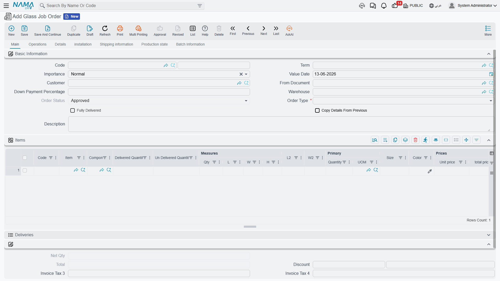

# Specialized Scenarios

The previous pages cover the core supply chain paths. But some specialized cases don't fit a page of their own: sector-specific job orders, document-automation tools, and tenders. This guide gathers them, and points to their homes when they belong to other modules.

## Glass Job Orders (Glass Job Order)

For the glass-manufacturing sector and similar process-based manufacturing, the system provides the specialized **Glass Job Order** path: from estimating the request to operational execution to delivery.

The path starts with the **Job Order Request** (GlassJobOrderReq) for cost study and quotation, then converts to the **Glass Job Order** (GlassJobOrder) that carries the bill of materials, operations, and delivery items. Operations are defined via the **Operation Map** (GlassOperationMap), and executions are recorded via **Order Execution** (OrderExecution), which tracks the responsible employee, time, and actual cost and generates material issues. Status is updated via **Job Order Status Update** (GlassJobOrderStatusUpdate), and output is delivered via **Order Delivery** (OrderDelivery) and **Order Finished** (OrderFinished). The path also supports outsourcing via **Outsource Request / Issue / Receipt** (OutsourceRequest / OutsourceIssue / OutsourceReceipt), damage documentation via **Order Damage** (OrderDamage), and expenses via **Job Order Expense** (JOrderExpense).

::: info A Specialized Sector
Glass job orders are a sector-specific sub-module; if your business isn't in this field, you won't need them. They rely on the same concepts as [assembly](./assembly-and-packaging.md) and [resources](#Resources-and-Activities) but with a dedicated order path.
:::

## Document Automation Tools

Supply chain repeatedly generates one document from another (a receipt from a purchase order, an invoice from a delivery...). The system provides tools that make this generation automatic and controlled:

- **Document Rule Set** (SCDocRuleSet): a central rules engine that triggers automatic document creation from source documents under defined conditions.
- **Extra Document Creation Rule** (SCExtraDocCreationRule): defines generating an extra document on a particular event.
- **Copier Extra Fields** (SCCopierExtraFields): determines which fields are copied when a document is derived from another, with entity-type-specific copy scripts.
- **Order Status Quantity Tracking Config** (OrderStatusQtyTrackConfig): sets order-status transitions based on received/issued quantities, automating quantity-driven workflow.
- **Delivery Configuration** (DeliveryConfiguration): defines delivery constraints, quantity relations, and consolidation criteria across orders.

These tools are for advanced users and implementation administrators who tailor system behavior without coding.

## Tenders (Tender)

When purchasing goes through a formal competition, the system provides the **Tender** (Tender): inviting suppliers to submit bids to specifications, tracking and comparing bids, and supporting weighted evaluation and selection. Standard terms and conditions for bids are defined via the **Tender Condition** (TenderCondition). This complements [The Purchasing Journey](./purchasing-journey.md) in cases that require organized competition.

## Resources and Activities

Some specialized paths (such as job orders) rely on shared master files:
- **Resource** (Resource): defines human and machine resources for job-order and manufacturing operations, with rates, periods, costs, and accounting setup.
- **Activity** (Activity): a flexible file for tracking various activities and milestones within job orders.
- **Material Classification** (MaterialClassification): classifies materials by type, grade, or source for reporting and analysis.

## Scenarios That Belong to Other Modules

Some specialized scenarios have their own standalone modules even though they intersect with supply chain:
- **Point of Sale (POS)**: fast retail selling has its [own module](/en/modules/pos/).
- **Pharmacies and medical supplies**: in the Hospital Management (HMS) module with its own paths.
- **Project site materials**: in the Contracting module.
- **Complex manufacturing**: in the [Manufacturing module](/en/modules/manufacturing/).

## Next Steps

- [Assembly & Packaging](./assembly-and-packaging.md) - the foundation job orders build on
- [The Purchasing Journey](./purchasing-journey.md) - tenders within purchasing
- [Supply Chain FAQ](./supply-chain-faq.md) - miscellaneous cases and questions
