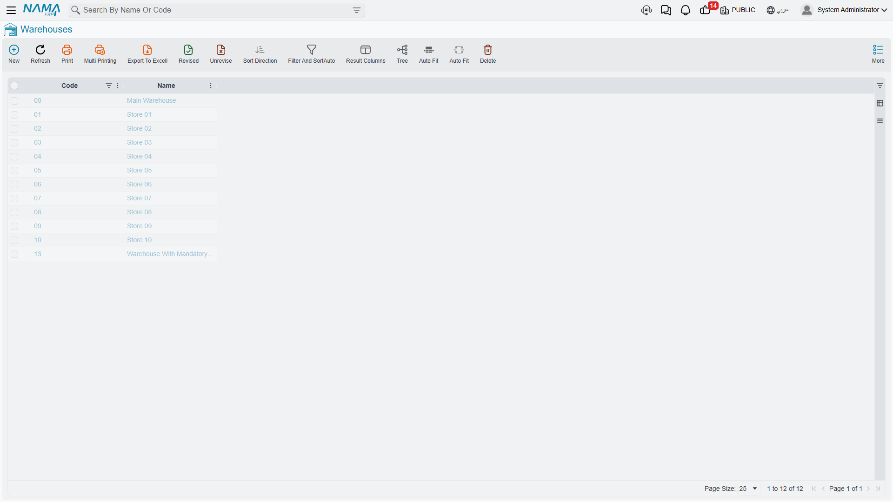
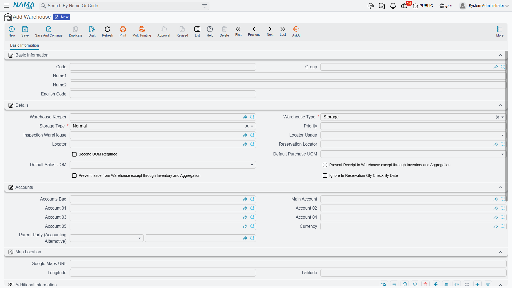

# Warehouses & Locators

You've defined your items - great. But where will you actually put them? This is where **Warehouses** and **Locators** come in. They're the spatial map of your inventory: where each item lives, how it moves, and who's responsible for it.

## The Warehouse: Your Primary Inventory Container

A warehouse in NaMa ERP isn't necessarily a building. It's any place where you want to track a separate inventory balance. It could be:
- A large physical warehouse
- A shelf in a showroom
- A mobile distribution truck
- A "goods in transit" area between two branches
- A sorting or quarantine area for goods under inspection

The simple rule: **if you want to know "how much do I have here?" independently, make it a warehouse.**

### Warehouse Types

Not all warehouses are the same. The system distinguishes several types, each with different behavior:

- **Standard warehouse**: ordinary storage for goods available to sell and issue.
- **Transit warehouse**: holds goods while they move between two locations, so they appear available at neither the sending nor the receiving side until the transfer completes.
- **Inspection/sorting warehouse**: received goods land here before approval, so they don't enter available stock until quality clears them.
- **Reservation warehouse**: dedicated to items reserved for specific customers or orders.

Choosing the right type matters because it determines when a location's stock counts toward "available to sell."

### Who's Responsible? The Warehouse Keeper and Permissions

For each warehouse you can assign a **warehouse keeper** - the employee responsible for it. This helps you:
- Route receiving and issuing tasks to the right person
- Set permissions that prevent users from transacting in warehouses outside their scope
- Maintain accountability during stock taking and reconciling differences

You can also link the warehouse to a branch and a group, set its priority (for automatic warehouse selection), and configure its own default purchase and sales units.

### Warehouses and Requirements Planning (MRP)

You can decide whether a particular warehouse is included in Material Requirements Planning (MRP) calculations. A showroom display warehouse may not be something you want counted as available for production, while your main raw-materials warehouse should be.

## Locators: Precision Inside the Warehouse

Inside a large warehouse, knowing you have "200 boxes" isn't enough - where exactly are they? Which aisle, which shelf, which pallet? This is where **Locators** come in.

A locator is a subdivision within the warehouse: aisle A, shelf 3, or a "fast-moving goods" zone. Enabling locators gives you:
- The exact location of each item
- Direction for warehouse staff straight to the pick location
- Organization of goods by movement, size, or storage requirements

### Locator Policy: Required or Prevented?

For each warehouse you set the locator policy:
- **Required**: no item can be received or issued without specifying its location - ideal for large, organized warehouses.
- **Prevented**: don't use locators at all - suitable for a small warehouse or a distribution truck.

Each locator can also prevent receiving or issuing individually (e.g. a "damaged" locator that accepts goods but prevents issuing them for sale), be linked to a specific supplier or customer when needed, and take a selection priority within automatic picking.

### Location Classes

When locators multiply, **location classes** help you group them by nature: refrigerated, frozen, high-value, quarantine... then apply rules to a whole class rather than a single locator. An item requiring refrigeration can be routed automatically to locators of the "refrigerated" class.

### Rack Quantities

For warehouses that need precision beyond the locator level, the system supports tracking quantities at the **rack** level within a single locator - useful in large distribution centers where one locator contains several racks.

## Linking Items to Warehouses

It's impractical for every item to be stored in every warehouse. So the system lets you **link items to warehouses**, defining the preferred warehouses for each item with a given priority. The benefits:
- The system automatically suggests the most appropriate warehouse on receipt or issue
- It prevents storing items in warehouses unsuited to them
- It simplifies document entry for the user

## Warehouse Groups

When the number of warehouses grows, **warehouse groups** bundle them for reporting and organization: for example a "Northern Region Warehouses" group or a "Showroom Warehouses" group. You can then pull an inventory report for an entire group at once.

## How It All Fits Together

Imagine a typical distribution center:

1. A shipment arrives and is first received into the **inspection warehouse**.
2. After quality clears it, it's transferred to the **main warehouse**, specifically to a **locator** in the appropriate aisle.
3. Items requiring refrigeration are routed automatically to locators of the **"refrigerated" class**.
4. When a sales order arrives, the system suggests the warehouse and locator based on **item-warehouse links** and **locator priorities**.
5. Goods distributed to distant branches are held in a **transit warehouse** during transport until they arrive and the transfer is received.

This spatial structure is the foundation on which all the stock movements we'll cover in the next sections operate.

## Next Steps

- [Receiving Stock](./receiving-stock.md) - bringing items into these warehouses
- [Issuing Stock](./issuing-stock.md) - taking them out
- [Moving Stock Between Warehouses](./moving-stock.md) - transferring them from one warehouse to another
- [Stock Taking](./stock-taking.md) - verifying that book and physical balances match
