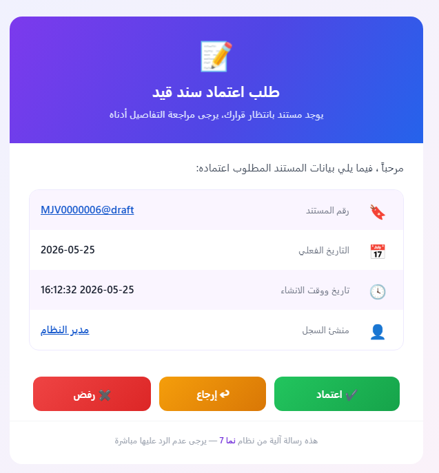

# Sample Approval Email Templates

When a document enters an approval workflow, NAMA can send the responsible person an email asking them to **approve**, **reject**, or **return** it. The body of that email is just a [Tempo](../../admin/tempo.md) template defined on the approval rule — which means you can make it as plain or as beautiful as you like.

This page collects ready-to-use, good-looking templates you can copy straight into an approval rule's email body. We start with a **generic template** that works for any document type, and we'll grow this page with templates tailored to specific documents (sales invoices, orders, and so on) over time.

::: tip How to use a template
Copy the HTML block, paste it into the **email body** of your approval rule, and adjust the field names (`code`, `valueDate`, `firstAuthor`, …) if your document uses different ones. The three action buttons rely on the Tempo placeholders `{approvelink}`, `{rejectlink}`, and `{returnlink}` — see [Adding Approval Action Links](../../admin/tempo.md#2-Adding-Approval-Action-Links).
:::

::: warning A note on styling
Email clients are notoriously picky about CSS. This template uses **inline styles** and a **table-based layout** on purpose — the most reliable way to get consistent results across Gmail, Outlook, and mobile clients. To make each button a fully clickable colored pill, we use the `plain=true` option on the action links (e.g. `{approvelink(plain=true)}`), which outputs **only the URL** so we can wrap it in our own styled `<a>` tag with our own text and icon.
:::

---

## Generic Approval Template (Arabic)

A colorful, right-to-left card whose header shows the (Arabic) document type, with a body listing the code, actual date, creation date & time, and who created the record — followed by three clear, fully-clickable action buttons. The code and the author are clickable links that open the document and the author's record.

It uses these fields, all available on any document:

| Field | Tempo expression | Arabic label |
|-------|------------------|--------------|
| Document type (in header) | `{entityType.$arabic}` | — |
| Code (link to document) | `{titledlink($this)}{code}{endlink}` | رقم المستند |
| Actual date | `{valueDate}` | التاريخ الفعلي |
| Creation date & time | `{$creationDate}` | تاريخ ووقت الانشاء |
| Record author (link) | `{titledlink(firstAuthor)}{firstAuthor.name1}{endlink}` | منشئ السجل |
| Remarks (shown only if present) | `{if(remarks)}…{remarks}…{endif}` | ملحوظة |

::: tip A meaningful subject line
The template opens with a `subject:` line so the email arrives with a descriptive subject — e.g. *طلب اعتماد فاتورة مبيعات - SI-0012 - منشئ السجل: أحمد* — instead of a generic one. This **must** be the very first line of the body (before the `<div>`); see [Setting the Email Subject](../../admin/tempo.md#1-Setting-the-Email-Subject).
:::

::: details HTML Code

```html
subject:طلب اعتماد {entityType.$arabic} - {code} - منشئ السجل: {firstAuthor.name1}
<div dir="rtl" style="margin:0;padding:24px;background:#eef2ff;background:linear-gradient(135deg,#eef2ff 0%,#fdf2f8 100%);font-family:'Segoe UI',Tahoma,Arial,sans-serif;">
  <table role="presentation" align="center" width="600" cellpadding="0" cellspacing="0" style="max-width:600px;width:100%;margin:0 auto;background:#ffffff;border-radius:18px;overflow:hidden;box-shadow:0 10px 30px rgba(79,70,229,0.18);">

    <!-- Header -->
    <tr>
      <td style="padding:32px 28px;background:#6d28d9;background:linear-gradient(120deg,#7c3aed 0%,#4f46e5 55%,#2563eb 100%);text-align:center;">
        <div style="font-size:40px;line-height:1;">📝</div>
        <div style="margin-top:10px;font-size:22px;font-weight:700;color:#ffffff;">طلب اعتماد {entityType.$arabic}</div>
        <div style="margin-top:6px;font-size:14px;color:#e0e7ff;">يوجد مستند بانتظار قرارك، يرجى مراجعة التفاصيل أدناه</div>
      </td>
    </tr>

    <!-- Greeting -->
    <tr>
      <td style="padding:24px 28px 4px 28px;color:#374151;font-size:15px;">
        مرحباً <strong style="color:#4f46e5;">{$notificationTarget.name1}</strong>، فيما يلي بيانات المستند المطلوب اعتماده:
      </td>
    </tr>

    <!-- Info card -->
    <tr>
      <td style="padding:16px 28px 8px 28px;">
        <table role="presentation" width="100%" cellpadding="0" cellspacing="0" style="border:1px solid #ede9fe;border-radius:14px;overflow:hidden;">

          <tr style="background:#faf5ff;">
            <td width="46" style="padding:14px;text-align:center;font-size:20px;">🔖</td>
            <td style="padding:14px 4px;color:#6b7280;font-size:13px;">رقم المستند</td>
            <td style="padding:14px 16px;text-align:left;color:#111827;font-size:15px;font-weight:600;">{titledlink($this)}{code}{endlink}</td>
          </tr>

          <tr style="border-top:1px solid #f3f4f6;">
            <td width="46" style="padding:14px;text-align:center;font-size:20px;">📅</td>
            <td style="padding:14px 4px;color:#6b7280;font-size:13px;">التاريخ الفعلي</td>
            <td style="padding:14px 16px;text-align:left;color:#111827;font-size:15px;font-weight:600;">{formatDate(valueDate, "yyyy-MM-dd")}</td>
          </tr>

          <tr style="background:#faf5ff;border-top:1px solid #f3f4f6;">
            <td width="46" style="padding:14px;text-align:center;font-size:20px;">🕓</td>
            <td style="padding:14px 4px;color:#6b7280;font-size:13px;">تاريخ ووقت الانشاء</td>
            <td style="padding:14px 16px;text-align:left;color:#111827;font-size:15px;font-weight:600;">{formatDate($creationDate, "yyyy-MM-dd HH:mm:ss")}</td>
          </tr>

          <tr style="border-top:1px solid #f3f4f6;">
            <td width="46" style="padding:14px;text-align:center;font-size:20px;">👤</td>
            <td style="padding:14px 4px;color:#6b7280;font-size:13px;">منشئ السجل</td>
            <td style="padding:14px 16px;text-align:left;color:#111827;font-size:15px;font-weight:600;">{titledlink(firstAuthor)}{firstAuthor.name1}{endlink}</td>
          </tr>

          {if(remarks)}
          <tr style="background:#faf5ff;border-top:1px solid #f3f4f6;">
            <td width="46" style="padding:14px;text-align:center;font-size:20px;">📝</td>
            <td style="padding:14px 4px;color:#6b7280;font-size:13px;">ملحوظة</td>
            <td style="padding:14px 16px;text-align:left;color:#111827;font-size:15px;font-weight:600;">{remarks}</td>
          </tr>
          {endif}

        </table>
      </td>
    </tr>

    <!-- Action buttons (each whole pill is a clickable approval link) -->
    <tr>
      <td style="padding:24px 28px 8px 28px;">
        <table role="presentation" width="100%" cellpadding="0" cellspacing="0">
          <tr>
            <td style="padding:6px;" align="center">
              <a href="{approvelink(plain=true)}" style="display:block;padding:14px 10px;background:#16a34a;background:linear-gradient(135deg,#22c55e,#16a34a);color:#ffffff;text-decoration:none;font-size:15px;font-weight:700;border-radius:12px;box-shadow:0 4px 12px rgba(22,163,74,0.35);">✔ اعتماد</a>
            </td>
            <td style="padding:6px;" align="center">
              <a href="{returnlink(plain=true)}" style="display:block;padding:14px 10px;background:#d97706;background:linear-gradient(135deg,#f59e0b,#d97706);color:#ffffff;text-decoration:none;font-size:15px;font-weight:700;border-radius:12px;box-shadow:0 4px 12px rgba(217,119,6,0.35);">↩ إرجاع</a>
            </td>
            <td style="padding:6px;" align="center">
              <a href="{rejectlink(plain=true)}" style="display:block;padding:14px 10px;background:#dc2626;background:linear-gradient(135deg,#ef4444,#dc2626);color:#ffffff;text-decoration:none;font-size:15px;font-weight:700;border-radius:12px;box-shadow:0 4px 12px rgba(220,38,38,0.35);">✖ رفض</a>
            </td>
          </tr>
        </table>
      </td>
    </tr>

    <!-- Footer -->
    <tr>
      <td style="padding:18px 28px 26px 28px;text-align:center;color:#9ca3af;font-size:12px;border-top:1px solid #f3f4f6;">
        هذه رسالة آلية من نظام <a href="https://{translate("appUrl")}" style="color:#6d28d9;text-decoration:none;font-weight:600;">{translate("applicationName")}</a> — يرجى عدم الرد عليها مباشرة
      </td>
    </tr>

  </table>
</div>
```
:::

Here is how the rendered email looks in the inbox:



::: tip About the buttons
Each button wraps an action URL produced by `{approvelink(plain=true)}`, `{returnlink(plain=true)}`, and `{rejectlink(plain=true)}`. Because `plain=true` emits only the URL, the **entire colored pill is clickable** and you control its text and icon. If you prefer NAMA's default rendering, drop `plain=true` and use the bare `{approvelink}` / `{returnlink}` / `{rejectlink}`, which generate their own anchor text.

The header shows the document's Arabic type via `{entityType.$arabic}`. For document-specific templates you can replace it with a fixed name (e.g. *فاتورة مبيعات*, *أمر بيع*) — which is exactly what the upcoming sections will do.
:::

::: tip Branding-aware footer
The footer uses `{translate("applicationName")}` and `{translate("appUrl")}` instead of a hardcoded product name and link. These keys resolve to the running installation's branding — so the same template shows *Nama ERP* / `namasoft.com`, *Capital Solutions ERP*, *Exceed ERP* / `exceed-erp.com`, and so on, without editing. See [Branding Keys: Application Name and URL](../../admin/tempo.md#Branding-Keys-Application-Name-and-URL).
:::

---

## Sales/Inventory Documents Template (Arabic)

While the generic template above works for any document, a sales invoice carries information that really deserves to be shown in the email itself — *how much* is being approved and *what* it's made of. This template builds on the generic card and adds two things tailored to such documents: a **money summary** (total, header discount, and net value) and an **itemized table** of the lines (item, quantity, unit price, and net value per line).

Although it's written here with a sales invoice in mind, **the exact same template works unchanged for the whole family of sales/inventory documents** — sales orders, sales returns, purchase invoices, purchase orders, quotations, and so on. They all share the same `money.*` header fields and the same `details` line structure, and the header title adapts automatically via `{entityType.$arabic}`. So you can copy this block onto any of those documents' approval rules without editing a thing.

It uses these fields, all confirmed against the `SalesInvoice` entity (and shared by its siblings):

| Field | Tempo expression | Arabic label |
|-------|------------------|--------------|
| Total | `{money.total}` | الإجمالي |
| Header discount | `{money.headerDiscount.value}` | قيمة الخصم |
| Net value | `{money.netValue}` | الصافي |
| Line item (in loop) | `{#details.item.item.name1}` | الصنف |
| Line quantity (in loop) | `{#details.quantity.quantity.primeQty.value}` | الكمية |
| Line unit price (in loop) | `{#details.price.unitPrice}` | سعر الوحدة |
| Line net value (in loop) | `{#details.price.netValue}` | الصافي |

::: tip Why the `#` and `loop` for line fields
The header money fields (`{money.total}`, …) are read straight off the document. The **line** fields live inside the `details` collection, so they must appear inside a `{loop(details)}…{endloop}` block, and each is prefixed with `#` (e.g. `{#details.price.netValue}`) so Tempo resolves it against the *current row* of the loop. See [Looping Through Repeated Data](../../admin/tempo.md#Looping-Through-Repeated-Data-e-g-Document-Details).
:::

::: tip Formatting the money values
The amounts are wrapped in `{formatNumber(…, "###,##0.00")}` so they render as grouped, two-decimal figures (e.g. *12,500.00*) instead of raw numbers. See [Formatting Numbers](../../admin/tempo.md#Formatting-Numbers).
:::

::: details HTML Code
```html
subject:طلب اعتماد {entityType.$arabic} - {code} - الصافي: {formatNumber(money.netValue, "###,##0.00")}
<div dir="rtl" style="margin:0;padding:24px;background:#ecfeff;background:linear-gradient(135deg,#ecfeff 0%,#f0fdf4 100%);font-family:'Segoe UI',Tahoma,Arial,sans-serif;">
  <table role="presentation" align="center" width="640" cellpadding="0" cellspacing="0" style="max-width:640px;width:100%;margin:0 auto;background:#ffffff;border-radius:18px;overflow:hidden;box-shadow:0 10px 30px rgba(13,148,136,0.18);">

    <!-- Header -->
    <tr>
      <td style="padding:32px 28px;background:#0d9488;background:linear-gradient(120deg,#14b8a6 0%,#0d9488 55%,#0f766e 100%);text-align:center;">
        <div style="font-size:40px;line-height:1;">🧾</div>
        <div style="margin-top:10px;font-size:22px;font-weight:700;color:#ffffff;">طلب اعتماد {entityType.$arabic}</div>
        <div style="margin-top:6px;font-size:14px;color:#ccfbf1;">{entityType.$arabic} بانتظار قرارك، يرجى مراجعة التفاصيل أدناه</div>
      </td>
    </tr>

    <!-- Greeting -->
    <tr>
      <td style="padding:24px 28px 4px 28px;color:#374151;font-size:15px;">
        مرحباً <strong style="color:#0d9488;">{$notificationTarget.name1}</strong>، فيما يلي بيانات المستند المطلوب اعتماده:
      </td>
    </tr>

    <!-- Info card -->
    <tr>
      <td style="padding:16px 28px 8px 28px;">
        <table role="presentation" width="100%" cellpadding="0" cellspacing="0" style="border:1px solid #ccfbf1;border-radius:14px;overflow:hidden;">

          <tr style="background:#f0fdfa;">
            <td width="46" style="padding:14px;text-align:center;font-size:20px;">🔖</td>
            <td style="padding:14px 4px;color:#6b7280;font-size:13px;">رقم الفاتورة</td>
            <td style="padding:14px 16px;text-align:left;color:#111827;font-size:15px;font-weight:600;">{titledlink($this)}{code}{endlink}</td>
          </tr>

          <tr style="border-top:1px solid #f3f4f6;">
            <td width="46" style="padding:14px;text-align:center;font-size:20px;">📅</td>
            <td style="padding:14px 4px;color:#6b7280;font-size:13px;">التاريخ الفعلي</td>
            <td style="padding:14px 16px;text-align:left;color:#111827;font-size:15px;font-weight:600;">{formatDate(valueDate, "yyyy-MM-dd")}</td>
          </tr>

          <tr style="background:#f0fdfa;border-top:1px solid #f3f4f6;">
            <td width="46" style="padding:14px;text-align:center;font-size:20px;">👤</td>
            <td style="padding:14px 4px;color:#6b7280;font-size:13px;">منشئ السجل</td>
            <td style="padding:14px 16px;text-align:left;color:#111827;font-size:15px;font-weight:600;">{titledlink(firstAuthor)}{firstAuthor.name1}{endlink}</td>
          </tr>

        </table>
      </td>
    </tr>

    <!-- Money summary -->
    <tr>
      <td style="padding:8px 28px;">
        <table role="presentation" width="100%" cellpadding="0" cellspacing="0">
          <tr>
            <td width="33%" style="padding:6px;" align="center">
              <div style="padding:14px 8px;background:#f8fafc;border:1px solid #e2e8f0;border-radius:12px;">
                <div style="color:#64748b;font-size:12px;">الإجمالي</div>
                <div style="margin-top:6px;color:#0f172a;font-size:17px;font-weight:700;">{formatNumber(money.total, "###,##0.00")}</div>
              </div>
            </td>
            <td width="33%" style="padding:6px;" align="center">
              <div style="padding:14px 8px;background:#fff7ed;border:1px solid #fed7aa;border-radius:12px;">
                <div style="color:#9a3412;font-size:12px;">قيمة الخصم</div>
                <div style="margin-top:6px;color:#c2410c;font-size:17px;font-weight:700;">{formatNumber(money.headerDiscount.value, "###,##0.00")}</div>
              </div>
            </td>
            <td width="33%" style="padding:6px;" align="center">
              <div style="padding:14px 8px;background:#f0fdf4;border:1px solid #bbf7d0;border-radius:12px;">
                <div style="color:#166534;font-size:12px;">الصافي</div>
                <div style="margin-top:6px;color:#15803d;font-size:18px;font-weight:800;">{formatNumber(money.netValue, "###,##0.00")}</div>
              </div>
            </td>
          </tr>
        </table>
      </td>
    </tr>

    <!-- Items table -->
    <tr>
      <td style="padding:12px 28px 8px 28px;">
        <table role="presentation" width="100%" cellpadding="0" cellspacing="0" style="border:1px solid #e5e7eb;border-radius:12px;overflow:hidden;font-size:13px;">
          <tr style="background:#0d9488;color:#ffffff;">
            <td style="padding:10px 12px;font-weight:700;">الصنف</td>
            <td style="padding:10px 12px;font-weight:700;text-align:center;">الكمية</td>
            <td style="padding:10px 12px;font-weight:700;text-align:center;">سعر الوحدة</td>
            <td style="padding:10px 12px;font-weight:700;text-align:left;">الصافي</td>
          </tr>
          {loop(details)}
          <tr style="border-top:1px solid #f3f4f6;">
            <td style="padding:10px 12px;color:#111827;">{#details.item.item.name1}</td>
            <td style="padding:10px 12px;color:#374151;text-align:center;">{formatNumber(#details.quantity.quantity.primeQty.value, "###,##0.##")}</td>
            <td style="padding:10px 12px;color:#374151;text-align:center;">{formatNumber(#details.price.unitPrice, "###,##0.00")}</td>
            <td style="padding:10px 12px;color:#111827;font-weight:600;text-align:left;">{formatNumber(#details.price.netValue, "###,##0.00")}</td>
          </tr>
          {endloop}
        </table>
      </td>
    </tr>

    <!-- Action buttons (each whole pill is a clickable approval link) -->
    <tr>
      <td style="padding:20px 28px 8px 28px;">
        <table role="presentation" width="100%" cellpadding="0" cellspacing="0">
          <tr>
            <td style="padding:6px;" align="center">
              <a href="{approvelink(plain=true)}" style="display:block;padding:14px 10px;background:#16a34a;background:linear-gradient(135deg,#22c55e,#16a34a);color:#ffffff;text-decoration:none;font-size:15px;font-weight:700;border-radius:12px;box-shadow:0 4px 12px rgba(22,163,74,0.35);">✔ اعتماد</a>
            </td>
            <td style="padding:6px;" align="center">
              <a href="{returnlink(plain=true)}" style="display:block;padding:14px 10px;background:#d97706;background:linear-gradient(135deg,#f59e0b,#d97706);color:#ffffff;text-decoration:none;font-size:15px;font-weight:700;border-radius:12px;box-shadow:0 4px 12px rgba(217,119,6,0.35);">↩ إرجاع</a>
            </td>
            <td style="padding:6px;" align="center">
              <a href="{rejectlink(plain=true)}" style="display:block;padding:14px 10px;background:#dc2626;background:linear-gradient(135deg,#ef4444,#dc2626);color:#ffffff;text-decoration:none;font-size:15px;font-weight:700;border-radius:12px;box-shadow:0 4px 12px rgba(220,38,38,0.35);">✖ رفض</a>
            </td>
          </tr>
        </table>
      </td>
    </tr>

    <!-- Footer -->
    <tr>
      <td style="padding:18px 28px 26px 28px;text-align:center;color:#9ca3af;font-size:12px;border-top:1px solid #f3f4f6;">
        هذه رسالة آلية من نظام <a href="https://{translate("appUrl")}" style="color:#0d9488;text-decoration:none;font-weight:600;">{translate("applicationName")}</a> — يرجى عدم الرد عليها مباشرة
      </td>
    </tr>

  </table>
</div>
```
:::

Here is how the rendered email looks in the inbox:


::: tip Showing the item code instead of its name
The table shows each line's item by its Arabic name via `{#details.item.item.name1}` (use `name2` for the English name). If you prefer the item **code**, swap it for `{#details.item.item.code}`; to show both, combine them: `{#details.item.item.code} — {#details.item.item.name1}`.
:::

---

*More templates for specific document types (sales/purchase orders, receipt vouchers, …) will be added below as we expand this page.*
