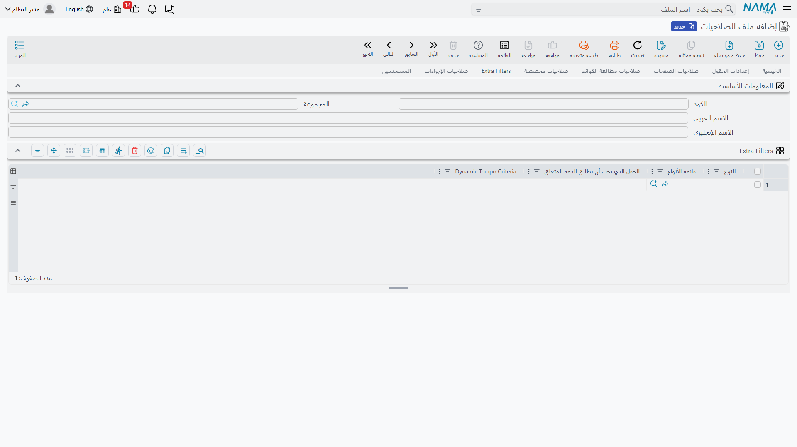

# Record-Level Security (Dimensions and Filters)

Granting a user *list view* access to sales invoices answers the question "can they browse invoices?" This page answers the follow-up: **which invoices specifically?** Nama narrows record visibility through four independent mechanisms that sit on top of permission checks:

1. **Dimensions** — the organizational scope system
2. **Creator-only record restrictions** — "only what I created"
3. **Extra Filters** — per-type row filters
4. **Record Capabilities** — tagging specific records with a required capability

## Dimensions

Almost every record in Nama carries five organizational dimensions:

| Dimension | English |
|---|---|
| الشركة | Legal Entity |
| الفرع | Branch |
| الإدارة | Department |
| القطاع | Sector |
| المجموعة التحليلية | Analysis Set |

Each dimension on a record either holds a specific value or is left as **PUBLIC**. A PUBLIC dimension means "no restriction on this axis."

Users carry the same five dimensions twice, each copy serving a different purpose:

- **The user record's own dimensions** (in the screen header, like any master file) define the *maximum* scope the user can ever be restricted to.
- **Login Context dimensions** in the user settings define what the user is *acting as* right now: which Legal Entity, Branch, etc. their current session belongs to.

When a user creates a document, the system automatically stamps it with the session's login context dimensions. When browsing or searching, records are filtered: a record appears when every one of its dimensions is either PUBLIC or compatible with the user's session dimensions. Master files the system considers "global" are exempt from dimension filtering.

### Login Context and the Alternate Login Context Table

Inside the user screen you will find:

- **Login Context** — the default set of five dimensions the session starts with.
- **Login Context Table** — complete alternative sets the user can switch between at login (for example, an accountant who serves two branches).
- **Prevent Modify Context** — when enabled the user *cannot* choose freely at login; they are restricted to the header dimensions or one of the table rows. The system then requires every set to be fully filled in, and every value must fall within the user record's own dimensions.
- When not enabled, the login context works as a default only, and the user can adjust their session dimensions after login (within their record's dimensions).

::: tip Start restrictions at the user record
Setting the user record's dimensions (for example Branch = Jeddah) is the strongest fence: all login contexts — and therefore everything the user creates and sees — must fall within them. Leaving the user dimensions public and relying solely on the login context gives more flexibility, at the cost of letting the user switch their own context.
:::

## Creator-Only Record Restrictions

Three flags on the basic permission row (at the profile or user level — see [Security Profiles](/en/platform/security/security-profiles.md)) tie a permission to the record's creator:

- **View Only Created Records** — the user's lists, searches, and screens only show records they themselves created.
- **Edit Only Created Records** — other users' records open read-only.
- **Delete Only Created Records** — a matching flag for deletion; a separate flag covers drafts only.

Two user-level settings redefine the concept of "creator" itself:

- **Treat-as users in first author**: a table in the user permissions page listing other users whose records are treated as if this user created them — ideal for a supervisor who must see their whole team's documents under a *View Only Created Records* policy.
- **Do not use as first author**: this user is never recorded as the first author of documents (useful for shared service accounts).

One escape hatch: **Allow viewing other users' records in search** makes other users' records appear in reference-search results even when the user cannot browse them — a collections clerk who only sees their own receipts can still pick any customer on a new receipt.

## Extra Filters

Extra Filters are per-type row filters, defined on the **Extra Filters** page of the security profile or user (user rows take precedence over profile rows for the same type).

Each row targets a type or type list, then defines the filter in one of two ways:

### 1. The field that must match the Related Entity

The simplest and most common form. The user record holds a **Related Entity** reference — typically the employee, but it could be a customer, supplier, sales rep, or anything else. Enter a field ID here, and only records where that field equals the user's Related Entity will appear.

Example: on a sales invoice row, set the field to `salesMan`. A user whose Related Entity is sales rep *Ahmed* will now only see invoices where the sales rep field is Ahmed.

### 2. Dynamic Tempo Criteria

When matching a single field is not enough, write a criteria expression in the **Dynamic Tempo Criteria** column. The expression supports Tempo template syntax, so it can reference the current user's data and combine multiple conditions. Use it for rules like "only invoices for customers whose collector is the current user's employee" or a view restricted to specific time periods.

::: info Filters are applied everywhere
Extra Filters are added to lists, searches, and reports built on the type — and they are re-checked when a record is opened directly (via a link, for example), so the user cannot bypass them by guessing a record code or URL.
:::

## Record Capabilities (Changing Capability at the Record Level)

Sometimes sensitivity lives in a *specific record*, not the whole type: one particular contract, or a handful of confidential journal entries. For this, individual records can be tagged with a **Capability Type** record that gates read/edit access:

1. Define a Capability Type record — see [Security Profiles](/en/platform/security/security-profiles.md).
2. Grant the **Can Change Capability** permission on the basic permission row to those who may tag records.
3. Those users apply the Change Capability action on a record to link it to the capability.
4. From that point on, only users who hold that capability (through their dedicated permission rows) can see or edit the tagged record; untagged records remain visible to everyone with normal permissions.

Global settings provide switches to skip record capability checks in list views where the overhead is undesirable.

## Records Blocked from Use

Master files can be flagged as *blocked from use* (discontinued item, banned customer, etc.). Permissions control how each role experiences those records:

- On the basic permission row: **Display Blocked Records** — *Display*, *Hide*, or *Same As Config*.
- In the security profile / user header: allow using blocked records in **entry** and/or **editing**, show them in **search**, and show or hide them in **list views**.

This separation lets a purchasing manager still view a blocked supplier's history while data-entry operators cannot put that supplier on a new purchase order.
