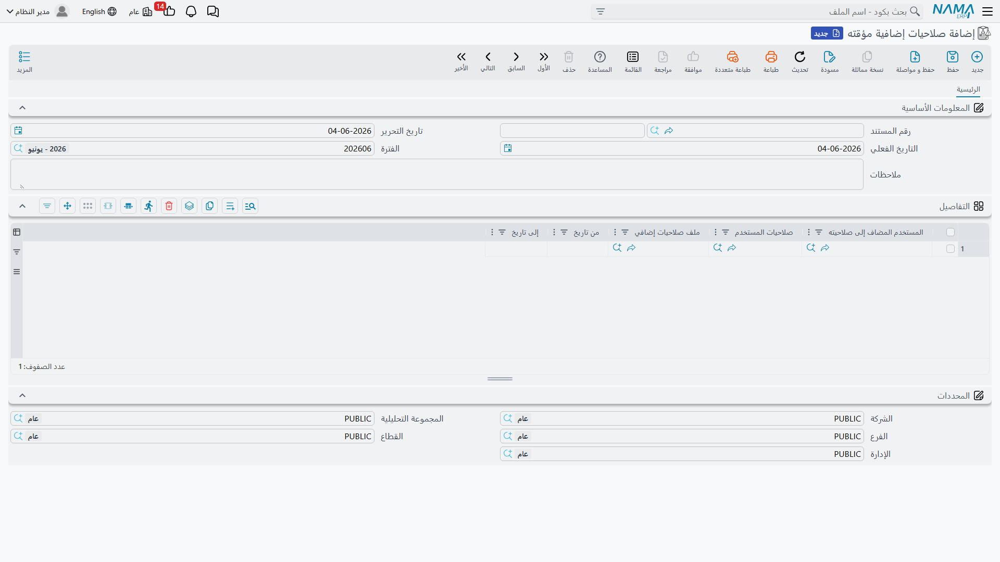

# Temporary Additional Permissions (Delegation)

The purchasing manager is on two weeks' leave, and purchase order approvals must keep flowing. The wrong solution — sharing the manager's password or permanently upgrading the stand-in's security profile and forgetting to revert it — is common enough to deserve a better alternative. The right answer in Nama is the **Temporary Additional Permissions (Security Profile Transfer)** document: a tracked, time-bounded delegation that is added on top of the stand-in's existing permissions and then expires on its own.

**Path**: Administration > Security > Security Profile Transfer

## Document Structure

The document is straightforward: a standard header (number, date, period, dimensions) and a detail grid where each row is an independent delegation:

| Column | Meaning |
|---|---|
| **Granted User** | The stand-in — the user who *receives* the additional permissions. (Required) |
| **User Profile** | The delegator — the user whose permissions (basic rows, security profile, and everything associated with them) are granted to the stand-in. |
| **Additional Security Profile** | An alternative or addition: a security profile granted directly without referencing a specific user. |
| **From Date / To Date** | The period during which the delegation is active. Outside this range the row has no effect. |

You can delegate to multiple people or cover multiple periods in the same document — each row is self-contained.

## How Does Delegation Work?

During the active period, the system treats the receiving user as if they hold their own permissions **plus the permissions of everyone delegated to them**:

- When checking any permission (view, edit, delete, print, review, actions, custom capabilities...) the system asks the user first; if they do not hold it, it asks the delegators — and the permission is granted if *any of them* hold it.
- The practical result is a **union of permissions**: delegation adds and never subtracts. It cannot be used to restrict a user — to restrict someone, edit their security profile or user rows directly.
- If a delegator holds full access, the stand-in effectively gains full access for the entire period — be careful about whom you delegate from.

::: info Merge option in global settings
The system offers a global setting called **Merge Alternate Security Profiles Into Main User** that changes the calculation mechanism: instead of querying delegators one by one, their rows (basic permissions, page security, field settings, actions) are merged into a unified copy of the user from which all answers are computed. The end result is equivalent in principle (union of permissions) but faster in delegation-heavy environments.
:::

## Where Can I See a User's Delegations?

Inside the user screen itself, the **Additional Security Profile** page lists the delegation documents that concern this user — so you do not have to hunt through documents to understand why a stand-in suddenly sees screens that were not available to them yesterday.

## Common Use Cases

- **Leave coverage**: Delegate the manager's permissions to the stand-in from the first day of leave to the last. Nothing is forgotten — the delegation dies when the date ends.
- **Closing periods**: Grant the accounting team an additional security profile (via the *Additional Security Profile* column) that unlocks reconciliation entries during the closing week only.
- **Temporary onboarding**: A new employee who needs expanded permissions during a supervised training period automatically reverts to their base role when the period ends.

::: warning Delegation is not identity switching
The stand-in works under their own account: their name is recorded as the creator on documents and in audit logs. Delegation grants permissions only — which is intentional, keeping accountability clear.
:::
