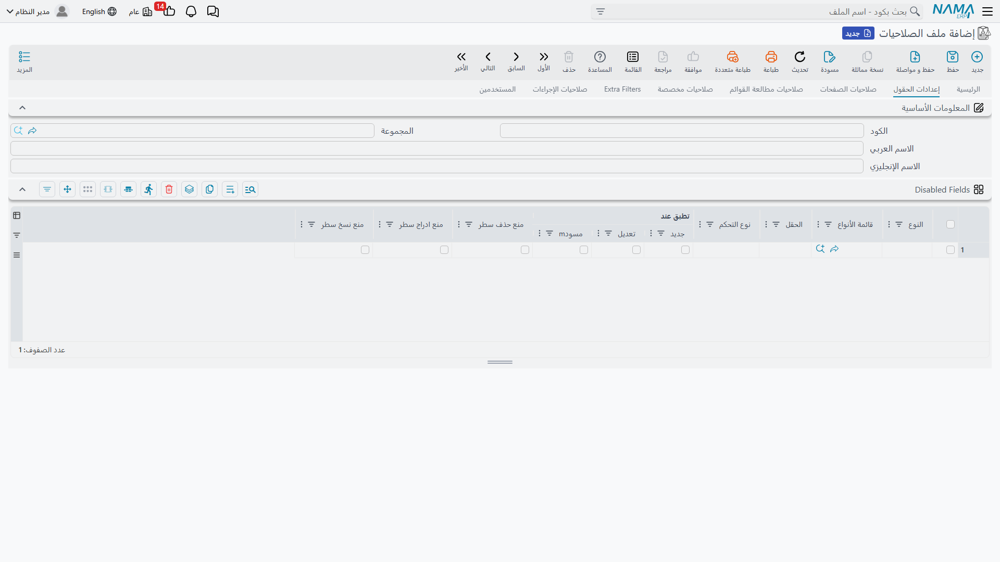
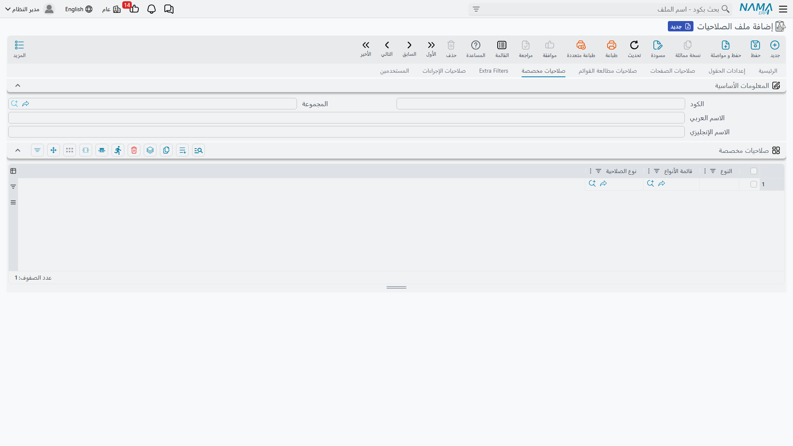

# Security Profile

The Security Profile is where most of your permission settings live. You create one profile per job role, fill in its tables once, and then assign it to every user who performs that role. This page walks through the Security Profile screen tab by tab.

**Path**: Administration > Security > Security Profile

## Full Authority

The most powerful flag in the entire system. When **Full Authority** is enabled, the profile grants *everything*: all types, all permissions, all fields, all pages, all list views. The rest of the permission tables are ignored entirely.

A few rules the system enforces around this:

- The built-in **default** security profile must always have Full Authority enabled — it is the `admin` user's profile.
- A profile *without* Full Authority must contain at least one standard security line, otherwise it grants nothing and the system rejects it on save.
- A Full Authority profile cannot contain list-view security lines — the two are contradictory.

::: tip
Even with a full-authority profile, record visibility can still be narrowed through Dimensions on the user record and login dimensions — see [Record-Level Security](/en/platform/security/record-level-security.md).
:::

## Standard Security Lines

This table on the main page is the heart of the Security Profile: one line per entity type (or group of types) describing what the role can do with it.

### Defining the Line's Scope

Every line starts with the question "which types does this line govern?":

- **Type** — a single entity type, such as a sales invoice.
- **Type List** — an *EntityType List* record that groups several types together.
- **Both empty** — a Wildcard line that matches any type not covered by a more specific line.

When checking a permission, a line that names the type explicitly always takes priority over a type-list line, which in turn takes priority over the wildcard. Duplicate lines covering the same scope are rejected on save.

You do not have to add lines one by one: the **Copy Entities From Menu** and **Copy Entities From Group** fields in the screen header, together with the **Add From Menu Definition** buttons, generate lines for every type that appears in a menu or menu group — a fast way to seed a role from the menu the user will actually use.

### View Permissions

| Column | Meaning |
|---|---|
| **Full** | Grants all permissions for the types in this line — "full authority" at the line level. |
| **Record View** | Open a record and read its details. |
| **List View** | See list screens for the type. |
| **Search View** | The type's records appear in reference-field search results. Granting List View includes Search View. |
| **Min Search Query Length** | The user must type at least this many characters before the search returns results — useful for large files like items and customers. |
| **View Only Created Records** | The user sees only records they themselves created. See [Record-Level Security](/en/platform/security/record-level-security.md). |
| **Allow View Other Records At Search** | Softens the above flag: other users' records still appear in reference search results even though their screens are blocked. |

### Add, Edit, and Delete

| Column | Meaning |
|---|---|
| **Can Edit** | A level, not just a flag: **Disabled** (no writing at all) ← **Save Draft** (drafts only) ← **Commit** (create and save, but the saved record is then locked) ← **Edit After Commit** (full editing even after saving). |
| **Edit Only Created Records** | The user can only edit records they created. Requires *Edit After Commit* level. |
| **Can Delete** | Delete records. |
| **Delete Only Created Records** | The user can only delete records they created. Requires the Delete permission. |
| **Draft Deletion Capability** | Independent control over draft deletion: **Yes**, **No**, or **Same As Delete** (mirrors the Delete permission). |
| **Delete Only Created Drafts** | The user can only delete drafts they created. |
| **Prevent Save Draft** | Disables the draft mechanism entirely for this type. |
| **Prevent Edit/Delete After Print** | Once a record is printed it is locked for editing/deletion. |
| **Prevent Edit/Delete After Approval** | Once the approval workflow completes the record is locked. |
| **Prevent Modify While Under Approval** | Prevents editing while an approval is in progress (see [Approvals System](/en/platform/approvals/approvals-system.md)). |

### Printing

| Column | Meaning |
|---|---|
| **Can Print** | **Disabled**, **One** (print once), or **More Than One**. |
| **Max Print Count** | A numeric cap on how many times the same record can be printed. |
| **Do Not Allow Print Drafts** | Drafts cannot be printed. |

Combining these columns with *Prevent Edit/Delete After Print* gives you a tight "printing = final" policy for documents such as official invoices.

### Revision

Documents in Nama can be *revised* — stamped as reviewed at one of five levels (L1–L5):

| Column | Meaning |
|---|---|
| **Can Revise** | The user can stamp documents as revised. |
| **Revise Levels** | The levels the user is allowed to stamp, e.g. `1,2` or `1-3`. |
| **Can UnRevise / UnRevise Levels** | The same pair for removing a revision stamp. |

### Data Transfer and Miscellaneous

| Column | Meaning |
|---|---|
| **Can Duplicate** | Create a copy of an existing record (enabled by default). |
| **Copy From / Copy To** | Allow the type to be a source / target for the "copy from another entity" feature. |
| **Can Import / Can Export** | Import and export records of this type via Excel. |
| **Can View With From Doc** | Open a record from a "from document" reference on other screens. |
| **Prevent View System Transaction** | Hide the system effects of the record (journal entries, stock movements). |
| **Prevent View More Menu** | Hide the "More" menu on the type's screens. |
| **Can Change Capability** | Allow assigning/changing a capability at the individual record level (see [Record-Level Security](/en/platform/security/record-level-security.md)). |
| **Display Prevent-Usage Records** | Whether records flagged "prevent usage" are visible to this role: **Display**, **Hide**, or **Same As Config** (follows global settings). |
| **Can Edit/Delete Docs In Closed Shifts** | POS-specific: allow interacting with documents that belong to a closed cash shift. |

## Menu Allow/Block

Also on the main page, the **Menu Allow/Block** table controls which menu items the role sees. Each line targets either a type / type list, **or** a menu item code / group code — not both at once. This is the cleanest way to trim the navigation menu per role without redefining the menus themselves.

## Field Settings Page

Hide specific fields or prevent editing them per type. Documented in full detail in [Field, Page, and List-View Security](/en/platform/security/field-page-listview-security.md).

## Page Security Page

Hide entire pages from the type's screen or make them read-only.

## List View Security Page

Allow or block specific list views.

## Custom Capabilities Page

Some checks in the system are not standard operations (add/edit/delete) — they are named permissions specific to certain features, defined as **Capability Type** records under **Administration > Security > Capability Types**.

How it works:

1. Define a **Capability Type** record (for example "View System Reports", or a capability used to tag sensitive records).
2. In the Custom Capabilities section on the security profile (or user), add a line granting that capability, optionally scoped to a type or type list.
3. Wherever the system — or any customization — checks for that capability, only users who hold it pass through. Unlike standard security lines, there is no wildcard-line logic here: either you hold the capability or you don't.

Custom capability lines also carry optional inputs (two references, two dates, two text fields) that specific features can interpret — for example a reference to a cost center to which the capability applies.

::: info System Reports
The **View System Reports** flag in the screen header is implemented internally as a built-in capability with code `SYSTEMREPORTS`. Enabling it on the profile or user automatically grants that capability, and reports tagged as *system reports* are visible only to users who hold it.
:::

## Extra Filters Page

Row-level filters that restrict *which records* the role sees for each type — by matching a field against something related to the user, or via a free-form criteria expression. Because this is a record-visibility topic it is documented in [Record-Level Security](/en/platform/security/record-level-security.md).

## Action Security Page

Type screens carry actions beyond the standard operations — generation buttons, recalculation tools, entity flows. Each line here targets a type (or type list, or a wildcard) together with an **Action ID** and a **Control Type** of either *enabled* or *disabled*.

The resolution logic here is the inverse of standard security lines:

- **No matching line → the action is allowed.** Actions are open by default.
- A matching line allows the action only if its control type is *enabled* — a *disabled* line is how you remove an action from a role.
- Action ID `*` acts as a wildcard for all actions on the targeted type, and a line that names the action explicitly takes priority over `*`.

The common pattern therefore is: a line with action `*` and *disabled* for a type (locking everything down), plus explicit *enabled* lines for the few actions the role actually needs.

## Header Options on the Main Page

Alongside the tables, the security profile header carries defaults and switches that apply to every user assigned this profile (most are also present on the user record, where the user's value takes priority):

- **Sessions and Login**: maximum number of concurrent login sessions with an option to auto-logout the oldest session, *Allow Login Through Applications Only*, and *Do Not Use LDAP For Login*.
- **Reports and Printing**: maximum number of reports a user can run simultaneously, *Prevent the user from running the same report twice at the same time*, *Allow PDF Printing Only* for reports and/or screen forms, and *View System Reports*.
- **Prevent-Usage Records**: allow their use in data entry/editing, and show or hide them in search and list views.
- **Default Settings**: default menu, default list-view ID, dashboard, the email used with the send-as-email window, maximum records per list page.
- **Reprocessing Controls**: allow re-saving files, re-issuing accounting effects, re-issuing stock effects, and re-syncing files — four switches (enabled by default) that you can remove from sensitive roles.
- **Miscellaneous**: do not show system help messages, do not display critical errors, prevent access to sales threads not assigned to the employee, auto-load user shift, access to AI capabilities, prevent access to instant messaging, and notification sounds.

## Users Page

The last page is view-only: a list of all users currently assigned this profile, so you can immediately see the scope of any change before saving it.

::: warning Changes Take Effect at Next Login
Permission data is loaded with the session. Users typically pick up security profile changes at their next login — keep this in mind during testing.
:::
