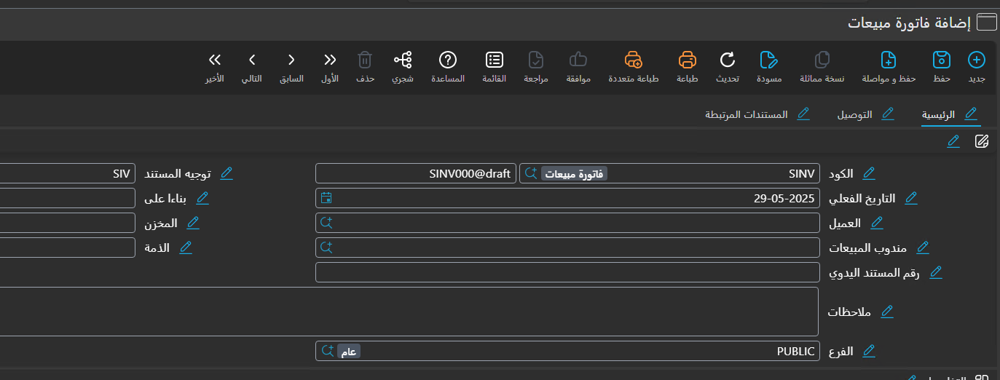
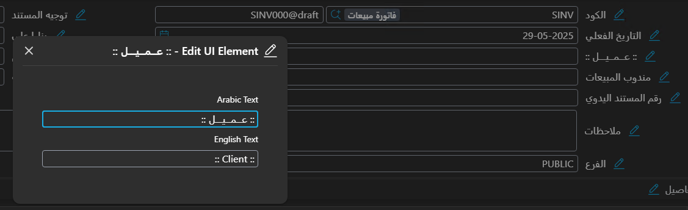
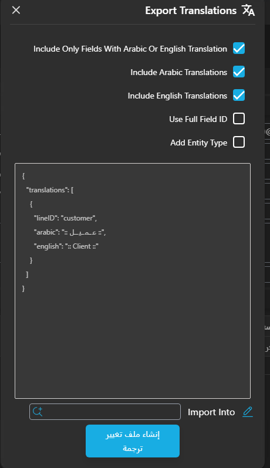

# Modifying Translations in Nama ERP

* Translations can be modified using the **Translation Change File**.
* The lines in the translation file allow modifying translations for:

    * Fields
    * Screens
    * Page titles
    * Groups
    * System actions
      in Arabic, English, or both. (Either language can be left empty.)

### Supported Languages:

* Arabic
* English
* French (treated as an alternative to English)

---

### Translating Screen Names (Singular / Plural):

* The singular translation is used on the edit screen (e.g., *Sales Invoice*).
* The plural translation is used on the list screen (e.g., *Sales Invoices*).

To modify these translations:

* **For singular**: Select the type, leave the "ID" field empty, then fill in the "Arabic" and "English" fields.
* **For plural**: Select the same type, enter `s` in the "ID" field, then fill in the "Arabic" and "English" fields.

---

### Translating Fields:

* **General field translation**:

    * Enter the field ID in the "ID" field.
    * Fill in the "Arabic" and "English" fields.

* **Translating a field within a specific screen**:

    * Specify the screen name in the "Type" field.

* **Translating a field across multiple screens**:

    * Create a "Type List" file containing those screens.
    * Use this file in the "Type List" field.

---

### Simplifying Translation Using a Keyboard Shortcut

* Use the shortcut **Alt + Ctrl + T** to show buttons next to fields and headings for editing translations.

* Clicking the button displays a box containing two fields: Arabic and English.

* The translation is modified temporarily and directly within the system.
* When finished, from the "More" menu choose **Export Translations**.

---

### Export Translations Window

This window contains the following options:

* **Include Only Fields With Arabic Or English Translation**
  Include only fields whose translation has been modified.

* **Include Arabic Translations**
  Add the Arabic translation.

* **Include English Translations**
  Add the English translation.

* **Use Full Field ID**
  Use the full field ID.

* **Add Entity Type**
  Add the type to the translation file (to link the translation to the current screen only).

After selecting the options, click **"Create Translation File"**, and a window will appear containing the selected translations.
Fill in the remaining data and click "Save", and the translations will be loaded immediately.
