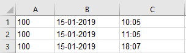

<rtl>

# صيغ الحضور والانصراف

في العادة يقوم الموظفون بتسجيل الحضور والانصراف عن طريق البصمة بواسطة أحد ماكينات الحضور المخصصة لذلك Time Attendance Machine.
بالطبع يختلف شكل البيانات الخارج من ماكينة لأخرى.
فعلى سبيل المثال، بعض الماكينات تقوم بإخراج الوقت مثلاً بطريقة 24 ساعة والبعض بطريقة 12 ساعة صباحاً ومساءً،
ويمكن أن تخرج البيانات على شكل ملف إكسل والبعض بملف نصي على أن تستخدم فاصلة محددة للفصل بين الحقول المستوردة.
وتختلف هذه الفاصلة من ماكينة لأخرى، وهكذا.

لاحظ أنه إذا كان الملف الخارج من الماكينة يخرج بإصدار إكسل قديم بالامتداد xls، فلابد من إعادة تخزين هذا الملف بالامتداد الحديث xlsx، وذلك تجنباً لحدوث أخطاء عند استيراد البيانات.

من خلال مستند الحضور والإنصراف يتم استيراد ملفات الدوام الخاصة بالموظفين وذلك عن طريق تحديد ماكينة الحضور والانصراف المستخدمة
ثم تحديد الملفات التي سيتم استيرادها والتي سيتم تحديدها من خلال حقول المرفقات، حيث يسمح النظام باستيراد حتى 5 مرفقات.
أنظر الشكل التالي:


قامت شركة نما سوفت، ومن خلال ملف إعدادات الرواتب بتصميم آلية لمساعدة المستخدم في استيراد البيانات من ملف الدوام،
وبالمناسبة فإن نظام نما يتعامل فقط مع ملف الدوام الخارج من ماكينة الحضور والانصراف،
ولا يقوم بالإتصال بماكينة الحضور والانصراف نفسها بأي حال من الأحوال.

لذا فالغرض من صيغ الحضور والانصراف - التي سنقوم بشرحها - هو إعلام نظام نما بشكل و تنسيق البيانات بالملف التي سيتم استيرادها،
مثل كيفية صياغة التاريخ هل سيتم إدراج اليوم كرقم واحد (1،2،3)، أم كرقمين (01,02,03).

فيما يلي سنقوم بشرح كيفية توصيف الصيغة المستخدمة في توصيف بيانات الحضور والانصراف، وذلك من خلال شرح الآلية التي تحدثنا عنها بالفقرة السابقة.

الصيغة العامة لتعريف شكل الحقول المستوردة يمكن فهمها من المثال المذكور بالصورة التالية :


حيث AA هو اسم يعبرعن الماكينة التي يراد استخدام الصيغة لها، ويمكن استبداله بأي نص آخر، ومن ثم فعند استيراد بيانات هذه الماكينة من خلال ملف الدوام، يتم اختيار (AA) بالحقل آلة الحضور والإنصراف.

يتم استخدام الرمز "#" قبل صيغة أي حقل - أنظر الصورة.

تعبر عن كود المستخدم على ماكينة الحضور والانصراف.  #empid

تعبر عن صيغة التاريخ الخاص بهذا الموظف.  #date{dd-MM-yyyy}

تعبر عن صيغة الوقت الأول (وقت الدخول) الخاص بهذا الموظف.  #time{HH:mm}

ويتم سرد أي بيانات أخرى يراد إضافتها مثل نص 1 وغير ذلك.

يمكن استخدام أي من الأزرار الموجودة بأسفل النافذة لإدراج أي من صيغ الدوام مثل التاريخ والوقت، وهو يقوم آلياً بوضع الرمز # متبوعاً بالصيغة المطلوبة بشكل صحيح، ولذلك فالشركة المطورة تنصح باستخدام هذه الأزرار تجنباً للأخطاء اليدوية.

عند ضبط الصيغة بهذه الطريقة فإن نظام نما يتوقع أن تكون البيانات الموجودة بالملف المستورد بالشكل التالي:


# صيغ أزرار استيراد الحضور والانصراف

فيما يلي شرح لجميع صيغ الحقول التي يمكن استخدامها عند استيراد بيانات الحضور والانصراف في نظام نما.

## جدول شرح لكل مكونات صيغ الحضور و الانصراف 

بالطبع، إليك النسخة المعاد تنسيقها من المستند الأصلي، بدون استخدام جداول، وبنفس المستوى من التفاصيل والأمثلة:

---

# صيغ أزرار استيراد الحضور والانصراف

## Employee ID

**الصيغة:** `#empid`

يُستخدم لإدراج كود الموظف على ماكينة الحضور والانصراف.

---

## Date

**الصيغة:** `#date{dd-MM-yyyy}`

يُستخدم لإدراج التاريخ (سواء كان للدخول أو الخروج).
تفاصيل التنسيق:

* `dd`: اليوم. إذا استُخدم حرفان، يُتوقع أن تكون البيانات مثل `01, 02, ..., 31`.
  أما إذا استُخدم حرف واحد `d`، فيُتوقع أن تكون مثل `1, 2, ..., 31`.

* `MM`: الشهر بحرفين، مثل `01, 02, ..., 12`.
  **مهم:** يجب استخدام حرف كبير `M` لأن الحرف الصغير `m` يُشير إلى الدقائق.

* `yyyy`: السنة بأربعة أرقام، مثل `2024`, `2025`.

---

## In Date

**الصيغة:** `#indate{dd-MM-yyyy}`

تُستخدم لإدراج **تاريخ الدخول** في عمود مستقل.
عند استخدامها، يجب استخدام `Out Date` معها لوجود تاريخي الحضور والانصراف في نفس السطر.

---

## Out Date

**الصيغة:** `#outdate{dd-MM-yyyy}`

تُستخدم لإدراج **تاريخ الخروج** في عمود مستقل.
تُستخدم مع `In Date`.

---

## Time

**الصيغة:** `#time{HH:mm}`
أو `#time{hh:mm a}`

* `HH`: الساعة بصيغة 24 ساعة.
  إذا استُخدم `H` فقط، فيُتوقع الشكل `1, 2, ..., 24`.

* `hh`: الساعة بصيغة 12 ساعة، ويجب إضافة `a` لتحديد الفترة (AM/PM أو صباحاً/مساءً).

* `mm`: الدقائق، مثل `01, 02, ..., 59`.

أمثلة:

* `10:42 am`
* `10:42 pm`

---

## In Time

**الصيغة:** `#intime{HH:mm:ss}`

تُستخدم لإدراج **وقت الدخول** في عمود مستقل.
يُستخدم معها `Out Time`.

---

## Out Time

**الصيغة:** `#outtime{HH:mm:ss}`

تُستخدم لإدراج **وقت الخروج** في عمود مستقل.
يُستخدم معها `In Time`.

---

## Date Time

**الصيغة:** `#datetime{dd-MM-yyyy HH:mm:ss}`

تُستخدم لإدراج التاريخ والوقت في عمود واحد.

---

## In Date Time

**الصيغة:** `#indatetime{dd-MM-yyyy HH:mm:ss}`

تُستخدم لإدراج تاريخ ووقت الدخول في عمود واحد.

---

## Out Date Time

**الصيغة:** `#outdatetime{dd-MM-yyyy HH:mm:ss}`

تُستخدم لإدراج تاريخ ووقت الخروج في عمود واحد.

---

## Alternating Punch

**الصيغة:** `#alternatingPunch`

تعتبر أول قراءة خلال اليوم "دخول"، وآخر قراءة "خروج".
تُستخدم لتبسيط بيانات الاستيراد من الماكينة.

---
## Alternating With Attendance Plan Punch

**الصيغة:** `#alternatingWithAttendancePlanPunch{2.5}`

تُستخدم هذه الصيغة للتعامل مع البيانات المستوردة بذكاء، بحيث يقوم النظام بتحديد ما إذا كانت البصمة تمثل **دخولاً** أو **خروجاً**، وذلك بناءً على **خطة الدوام** الخاصة بالموظف.

يعتمد هذا التحديد على مدى زمني (بالساعات) يتم تحديده داخل الأقواس `{}`. ضمن هذا المدى، يتم اعتبار البصمة إما دخولًا أو خروجًا بناءً على قربها من وقت الدوام المحدد.

### مثال توضيحي:

```
AA=#empid#date{dd-MM-yyyy}#time{hh:mm}#alternatingWithAttendancePlanPunch{2}
```

**الشرح:**

* خطة دوام الموظف: من الساعة 8:00 صباحًا إلى 4:00 مساءً.
* تم تحديد المدى `{2}` في الصيغة.

بالتالي:

* أي بصمة بين **6:00 صباحًا إلى 10:00 صباحًا** → تعتبر **بصمة دخول**.
* أي بصمة بين **2:00 مساءً إلى 6:00 مساءً** → تعتبر **بصمة خروج**.

### متى تستخدم هذه الصيغة؟

تفيد هذه الصيغة بشكل خاص عندما:

* يكون لدى الموظف **أكثر من وردية** عمل في اليوم الواحد.
* يتم تسجيل **أكثر من دخول وخروج فعلي** في نفس اليوم.

بفضل هذه الصيغة، يتم تفسير البيانات بشكل مرن وذكي دون الحاجة لتعريف نوع البصمة بشكل صريح داخل الملف.

---

## Exact Alternating

**الصيغة:** `#exactAlternating`

تعتبر القراءة الأولى دخول، الثانية خروج، الثالثة دخول، ...وهكذا.
إذا بدأ يوم جديد، تُعتبر القراءة دخول تلقائيًا.

---

## Exact Alternating With Different Days

**الصيغة:** `#exactAlternatingWithDifferentDays`

نفس فكرة `Exact Alternating` لكن عبر أيام متعددة.

---

## Exact With Different Days

**الصيغة:** `#exactWithDifferentDays`

تعتبر كل قراءتين متتاليتين دخول وخروج بغض النظر عن التواريخ.

---

## Ignore Consecutive Punches

**الصيغة:** `#ignoreConsecutivePunches{5}`

تُستخدم لتجاهل البصمات المتقاربة خلال عدد دقائق معين (مثلاً 5 دقائق).

---

## Add Hours: Time Zone Diff

**الصيغة:** `#addhours{2}`
أو `#addhours{-2}`

تُستخدم لترحيل الوقت بإضافة أو طرح عدد ساعات معين.

---

## Type: In or Out

**الصيغة:** `#type{I-O}`
أو `#type{C/In-C/Out}`

تُستخدم لتحديد نوع البصمة (دخول أو خروج) إذا كانت موجودة كقيمة في الملف.

---

## Copy Lines

**الصيغة:**
`#copylines{intime=Checkin2,outtime=Checkout2|intime=Checkin3,outtime=Checkout3}`

في بعض الأحيان، يتم استيراد بيانات الحضور والانصراف لأكثر من **ورديّة** (ورديتين أو ثلاث) في **نفس السطر** داخل الملف المصدر.

### طريقة التمثيل:

#### 1. إدراج التاريخ والوقت للوردية الأولى:

```
AA=#date{dd-MM-yyyy}#intime{HH:mm:ss}#outtime{HH:mm:ss}
```

#### 2. إدراج الحقول الإضافية للورديات الثانية والثالثة (مثلاً):

```
AA=#date{dd-MM-yyyy}#intime{HH:mm:ss}#outtime{HH:mm:ss}#Checkin2#Checkout2#Checkin3#Checkout3
```

#### 3. استخدام الصيغة `copylines` لنسخ الورديات الأخرى إلى سطور مستقلة:

```
AA=#date{dd-MM-yyyy}#intime{HH:mm:ss}#outtime{HH:mm:ss}#Checkin2#Checkout2#Checkin3#Checkout3#copylines{intime=Checkin2,outtime=Checkout2|intime=Checkin3,outtime=Checkout3}
```

### ملاحظات:

* إذا كان هناك وردية إضافية واحدة فقط، يمكن حذف الجزء الخاص بـ `Checkin3` و `Checkout3`.
* هذه الصيغة تجعل النظام يُعامل كل زوج من (وقت دخول ووقت خروج) كوردية مستقلة، ويقوم بتحويلها إلى **سطر مستقل** عند الاستيراد.

---


## Separator

**الصيغة:** `#sep{,}`

تُستخدم لتحديد الفاصل بين الحقول في الملف النصي (مثل `,` أو تبويب `\\t` أو مسافة).

---

## Empty Column

**الصيغة:** `#ignore`

لتجاهل عمود معين في الملف.

---

## Ignore Lines From Top

**الصيغة:** `#ignoreLinesFromTop{1}`

لتجاهل عدد معين من السطور من أعلى الملف.

---

## Ignore Lines From End

**الصيغة:** `#ignoreLinesFromEnd{1}`

لتجاهل عدد معين من السطور من أسفل الملف.

---

## Text 1

**الصيغة:** `#text1`

لاستيراد حقل نصي إضافي، مثل الجنسية.

---

## Machine Code

**الصيغة:** `#machinecode`

لاستيراد كود الماكينة في تفاصيل الحضور والانصراف.

---

## Ref1 Code & Ref1 Entity Type

**الصيغ:**

* `#ref1Code`
* `#ref1EntityType{Project}`

تُستخدم لاستيراد كود ونوع مرجع 1 (مثل المشروع، الإدارة، الفرع...).

---

## Ref2 Code & Ref2 Entity Type

**الصيغ:**

* `#ref2Code`
* `#ref2EntityType{Branch}`

تُستخدم لاستيراد كود ونوع مرجع 2.

---

## Remove Empty Columns

**الصيغة:** `#removeEmptyColumns`

تُستخدم لإزالة الأعمدة الفارغة التي تنتج من فراغات متكررة في الملف النصي.

---

## AM / PM

**الصيغة:** `#am_pm{صباحاً-مساءاً}`

تُستخدم عند استخدام تنسيق 12 ساعة مع تعبيرات صباحاً/مساءاً بدلاً من AM/PM.

---
## Merge With Previous With Separator

**الصيغة:** `#mergeWithPreviousWithSeparator{-}`

تُستخدم هذه الصيغة في **الحالات النادرة** التي يتم فيها إدراج أحد الحقول مقسومًا على **عدة أعمدة** في ملف نصي، كما في حالة التاريخ المكتوب بالشكل التالي:

```
2019 01 15
```

في هذه الحالة، يقرأ النظام هذه القيم كثلاثة أعمدة منفصلة، وليس كقيمة واحدة.

### الحل:

يمكن استخدام `#mergeWithPreviousWithSeparator{-}` لدمج هذه الأعمدة الثلاثة في قيمة واحدة مفصولة بعلامة مثل `-`، لتصبح:

```
2019-01-15
```

### مثال تطبيقي:

```
AA=#empid#date#mergeWithPreviousWithSeparator{-}#mergeWithPreviousWithSeparator{-}#time{HH:mm}
```

### ملاحظات:

* تم استخدام الصيغة **مرتين** لأن هناك **مسافتين** بين أجزاء التاريخ.
* داخل الأقواس `{}` يتم تحديد **الفاصل** الجديد الذي سيُستخدم عند الدمج (في هذا المثال `-`).
* تُفيد هذه الصيغة عند الاستيراد من ملفات غير منظمة أو يتم تنسيقها يدويًا بفواصل غير موحدة.


---

## Merge With Previous With No Separator

**الصيغة:** `#mergeWithPreviousNoSeparator`

تُستخدم لدمج القيم دون استخدام أي فاصل.

---

## Merge With Previous With Space

**الصيغة:** `#mergeWithPreviousWithSpace`

تُستخدم لدمج القيم وفصلها بمسافة بدلًا من فاصل آخر.

---


::: tip
 📌 يمكن الاستعانة بالأزرار المتوفرة في شاشة إعداد الصيغة داخل النظام لإدراج الصيغة الصحيحة تلقائيًا وتجنب الأخطاء اليدوية.
:::

</rtl>