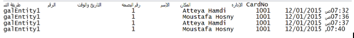

# Attendance Machine Formula Guide
- Go to Human Resources → Settings → Salary Settings → Attendance Machines Settings

##  How to Write a Formula

- Formula is mainly based on Employee, Date, Time and Punch
- Use ‘#’ character to indicate where the properties (e.g. Employee,Date.. etc)

Example:
If the **employee code** is the second column:

```
x#empid
```

This means "skip the first column, take the second as the employee code."

---

##  Supported Functions

| Function                                     | Description                                                        |
| -------------------------------------------- |--------------------------------------------------------------------|
| `empid`                                      | Employee Attendance machine code                                   |
| `date{format}`                               | Date column with specified format (e.g. `date{dd/MM/YYYY}`)        |
| `time{format}`                               | Time column with specified format (e.g. `time{HH:mm}`)             |
| `datetime{format}`                           | Combined date & time column (e.g. `datetime{dd/MM/YYYY HH:mm}`)    |
| `type{in-out}`                               | Indicates punch type: in (`I`) or out (`O`), e.g. `type{I-O}`      |
| `indate{format}` / `outdate{format}`         | In/out date used if both exist on one line                         |
| `intime{format}` / `outtime{format}`         | In/out time used if both exist on one line                         |
| `indatetime{format}` / `outdatetime{format}` | In/out date+time used if both exist on one line                    |
| `machinecode`                                | Column for machine code                                            |
| `text1`                                      | Column for text1 field                                             |

---

##  Punch Handling Functions

| Function                     | Description                                                  |
| ---------------------------- | ------------------------------------------------------------ |
| `initialPunch`               | Used in punch detection                                      |
| `alternatingpunch`           | Treats first punch as In, last as Out, no type column needed |
| `exact` / `exactAlternating` | Alternating with strict order (In, Out, In, Out...)          |
| `ignoreConsecutivePunches`   | Ignores duplicate consecutive punches                        |

---

##  Time Adjustment

| Function      | Description                                                             |
| ------------- | ----------------------------------------------------------------------- |
| `addhours{n}` | Adjust machine time by `n` hours (e.g. `addhours{2}` or `addhours{-2}`) |

---

##  Ignore Lines

| Function                | Description                            |
| ----------------------- | -------------------------------------- |
| `ignoreLinesFromTop{n}` | Ignore top `n` lines (e.g. headers)    |
| `ignoreLinesFromEnd{n}` | Ignore bottom `n` lines (e.g. footers) |

---

##  Separator

| Function   | Description                                                          |
| ---------- | -------------------------------------------------------------------- |
| `sep{‘ ’}` | Defines column separator (e.g. space `' '`, tab `'\t'`, comma `','`) |

---

##  Note

* The following functions **must be used at the end** of the formula:

    * `sep{...}`
    * `alternatingpunch`
    * `addhours{...}`
    * `ignoreLinesFromTop{...}`
    * `ignoreLinesFromEnd{...}`

This prevents them from interfering with the column positions.

---

##  DEMO Example

### Sample File:


### Formula:

```text
machineName = x#x#x#empid#date{dd/MM/YYYY}#time{hh:mm}#am_pm{ص-م}#sep{' '}#ignoreLinesFromTop{1}
```


#### machineName is used here to tell that this formula is used with files from certain machine in case you have more than one attendance machine.

#### Note: the following functions must be used at the end of formula `{sep,alternatingpunch ,addhours,igonreLinesFromTop,igonreLinesFromEnd}` in order not to affect the properties columns while parsing the machine file


