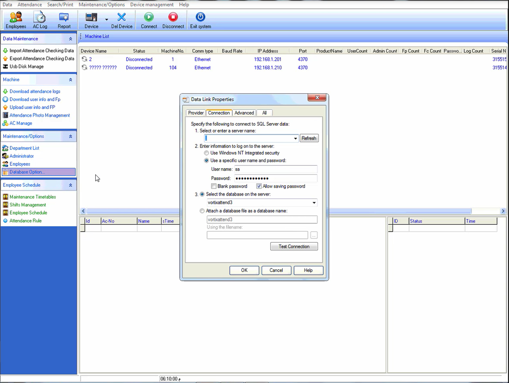
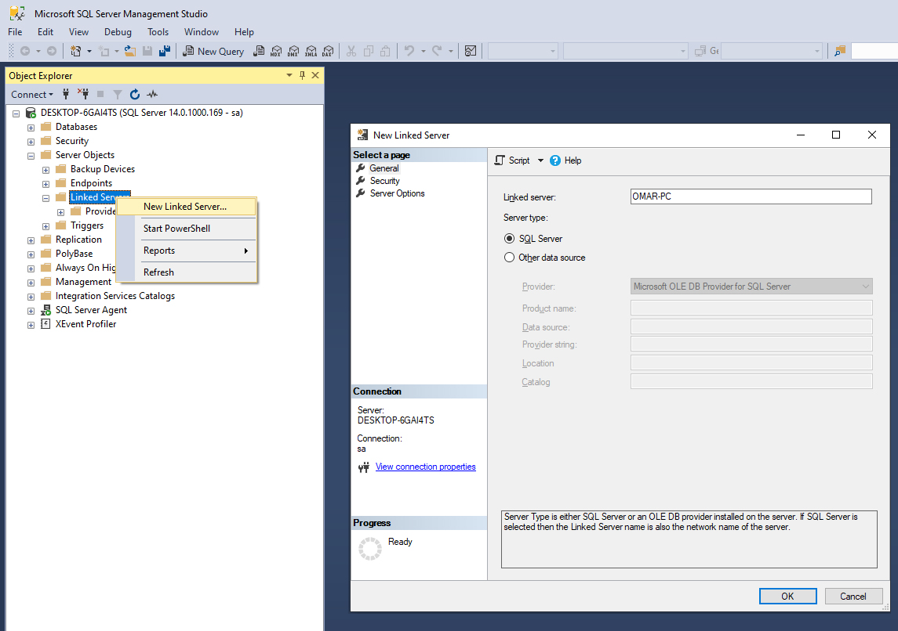
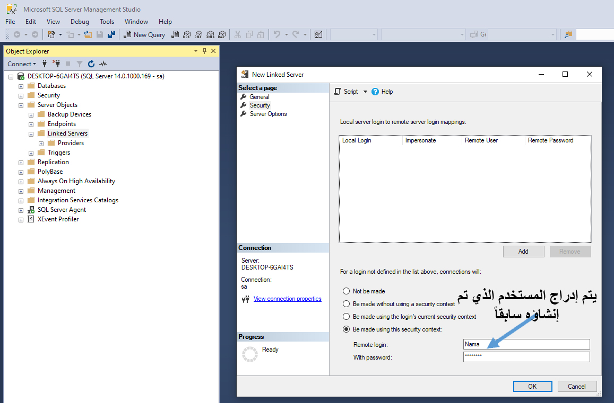
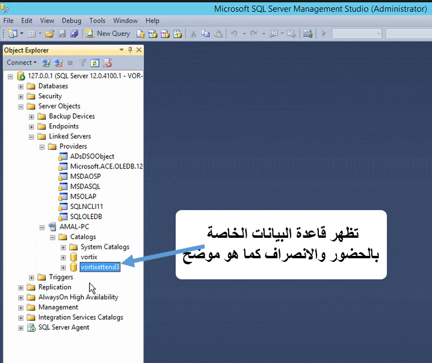

<rtl>

# الربط مع ماكينات الحضور والانصراف

يدعم النظام طريقتين للربط مع ماكينات الحضور والانصراف:

1. الطريقة الأولى من خلال تطبيق مخصص يتم وضعه على الأجهزة التي تقرأ البصمات من الماكينات.
2. الطريقة الثانية من خلال ربط خادم SQL Server الخاص بالماكينات مع SQL Server الخاص بنظام نما.

## الطريقة الأولى: تطبيق attcron

::: tip
هذا التطبيق بحاجة لترخيص منفصل – يرجى التواصل مع فريق المبيعات أو الدعم الفني للحصول على الترخيص.
:::

هو تطبيق مخصص يتم تنصيبه على الأجهزة التي بها برامج استيراد البيانات من ماكينات الحضور والانصراف.
وظيفته الأساسية هي جلب البيانات من قاعدة بيانات البرنامج المحلية أو من خلال واجهة البرمجة الخاصة ببرنامج الماكينة (API)، وإرسالها بشكل دوري إلى النظام.

### مميزات التطبيق

* لا يحتاج إلى static IP في كل الفروع التي تحتوي على ماكينات.
* لكن يجب وجود static IP أو أي طريقة تسمح للتطبيق بالوصول إلى خادم Nama ERP الرئيسي.

### خطوات التشغيل

* قم بإنشاء ملف API Credentials في نظام Nama ERP واحتفظ بـ **Client ID** و **Client Secret**.

* قم بإنشاء ملف "إعدادات ماكينة الحضور" جديد، وحدد له:

  * كود مناسب
  * اسم
  * نوع الاتصال

* حدد **CRON Expression** لتحديد توقيت قراءة البيانات وإرسالها إلى النظام:

  * مثال: `5 */1 * * *` سيقوم بقراءة البيانات كل ساعة عند الدقيقة الخامسة.
  * يمكنك استخدام الموقع التالي لمساعدتك: [https://crontab.guru](https://crontab.guru)

* حدد المهمة المجدولة التي سيتم تشغيلها بعد سحب البيانات من الماكينة:

  * هذه المهمة تقوم بجلب البيانات من جدول لوج البصمات إلى ملف الحضور والانصراف.
  * لتسهيل إنشاء المهمة، تم إضافة زر باسم **Create Scheduled Task**.

### نوع الاتصال (Connection Type)

نوع الاتصال يحتوي على ثلاث خيارات:

#### ZkBiotime

* يسمح بنقل بيانات البصمة من برنامج ZK BioTime.
* يتطلب:

  * رابط الماكينة
  * اسم المستخدم
  * كلمة المرور

#### SQL Server

* يسمح بنقل البيانات من أي ماكينة تدعم SQL Server.

* الإعدادات المطلوبة:

  * **رابط الماكينة**: عنوان خادم SQL Server – غالبًا يكون `localhost`
  * **Database Port**: منفذ الاتصال – غالبًا `1433`
  * **اسم المستخدم**: مثل `sa`
  * **كلمة المرور**
  * **SQL Query**: الاستعلام الذي سيتم استخدامه لقراءة البيانات من قاعدة بيانات الماكينة بشكل دوري
  * **Read For Period Query**: استعلام يستخدم لقراءة بيانات فترة معينة عند الضغط على زر "Read Attendance For Period" في تطبيق attcron
  * **Mapping Lines**: ربط أعمدة نتيجة الاستعلام بما يحتاجه النظام

    يحتوي على ثلاثة أعمدة:

    * **Response Field**: اسم الحقل المطلوب في النظام
      القيم الممكنة:
      `EmployeeCode`, `firstName`, `lastName`, `department`, `punchTime`, `punchState`, `punchStateDisplay`, `verifyType`, `verifyTypeDisplay`, `gpsLocation`, `areaAlias`, `terminalSN`, `uploadTime`
    * **Column Index**: رقم العمود في نتيجة الاستعلام
    * **Column Alias**: اسم العمود البديل لاستخدامه في جملة SQL

* يوجد زر باسم **Default Queries** يقوم بإدراج استعلامات افتراضية مناسبة لماكينات ZK.

#### Access

* يسمح بنقل البيانات من قاعدة بيانات Microsoft Access.
* نفس الإعدادات مثل SQL Server، باستثناء:

  * لا حاجة لاسم مستخدم وكلمة مرور ورابط الخادم.
  * بدلاً من ذلك يتم تحديد **مسار ملف قاعدة البيانات** الموجود على الجهاز الذي سيتم تنصيب عليه تطبيق attcron.

### خطوات تنصيب برنامج Attendance Cron على الجهاز

1. اذهب إلى الجهاز الذي سيتم تشغيل التطبيق عليه، وقم بتنصيب:

  * **JDK 21**
  * **Apache Tomcat 10**

2. اضبط Tomcat بحيث يكون `Startup Type = Automatic`.

3. قم بتحميل ملف تنصيب Attendance Cron من الرابط التالي:

   [https://namasoft.com/bin/nama-attcron-upgrader.jar](https://namasoft.com/bin/nama-attcron-upgrader.jar)

4. ضع الملف في مجلد Tomcat، ثم قم بتشغيله.

5. بعد تشغيل الملف سيتم تحميل التطبيق.

6. افتح المتصفح وادخل إلى العنوان:

   `http://localhost:8080/attcron`

7. ستظهر لك صفحة تطلب منك إدخال البيانات التالية:

  * **Nama Server Address**: أدخل عنوان خادم Nama.
  * **Client Id and Client Secret**: أدخل بيانات الاتصال التي أنشأتها سابقًا.
  * **Attendance Machine Config Code**: أدخل كود الماكينة الذي حددته عند إنشاء الإعدادات.

بعد إكمال هذه البيانات، يصبح التطبيق جاهزًا لإرسال بيانات الحضور والانصراف إلى النظام.

## الطريقة الثانية: من خلال الربط مع قاعدة بيانات SQL Server بشكل مباشر

سنعرض المثال هنا باستخدام ماكينات ZK، ولكن يمكن تفعيل هذه الطريقة مع أي ماكينة تدعم تخزين بياناتها في قاعدة بيانات SQL Server.

يتم تنصيب برنامج الحضور والانصراف الخاص بالماكينة (ZK) على أحد خوادم المنشأة.
**يُفضل عدم تنصيب هذا البرنامج على نفس الخادم الخاص بنظام نما**، حيث يُفضل أن يكون خادم نما خاصًا بمدير النظام وأخصائيي الدعم الفني لتجنب تعريض النظام لأي أخطاء ناتجة عن المستخدمين غير المؤهلين.



من خلال إعدادات **Database Options**، يتم التأكد من ضبط البرنامج للعمل على **SQL Server**.

### إذا كان البرنامج مثبتًا على نفس خادم Nama ERP:

في هذه الحالة، تكون قاعدة بيانات برنامج ZK على نفس قاعدة بيانات SQL Server الخاصة بنظام نما، وبالتالي يكون الاتصال بين النظامين مباشرًا ولا يحتاج إلى إعدادات متقدمة.

### إذا كان البرنامج مثبتًا على خادم مختلف:

اتبع الخطوات التالية:

* احصل على **IP Address** أو اسم الكمبيوتر الذي توجد عليه قاعدة البيانات الخاصة بماكينة الحضور.
* أنشئ مستخدمًا جديدًا في SQL Server الخاص بماكينة الحضور، بصلاحيات مناسبة، مثلاً: `Nama`.
* على خادم Nama ERP، أنشئ **Linked Server** جديدًا، كما يلي:



* ضمن تبويب **Security**، اضبط الإعدادات كما في الصورة التالية:



* بعد الضغط على (OK)، يمكن اختبار الاتصال مع قاعدة بيانات الحضور كما يلي:



---

### كيفية استيراد بيانات حضور وانصراف عن طريق مهمة مجدولة

* أنشئ سجلًا جديدًا في "المهام المجدولة" من النوع "إجراء".

يمكن تحديد التوقيت الذي يتم فيه تنفيذ المهمة بسهولة من النافذة الرئيسية، حسب نظام دوام الموظفين.

في نافذة "إجراء"، اضبط الإعدادات التالية:

* **اسم العنصر**:
  `com.namasoft.modules.humanresource.utils.actions.EATimeAttendanceFromDBImporter`

* **مدخل 1 (SQL Query):**

```sql
SELECT e.attendanceMachineCode USERID, CHECKTIME [(yyyy-MM-dd HH:mm:ss)]
FROM [OMAR-PC].[TATimeAttendance].dbo.CHECKINOUT atm
LEFT JOIN [OMAR-PC].[TATimeAttendance].dbo.USERINFO ui ON ui.USERID = atm.USERID
LEFT JOIN Employee e ON RIGHT('00000000'+e.attendanceMachineCode,8) COLLATE Arabic_CI_AS = RIGHT('00000000'+CAST(ui.BADGENUMBER AS nvarchar(50)),8) COLLATE Arabic_CI_AS
WHERE e.id IS NOT NULL
  AND MONTH(atm.CHECKTIME) = MONTH(GETDATE())
  AND YEAR(atm.CHECKTIME) = YEAR(GETDATE())
ORDER BY 1, 2
```

> حيث:
>
> * `OMAR-PC`: اسم الكمبيوتر المثبت عليه برنامج ZK
> * `TATimeAttendance`: اسم قاعدة البيانات
> * `CHECKINOUT`: جدول الدخول والخروج
> * `attendanceMachineCode`: كود الموظف المرتبط بالبصمة

* **مدخل 2 (صيغة الإدخال):**

```
empid#datetime{yyyy-MM-dd HH:mm:ss}#alternatingPunch
```

* **مدخل 3 (معلومات الدفتر والفترة المالية):**

```sql
SELECT
  'TA' + CAST(YEAR(GETDATE()) * 100 + MONTH(GETDATE()) AS nvarchar(8)) code,
  'TAB' book,
  YEAR(GETDATE()) * 100 + MONTH(GETDATE()) fiscalPeriod,
  CAST(DATEADD(MONTH, DATEDIFF(MONTH, 0, GETDATE()), 0) AS date) valueDate,
  (SELECT id FROM legalEntity WHERE code = '03') legalEntity
```

::: details JSON for Direct Import

```json
{
  "scheduleType": "Action",
  "className": "com.namasoft.modules.humanresource.utils.actions.EATimeAttendanceFromDBImporter",
  "title1": "Query. eg: SELECT USERID ,CHECKTIME [(yyyy-MM-dd HH:mm:ss)]...",
  "parameter1": "SELECT e.attendanceMachineCode USERID, CHECKTIME [(yyyy-MM-dd HH:mm:ss)] FROM [C.NAMASOFT.COM].[namazk].dbo.CHECKINOUT atm LEFT JOIN [C.NAMASOFT.COM].[namazk].dbo.USERINFO ui ON ui.USERID = atm.USERID LEFT JOIN Employee e ON RIGHT('00000000'+e.attendanceMachineCode,8) COLLATE Arabic_CI_AS = RIGHT('00000000'+CAST(ui.BADGENUMBER AS nvarchar(50)),8) COLLATE Arabic_CI_AS LEFT JOIN Sector s ON s.id = e.sector_id WHERE e.id IS NOT NULL AND MONTH(atm.CHECKTIME) = MONTH(GETDATE()) AND YEAR(atm.CHECKTIME) = YEAR(GETDATE()) ORDER BY 1,2",
  "title2": "Format Formula. eg: empid#datetime{}#type{I-O}#exact#addhours{2}",
  "parameter2": "empid#datetime{yyyy-MM-dd HH:mm:ss}#alternatingPunch",
  "title3": "Document Initialization Query",
  "parameter3": "SELECT 'TA'+CAST(YEAR(GETDATE())*100+ MONTH(GETDATE()) AS nvarchar(8)) code,'TAB' book,YEAR(GETDATE())*100+ MONTH(GETDATE()) fiscalPeriod,CAST(DATEADD(MONTH, DATEDIFF(MONTH, 0, GETDATE()), 0) AS date) valueDate,(SELECT id FROM legalEntity WHERE code = '1') legalEntity",
  "title4": "Save as draft(true,false)",
  "title5": "Data Pre-processor (groovy)",
  "title6": "Ignore Unfound Employees",
  "actionDescription": "Creates attendance doc per period from select"
}
```
:::


::: tip

* تقوم المهمة المجدولة تلقائيًا باستيراد بيانات الحضور والانصراف **من اليوم الأول حتى نهاية الشهر**.
* **كود السند** الناتج يتضمن السنة والشهر الحالي ليسهل التعرف عليه وتعديله لاحقًا.
* في حال وجود عدد كبير من الموظفين، يُفضّل تعديل المهمة المجدولة لتقوم بالاستيراد **لكل أسبوع** بدلًا من كل شهر، لتقليل الحمل وتسريع الأداء.
* لإعادة استيراد بيانات شهر سابق، يمكن استخدام المسار الموضح أدناه.
:::

---

## 🔁 إعادة استيراد البيانات في مستند حضور وانصراف

### لماذا قد نحتاج إلى إعادة الاستيراد؟

إذا تم إنشاء سند الحضور والانصراف لشهر معين، ولكن لم تُسجل بعض الأيام (مثلًا: آخر يومين بسبب عطل في الماكينة)، **فلن يتم تعديل السند القديم تلقائيًا** عند استئناف تسجيل البصمات في الشهر الجديد.

### ما هو الحل؟

يمكنك إنشاء **مسار كيان (Entity Flow)** باسم `ReImportTimeAttendance` يقوم بإعادة جلب البيانات من قاعدة بيانات ماكينة الحضور (مثل ZK) وإدخالها في السند الحالي يدويًا.

---

### ⚙️ تعريف مسار كيان إعادة الاستيراد

::: details JSON for an entity flow that re-imports time attendance

```json
{
  "code": "ReImportTimeAttendance",
  "name1": "إعادة استيراد بيانات الحضور والانصراف",
  "name2": "Re-import Time Attendance Data",
  "targetType": "TimeAttendance",
  "details": [
    {
      "className": "com.namasoft.modules.humanresource.utils.actions.EATimeAttendanceFromDBImportIntoDocument",
      "title1": "Query. eg: SELECT  USERID ,CHECKTIME [(yyyy-MM-dd HH:mm:ss)],CHECKTYPE...",
      "parameter1": "SELECT e.attendanceMachineCode USERID,CHECKTIME [(yyyy-MM-dd HH:mm:ss)]\nFROM [C.NAMASOFT.COM].[namazk].dbo.CHECKINOUT atm ...",
      "title2": "Format Formula. eg: empid#datetime{}#type{I-O}#exact#addhours{2}",
      "parameter2": "empid#datetime{yyyy-MM-dd HH:mm:ss}#alternatingPunch",
      "title3": "Data Pre-processor (groovy)",
      "title4": "Ignore unfound employees",
      "targetAction": "Manual",
      "description": "Imports attendance into current document"
    }
  ]
}
```

:::

#### شرح العناصر المهمة:

* `parameter1`: الاستعلام المخصص لجلب البصمات من قاعدة البيانات بناءً على الشهر والسنة المحددين.
* `parameter2`: الصيغة التي يتم بها تحويل البيانات إلى تنسيق قابل للإدخال في السند (`empid`, `datetime`, `alternatingPunch`).
* `className`: يشير إلى الفئة البرمجية داخل النظام التي تنفذ هذا الاستيراد.

---

### 🖥️ تعديل شاشة مستند الحضور والانصراف

لإظهار زر "إعادة استيراد البيانات" داخل الشاشة:

::: details Screen Modifier To Add re-import time attendance entity flow to time attendance screen

```json
{
  "applicableFor": "EntityType",
  "forType": "TimeAttendance",
  "actionLines": [
    {
      "inPage": "1",
      "notificationOrder": 2,
      "showButtonInEditScreen": true,
      "showInMoreMenuListScreen": true,
      "showInMoreMenuEditScreen": true,
      "entityFlow": "ReImportTimeAttendance",
      "arTitle": "اعادة استيراد البيانات",
      "enTitle": "اعادة استيراد البيانات"
    }
  ]
}
```

:::

### ملاحظات:

* يتم عرض الزر في **شاشة التحرير** وكذلك في **قائمة المزيد** داخل شاشة السند.
* يمكن استخدام الزر الأول لإعادة استيراد البيانات.

---

إذا أردت تنسيق هذه المعلومات على شكل صفحة توثيق VuePress أو ملف Markdown، أخبرني وسأقوم بترتيبها بذلك الشكل أيضًا.


### إنشاء مهمة مجدولة لحساب بيانات الحضور والانصراف

الخطوات السابقة تقوم بجلب بيانات البصمة إلى جدول `TimeAttendance`.

لحساب التأخير، الانصراف المبكر، الوقت الإضافي، وغيرها، يُستخدم جدول `EmpAttendanceSysLine`.
يتم ملء هذا الجدول تلقائيًا عند إصدار الراتب، لكن يمكن احتسابه مسبقًا لتجهيز تقارير للموظفين ومدرائهم.

::: details JSON for Direct Import

```json
{
  "scheduleType": "Action",
  "className": "com.namasoft.modules.humanresource.utils.actions.EAEmpAttendanceSysEntryCalculator",
  "title1": "Select Statement",
  "parameter1": "with data as (select employee_id, cast(min(coalesce(fromDate,toDate)) as date) fromDate, GETDATE() toDate, max(jo.startDate) joStartDate from TimeAttendanceLine l left join Employee e on e.id = l.employee_id left join JobOffer jo on jo.id = e.jobOfferId where jo.id is not null and coalesce(fromDate,toDate) between DATEADD(month,-2,GETDATE()) and GETDATE() group by employee_id union select employee_id, cast(min(coalesce(fromDate,toDate)) as date) fromDate, GETDATE() toDate, max(jo.startDate) joStartDate from ElectronicAttendance l left join Employee e on e.id = l.employee_id left join JobOffer jo on jo.id = e.jobOfferId where jo.id is not null and coalesce(fromDate,toDate) between DATEADD(month,-2,GETDATE()) and GETDATE() group by employee_id) select employee_id, case when min(fromDate)>max(joStartDate) then min(fromDate) else max(joStartDate) end fromDate, case when max(toDate)>max(joStartDate) then max(toDate) else max(joStartDate) end toDate from data group by employee_id",
  "actionDescription": "Creates EmpAttendanceSysEntry Automatically."
}
```

:::

### إعادة حساب بيانات الحضور والانصراف من خلال مستند حضور وانصراف

قد تحتاج في بعض الحالات إلى إعادة حساب بيانات الحضور والانصراف لفترة زمنية تم تسجيلها مسبقًا داخل مستند حضور وانصراف، خاصة بعد القيام بعملية إعادة استيراد لبيانات البصمات من أجهزة الحضور.
لتحقيق ذلك، يمكن استخدام مسار كيان يعتمد على الكائن `EAEmpAttendanceSysEntryCalculator` والذي يتولى إعادة إنشاء الإدخالات في جدول نظام الحضور والانصراف (EmpAttendanceSysLine).

::: details JSON for re-calculate Employee Attendance System Lines from a Time Attendance Document

```json
{
  "code": "RecalcAttendance",
  "targetType": "TimeAttendance",
  "targetAction": "Manual",
  "details": [
    {
      "className": "com.namasoft.modules.humanresource.utils.actions.EAEmpAttendanceSysEntryCalculator",
      "title1": "Select Statement. The first column must be employee id or code, the second is optional and it should return start date, the third is optional and it should return end date\nExample:- \nwith dates as (\nselect cast(DATEADD(month, DATEDIFF(month, 0, GETDATE()), 0) as date) mstart,cast(DATEADD(s,-1,DATEADD(mm, DATEDIFF(m,0,GETDATE())+1,0)) as date) mend\n)\nselect distinct l.employee_id,mstart,mend from TimeAttendanceLine l left join dates on 1 = 1 where fromDate >=dates.mstart and l.toDate<=mend",
      "parameter1": "select employee_id,cast(min(coalesce(fromDate,toDate)) as date) fromDate,cast(max(coalesce(toDate,fromDate)) as date) toDate from TimeAttendanceLine l\nwhere l.timeAttendance_id = {id} and coalesce(fromDate,toDate) is not null\ngroup by employee_id",
      "targetAction": "Manual",
      "description": "Creates EmpAttendanceSysEntry Automatically."
    }
  ]
}
```

:::

لإتاحة هذا المسار ضمن واجهة المستخدم، يجب تعديل شاشة مستند حضور وانصراف وإضافة المسار إلى قائمة الإجراءات.

::: details Screen Modifier To Add re-calculate Employee Attendance System Line entity flow to time attendance screen

```json
{
  "applicableFor": "EntityType",
  "forType": "TimeAttendance",
  "actionLines": [
    {
      "inPage": "1",
      "notificationOrder": 2,
      "showButtonInEditScreen": true,
      "showInMoreMenuListScreen": true,
      "showInMoreMenuEditScreen": true,
      "entityFlow": "RecalcAttendance",
      "arTitle": "اعادة حساب بيانات الحضور و الانصراف",
      "enTitle": "اعادة حساب بيانات الحضور و الانصراف"
    }
  ]
}
```

:::

---

### إرسال البيانات إلى الموظفين على هيئة تقرير

لإرسال تقرير الحضور والانصراف للموظفين، يمكنك استخدام التقرير النظامي `SYSR-HRS001` داخل مهمة مجدولة.

::: details JSON for Direct Import

```json
{
  "scheduleType": "ParameterizedReport",
  "reportDefinition": "SYSR-HRS001",
  "repOutputFormat": "PDF",
  "emailSubjectTemplate": "تفاصيل الحضور و الانصراف عن الفترة من {fromDate} الي {toDate}",
  "emailSubjectQuery": "select convert(nvarchar(20),DATEADD(MONTH, DATEDIFF(MONTH, 0, GETDATE())-1, 25),103) fromDate, convert(nvarchar(20),getdate(),103) toDate",
  "query": "select distinct DATEADD(MONTH, DATEDIFF(MONTH, 0, GETDATE())-1, 25) fromDate, getdate() toDate, 'Employee' [FEmployee#type], employee_id [FEmployee#id], 'Employee' [TEmployee#type], employee_id [TEmployee#id], email as sendto from NaMaUser where preventLogin = 0 and email <> '' and employee_id is not null",
  "attachmentNameTemplate": "namasoft-time-attendance",
  "sendAsMail": true
}
```

:::

</rtl>